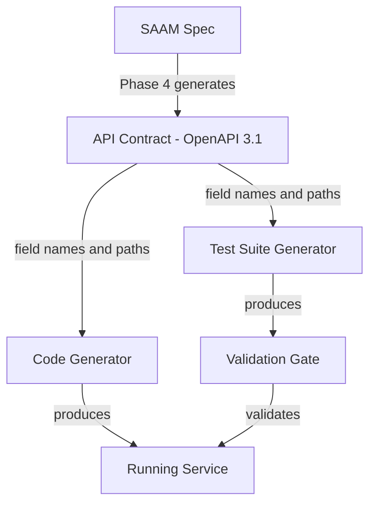

# SAAM API Contract (OpenAPI)

## Purpose

The API contract is a machine-readable OpenAPI specification that serves as the SINGLE SOURCE OF TRUTH for all interface details (field names, endpoint paths, HTTP status codes, request/response shapes, naming conventions). It eliminates naming mismatches between test suites and generated code by providing one authoritative reference that both consumers MUST follow.

## Problem Solved

Without a contract, test suites and code generators independently interpret the SAAM spec and make different naming choices:
- Spec says "service level target" → test writes `serviceLevelTarget`, code writes `service_level_target`
- Spec says "get suppliers" → test hits `/suppliers`, code serves `/supplier`
- Spec says "invalid input" → test expects 422, code returns 400

The contract locks these decisions BEFORE either the test suite or the code is generated.

## Architecture



**Key rule:** The contract is generated ONCE during Phase 4. Both Phase 4c (test generation) and Phase 5 (code generation) consume it. Neither is allowed to invent names — they MUST use what the contract defines.

## When to Generate

The API contract is generated as part of Phase 4 (Specification Generation), AFTER:
- `01-business-rules.md` is complete (rules define what endpoints do)
- `02-domain-model.md` is complete (DDL defines entity field names)
- `03-api-design.md` is complete (defines endpoints and their purpose)

The contract is generated BEFORE:
- Phase 4c (test suite generation) — tests reference the contract
- Phase 5 (code generation) — code references the contract

## File Location

```
spec/microservices/<service>/
├── 01-business-rules.md
├── 02-domain-model.md
├── 03-api-design.md
├── 04-api-contract.yaml    ← OpenAPI 3.1 specification
├── 05-dependencies.md
├── 06-completion-summary.md
├── 07-workflows.md          ← Multi-step operation sequences (generated in Phase 4 Stage 1.6)
├── 08-dtos/                 ← Target-language DTOs (generated in Phase 4c Stage 0, AFTER tech stack is confirmed)
│   ├── create-<resource>.dto.ts
│   ├── update-<resource>.dto.ts
│   ├── <resource>-response.dto.ts
│   └── index.ts
└── ...
```

## Contract Structure (OpenAPI 3.1)

```yaml
openapi: "3.1.0"
info:
  title: <Service Name> API
  version: "1.0.0"
  description: |
    API contract for <service-name>.
    Generated from SAAM specification.
    This is the SINGLE SOURCE OF TRUTH for field names, paths, and response shapes.
    Both test suites and code generators MUST reference this file.

servers:
  - url: http://localhost:{port}/api/v1/<service-path>
    variables:
      port:
        default: "<port>"

# Naming conventions (locked — applies to ALL schemas and paths)
x-naming-conventions:
  fieldNaming: camelCase           # ALL response/request fields use camelCase
  endpointNaming: kebab-case       # ALL URL paths use kebab-case
  headerNaming: kebab-case         # ALL custom headers use kebab-case
  enumValues: PascalCase           # ALL enum values use PascalCase
  queryParams: camelCase           # ALL query parameters use camelCase

# Global request context — headers required on EVERY request
# These MUST appear as parameters on every operation OR in a global security section
# Test suites use these to populate their GLOBAL_HEADERS variable
x-global-headers:
  - name: x-tenant-id
    required: true
    description: "Multi-tenancy isolation — all queries scoped to this tenant"
    testValue: "test-tenant-001"
  # - name: x-store-id
  #   required: true
  #   description: "Store-level isolation within a tenant"
  #   testValue: "test-store-001"
  # - name: Authorization
  #   required: true
  #   description: "JWT Bearer token"
  #   testValue: "Bearer <test-token>"

paths:
  /<resource>:
    get:
      operationId: list<Resources>
      summary: <from 03-api-design.md>
      parameters:
        - name: page
          in: query
          schema:
            type: integer
            default: 1
        - name: pageSize
          in: query
          schema:
            type: integer
            default: 20
      responses:
        "200":
          description: Success
          content:
            application/json:
              schema:
                $ref: "#/components/schemas/<Resource>ListResponse"
        "400":
          $ref: "#/components/responses/BadRequest"
        "401":
          $ref: "#/components/responses/Unauthorized"
        "500":
          $ref: "#/components/responses/InternalError"

    post:
      operationId: create<Resource>
      summary: <from 03-api-design.md>
      requestBody:
        required: true
        content:
          application/json:
            schema:
              $ref: "#/components/schemas/Create<Resource>Request"
      responses:
        "201":
          description: Created
          content:
            application/json:
              schema:
                $ref: "#/components/schemas/<Resource>"
        "400":
          $ref: "#/components/responses/BadRequest"
        "409":
          $ref: "#/components/responses/Conflict"

components:
  schemas:
    # Entity schemas — field names are LOCKED here
    <Resource>:
      type: object
      required: [id, <requiredFields>]
      properties:
        id:
          type: string
          format: uuid
        # Every field from 02-domain-model.md DDL, named per x-naming-conventions
        <fieldName>:
          type: <type>
          description: <from business rules>

    # Request/Response wrappers
    <Resource>ListResponse:
      type: object
      properties:
        items:
          type: array
          items:
            $ref: "#/components/schemas/<Resource>"
        pagination:
          $ref: "#/components/schemas/PaginationInfo"

    PaginationInfo:
      type: object
      properties:
        page:
          type: integer
        pageSize:
          type: integer
        totalItems:
          type: integer
        totalPages:
          type: integer

    # Standard error response (same shape across ALL services)
    ErrorResponse:
      type: object
      properties:
        error:
          type: string
        message:
          type: string
        statusCode:
          type: integer
        timestamp:
          type: string
          format: date-time

  responses:
    BadRequest:
      description: Invalid request
      content:
        application/json:
          schema:
            $ref: "#/components/schemas/ErrorResponse"
    Unauthorized:
      description: Authentication required
      content:
        application/json:
          schema:
            $ref: "#/components/schemas/ErrorResponse"
    Conflict:
      description: Resource conflict
      content:
        application/json:
          schema:
            $ref: "#/components/schemas/ErrorResponse"
    InternalError:
      description: Server error
      content:
        application/json:
          schema:
            $ref: "#/components/schemas/ErrorResponse"
```

## Generation Protocol

### Step 1: Determine Naming Convention

Before generating the contract, confirm the naming convention with the project's technology stack:

| Stack | Field Naming | Path Naming | Convention |
|-------|-------------|-------------|------------|
| Java/Spring | camelCase | kebab-case | Default JSON serialization |
| .NET/ASP.NET Core | camelCase | kebab-case | Default with `JsonNamingPolicy.CamelCase` |
| Node.js/NestJS | camelCase | kebab-case | Default |
| Python/FastAPI | snake_case | kebab-case | Pydantic default |
| Go/Gin | camelCase | kebab-case | JSON struct tags |

**The convention is LOCKED at generation time.** Record it in `x-naming-conventions` in the contract.

### Step 2: Map DDL Columns to Schema Fields

For each table in `02-domain-model.md`:
1. Take each column name (e.g., `service_level_target`)
2. Apply the naming convention (e.g., camelCase → `serviceLevelTarget`)
3. Map the SQL type to OpenAPI type
4. Record in the contract schema

| SQL Type | OpenAPI Type | OpenAPI Format |
|----------|-------------|----------------|
| UUID / UNIQUEIDENTIFIER | string | uuid |
| VARCHAR / NVARCHAR | string | — |
| INT / INTEGER | integer | int32 |
| BIGINT | integer | int64 |
| DECIMAL / NUMERIC | number | double |
| BOOLEAN / BIT | boolean | — |
| TIMESTAMP / DATETIME | string | date-time |
| DATE | string | date |
| TEXT | string | — |
| JSONB / JSON | object | — |

### Step 3: Define Endpoints from API Design

For each endpoint in `03-api-design.md`:
1. Define the exact path (apply path naming convention)
2. Define the HTTP method
3. Define all possible response status codes
4. Link request/response schemas
5. Define query parameters with types and defaults

### Step 4: Define Standard Shapes

Every service contract includes:
- `ErrorResponse` — standard error shape (same across all services in the engagement)
- `PaginationInfo` — standard pagination shape
- List response wrappers (`{ items: [...], pagination: {...} }`)

### Step 5: Define Global Request Context (Cross-Cutting Headers)

Identify ALL headers that EVERY request to this service must carry. These come from:
- Phase 2 architecture decisions (authentication model, multi-tenancy strategy)
- Service-level requirements (store isolation, correlation tracking)

For each required global header:
1. Add it to the `x-global-headers` extension at the top of the contract
2. Include `testValue` — the value test suites should use (so Phase 4c test generation can populate its `GLOBAL_HEADERS` variable)
3. Add it as a parameter on EVERY path operation (not just in a global section) — this ensures test generators see it per-endpoint

Common global headers:

| Header | When Required | Purpose |
|--------|--------------|---------|
| `x-tenant-id` | Multi-tenant services | Isolates all data queries to the tenant |
| `x-store-id` | Multi-store within tenant | Further isolates to a specific store |
| `Authorization` | Authenticated services | Bearer JWT token |
| `x-correlation-id` | Distributed tracing | Links requests across services |
| `x-user-id` | User-scoped operations | Identifies the acting user |

**CRITICAL for test generation:** The `testValue` field in `x-global-headers` is what Phase 4c uses to populate the test suite's global header variables. Without it, test suites will be generated WITHOUT required headers and fail at runtime.
### Step 5: Validate Contract (Agent-Driven — No External Tools)

After generation, the agent MUST perform a structural validation pass. This catches errors that would otherwise propagate into DTOs and test suites, causing integration failures in Phase 6.

**Structural checks (ALL must pass):**

1. **Schema completeness:**
   - [ ] Every entity from `02-domain-model.md` has a corresponding schema in `components/schemas`
   - [ ] Every endpoint from `03-api-design.md` has a corresponding path in the contract
   - [ ] Every `requestBody` schema has at least one `required` field defined

2. **Reference integrity:**
   - [ ] Every `$ref` in the contract points to an existing schema (no dangling references)
   - [ ] No schema references itself directly (circular `$ref`)
   - [ ] Every schema used in `requestBody` or `responses` exists under `components/schemas`

3. **Naming consistency:**
   - [ ] All field names follow the declared `x-naming-conventions` (e.g., camelCase for JSON fields)
   - [ ] No mixed casing within a single schema (e.g., `firstName` + `last_name` in same object)
   - [ ] Path segments use kebab-case consistently
   - [ ] No duplicate `operationId` values across all paths

4. **Response completeness:**
   - [ ] Every mutating operation (POST/PUT/PATCH/DELETE) has both success AND error responses defined
   - [ ] Every success response has a `content` schema (not empty)
   - [ ] Standard error responses (400, 401, 404, 422, 500) reference `ErrorResponse` schema

5. **Type correctness:**
   - [ ] Every schema property has a `type` field (no untyped properties)
   - [ ] `format` is used correctly (uuid → string+uuid, not integer+uuid)
   - [ ] Array schemas have `items` defined
   - [ ] Enum values are non-empty arrays

**If ANY check fails:** Fix the contract immediately before proceeding. Do NOT continue to Phase 4c with a structurally invalid contract — DTOs generated from it will inherit the errors.

**Duration:** 1-2 minutes per service (agent reads the YAML it just generated and verifies against the checklist).

## Consumption Rules

### For Test Suite Generation (Phase 4c)

The test suite generator MUST:
- Read field names from `04-api-contract.yaml` schemas (NEVER invent names)
- Reference `08-dtos/` for exact request payload shapes (field names, required/optional)
- Use exact paths from the contract (NEVER guess path format)
- Assert exact status codes defined in the contract
- Validate response shape matches the contract's schema structure
- Use enum values exactly as defined in the contract

### For DTO Generation (Phase 4c Stage 0)

DTOs are generated from the contract AFTER the tech stack is confirmed (Phase 4b). The DTO generator MUST:
- Create one DTO file per distinct request body or response shape in the contract
- Use EXACTLY the same property names as the contract's `components/schemas` (case-sensitive)
- Add validation decorators derived from the domain model (`02-domain-model.md`) constraints
- Add default values from domain model DDL defaults
- Store at `spec/microservices/<service>/08-dtos/`

**Reconciliation rule:** Every property in a contract schema that is used as a request body MUST have a corresponding field in a DTO. If a field exists in the contract schema but NOT in the DTO, or vice versa — it's a generation bug that must be fixed before Phase 5.

### For Code Generation (Phase 5 / ATX)

The code generator MUST:
- **Copy DTOs from `spec/microservices/<service>/08-dtos/*.cs` into `sourcecode/Shopizer.<Service>/DTOs/` VERBATIM as the first implementation step** — these are pre-generated and mechanically consistent with the contract. See `.github/skills/saam-dotnet-reference-implementation/SKILL.md`.
- **NEVER regenerate, rename, or restructure the copied DTOs** — they are the concrete binding that ensures test/code alignment
- Expose endpoints at exact paths defined in the contract
- Use the copied DTOs as request/response types in controllers
- Return exact status codes defined in the contract
- Structure responses per the contract's schema shapes
- If additional internal types are needed (not in the API contract), keep them in `Models/Domain.cs` rather than creating duplicate DTO files

### What the Contract Does NOT Define

The contract defines the INTERFACE only. It does NOT define:
- Business rule logic (that's in `01-business-rules.md`)
- Data access patterns (implementation detail)
- Internal method names (implementation detail)
- Service-to-service communication details (internal)
- Database column names (those map TO contract fields, not FROM them)

## Contract-DTO Consistency Rule

The contract and DTOs MUST remain in sync at all times. They are related as:

```
Contract (04-api-contract.yaml)          DTOs (08-dtos/)
─────────────────────────────            ────────────────
components/schemas/<Name>    ←→    <Name>Dto.cs (same fields)
  properties:                        public sealed class <Name>Dto {
    fieldA: string                     public string FieldA { get; set; }
    fieldB: integer                    public int FieldB { get; set; }
```

**Invariant:** For every schema property used in a request body, there MUST be a corresponding DTO field with the SAME name (case-sensitive). Any mismatch is a bug.

**When to regenerate DTOs:**
- After Phase 4a (BA review) if new schemas were added
- After any contract schema modification in Phase 6
- After contract versioning (new fields added)

**Regeneration does NOT mean reimplementation:** If DTOs change, the implementation's `DTOs/` files must also be updated to match. The regenerated DTOs from `08-dtos/` are always copied over the implementation DTOs.

## Cross-Service Contract Consistency

For multi-service engagements, ensure consistency across contracts:
- Same `ErrorResponse` schema in all services
- Same `PaginationInfo` schema in all services
- Same `x-naming-conventions` across all services (unless tech stack differs)
- Shared schemas (e.g., common types) extracted to a `spec/shared/common-schemas.yaml`

## Contract Versioning

The contract is versioned with the spec. When business rules change:
1. Update `01-business-rules.md`
2. Update `04-api-contract.yaml` to reflect new/changed fields
3. **Regenerate DTOs** (`08-dtos/`) from updated contract schemas — this keeps the concrete binding current
4. Regenerate test suite (Phase 4c) from updated contract + DTOs
5. **Update implementation DTOs** — copy regenerated `08-dtos/*.cs` into `sourcecode/Shopizer.<Service>/DTOs/`
6. **Update frontend api-client** — regenerate `09-api-client/` from updated contracts, copy to `sourcecode/<app>/src/api/`
7. Regenerate/fix code to match updated contract

The contract NEVER changes without corresponding spec changes. **DTOs NEVER change without corresponding contract changes.**

## Contract Freeze (After Phase 4c)

**Once Phase 4c generates DTOs (`08-dtos/`) and api-client (`09-api-client/`), the API contracts are FROZEN for implementation.** Changes after this point trigger a cascade:

```
Contract change → MUST regenerate DTOs → MUST regenerate api-client → MUST update test suites → MUST update implementation
```

**Rules:**
- During Phase 5 implementation: contracts are READ-ONLY. If the implementation agent discovers a contract gap (missing endpoint, wrong type), it flags it as a spec gap — it does NOT modify the contract directly.
- Contract changes during Phase 5 require: human approval → contract update → DTO regeneration → api-client regeneration → affected test suites regenerated. This is expensive — avoid it.
- During Phase 6: contract changes are normal (features, bug fixes) but ALWAYS trigger the full cascade above.
- **The cascade is not optional.** If someone updates `04-api-contract.yaml` without regenerating DTOs and api-client, the next implementation cycle will have drift. The Validator subagent catches this: "DTO field names don't match contract schema."

**Freeze signal in tracking:**
After Phase 4c completes, the tracking file records: `contract_frozen: true, frozen_at: <timestamp>`. Any subsequent contract modification must be logged as a tracked change with justification.
