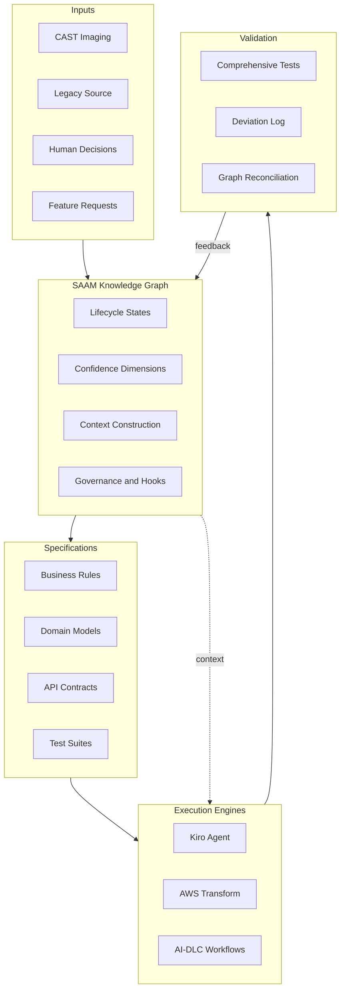
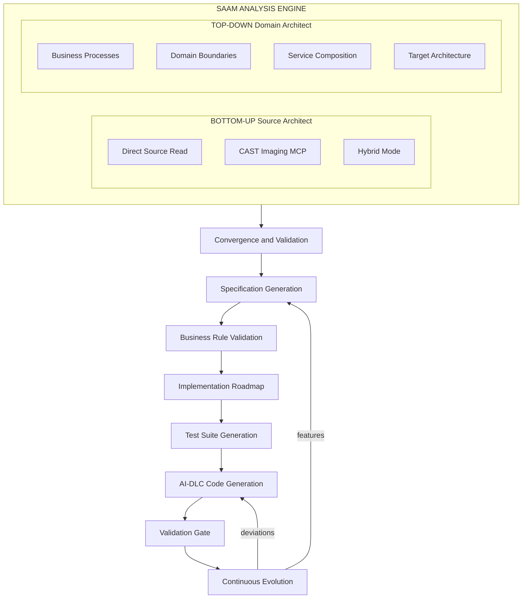
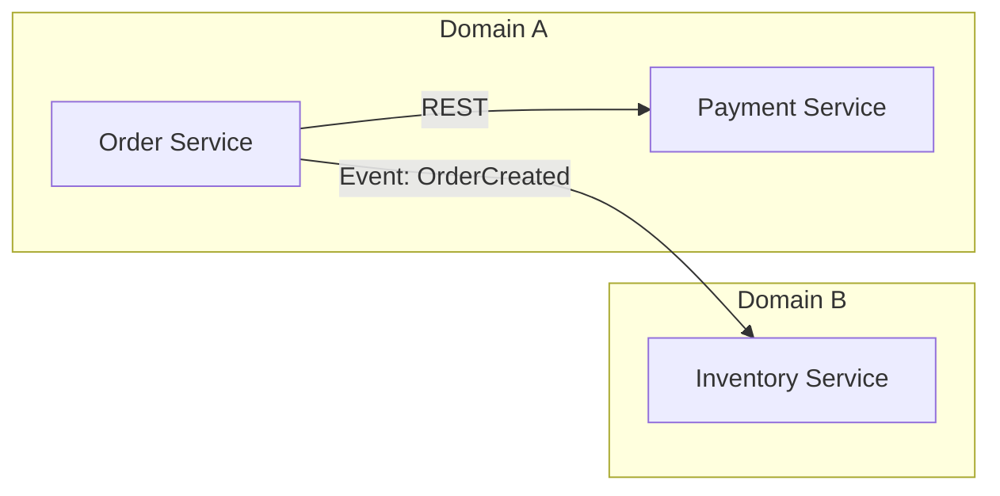
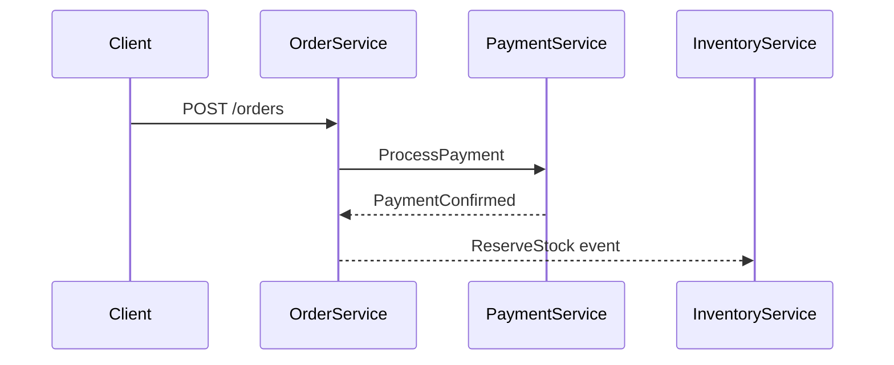

# SAAM — SoftServe Agentic Application Modernization

## Framework Overview

SAAM is a graph-driven modernization platform that transforms legacy applications into verified microservices. It combines dual-track analysis (source + domain), a Neo4j knowledge graph for lifecycle governance and confidence tracking, and pluggable execution engines (Kiro, AWS Transform, AI-DLC) — all connected through a continuous feedback loop.

The knowledge graph is the control plane: it stores every entity and relationship, tracks multi-dimensional confidence per business rule, constructs targeted agent context, and routes feedback from validation back into specifications.

### Control Plane



### Phase Pipeline



## Supported Legacy Stacks

| Stack | Source Reading Guide | CAST Imaging Support |
|-------|---------------------|---------------------|
| IBM i (RPG/CL/DDS) | `.github/skills/saam-source-reading-ibm-rpg/SKILL.md` | ✅ Full |
| COBOL/JCL/CICS | `.github/skills/saam-source-reading-cobol/SKILL.md` (create dynamically if missing — see Phase 1 Protocol) | ✅ Full |
| Java EE (EJB/Struts/Spring) | `.github/skills/saam-source-reading-java-legacy/SKILL.md` (create dynamically if missing — see Phase 1 Protocol) | ✅ Full |
| .NET Framework | `.github/skills/saam-source-reading-dotnet/SKILL.md` | ✅ Full |
| PL/SQL + Forms | Create dynamically per Phase 1 Protocol (or fallback below) | ✅ Full |
| PowerBuilder | Create dynamically per Phase 1 Protocol (or fallback below) | ✅ Full |
| Any other | Create dynamically per Phase 1 Protocol (or fallback below) | Depends on CAST analyzer |

**Fallback for stacks without a dedicated source reading guide:**

If no `.github/skills/saam-source-reading-<stack>/SKILL.md` exists for the project's legacy technology and one has not been dynamically generated, the agent uses the **Purpose-First Extraction Method** from Phase 4 (`.github/skills/saam-phase4-spec-generation/SKILL.md`) as the generic extraction approach:
1. Read the entire source unit
2. Understand WHAT business operation it accomplishes
3. Identify decision points (conditionals, calculations, state transitions)
4. Extract rules ONLY from decision points
5. Merge related checks into single rules

The Purpose-First method is technology-agnostic — it works for any imperative or declarative language. Stack-specific guides (like IBM RPG or .NET) add technology-specific patterns (e.g., "CHAIN operations indicate data retrieval" in RPG, "`[ServiceContract]` interfaces indicate API surfaces" in .NET) but are NOT required for extraction to proceed.

## Phase Summary

| Phase | Name | Input | Output | Human Checkpoints |
|-------|------|-------|--------|-------------------|
| 0 | Onboarding | Raw system access | Inventory, mode selection | Confirm scope, select mode |
| 1 | Bottom-Up | Source/CAST data | Rules, call graphs, data flows | Clarify ambiguous logic |
| 2 | Top-Down | Business knowledge | Domains, services, architecture | Approve boundaries |
| 3 | Convergence | Phase 1 + 2 outputs | Feature matrix, gap analysis | Resolve conflicts |
| 4 | Specification | Validated features | Microservice specs + API contract | Review each spec |
| 4a | BA Rule Validation | Specs | Classified/weighted rules, scope reduction | Mandatory — approve agent defaults or provide BA workshop outputs |
| 4b | Implementation Roadmap | Specs (BA-reviewed) | Automatibility scores, improvement plan, tech stack recommendation, architecture reconciliation, roadmap | Iterative — scores improve until ≥75%, then stack confirmed |
| 4c | Test Suite Generation | Specs | comprehensive-test-suite.sh per service | Review test coverage |
| 5 | AI-DLC | Specs + API contracts + test suites | Running code | Accept implementation |
| 6 | Continuous Evolution | Deviation log, bugs, features, SPEC-DRIFT | Spec-compliant, evolving system | Ongoing — loop until engagement ends |

**Task Tracking:** Every phase is tracked in `tracking/phase<N>-<name>.md`. When Jira is configured, tickets are created and kept in sync automatically. See `.github/skills/saam-task-tracking/SKILL.md` for the full protocol.

**Tracking Activation (MANDATORY for ALL phases):** At the START of each phase, the agent MUST:
1. Check if `tracking/phase<N>-<name>.md` exists
2. If NOT: create it with all tasks for that phase as PENDING (using the phase's deliverables list)
3. If Jira configured: create the Epic + Tasks, record IDs in the tracking file
4. If EXISTS: read it and resume from the first non-DONE task
5. **Record PhaseEvent (started):** `graph_add_node(nodeType="PhaseEvent", id="<phase>-started", properties={phase: "<P0|P1|...>", event: "started", timestamp: datetime()})`

At phase EXIT (after exit gate approved):
6. **Record PhaseEvent (completed):** `graph_add_node(nodeType="PhaseEvent", id="<phase>-completed", properties={phase: "<P0|P1|...>", event: "completed", timestamp: datetime()})`

These timestamps are the authoritative timing source for telemetry (not agent estimates).

During phase execution, the agent updates the tracking file after each task completion. This applies to ALL phases (0, 1, 2, 3, 4, 4a, 4b, 4c, 5, 6).

**Phase Entry Protocol (MANDATORY):** When the user asks to start any phase, the agent MUST:
1. READ the corresponding steering file BEFORE taking any action (e.g., `.github/skills/saam-phase5-ai-dlc-implementation/SKILL.md` for Phase 5)
2. Follow the instructions IN that file — do not improvise from memory or prior context
3. If the phase involves external tools (AWS Transform, CAST Imaging, etc.), read the relevant sections about those tools before running commands
4. Never assume familiarity — always re-read the steering file at phase start

**Phase 4 Known Failure Mode — Category Templating:**
Phase 4 has a known failure mode where the agent generates rules by rotating through a fixed set of categories per entity (Validation/Decision/Lifecycle/Integration/etc.), producing rule counts that pass numeric gates but score <70% automatibility. The Phase 4 steering includes template detection heuristics and quality gates to prevent this. After Phase 4 completion, an independent validation must confirm that rules are implementable from their Statements alone.

**API Contract (`04-api-contract.yaml`):** Phase 4 generates an OpenAPI 3.1 contract per service that locks field names, endpoint paths, status codes, and response shapes. Both Phase 4c (test suites) and Phase 5 (code generators) MUST reference this contract for all naming decisions. This eliminates mismatches between generated tests and generated code. See `.github/skills/saam-api-contract/SKILL.md`.

**Phase 5 Execution Models:** Phase 5 supports three models for maximum flexibility:
- **Model A (Pure Kiro)** — interactive, task by task (1-3 services)
- **Model B (Transform + Kiro)** — ATX generates per service, Kiro polishes (3-10 services)
- **Model C (ATX Batch + AI-DLC)** — maximum velocity, 4-stage pipeline (5+ services):
  1. ATX batch generates ALL services in parallel
  2. Smoke validation produces deviation log (identifies systemic patterns)
  3. AI-DLC fixes systemic issues first (Unit 0), then handles cross-cutting wiring
  4. Final validation gate (100% test pass required, produces final deviation log)

## Mandatory Deliverables Per Service

### Phase 4 Output: Specification Package (BEFORE implementation)

Phase 4 MUST produce ALL of these artifacts for EVERY service before Phase 4 can be declared complete:

1. ✅ **`01-business-rules.md`** — numbered BR-IDs with semantic statements, source references, logic, examples
2. ✅ **`02-domain-model.md`** — complete executable DDL (CREATE TABLE, indexes, constraints, relationships)
3. ✅ **`03-api-design.md`** — all endpoints with methods, paths, request/response schemas
4. ✅ **`04-api-contract.yaml`** — OpenAPI 3.1 specification (naming authority for tests + code)
5. ✅ **`05-dependencies.md`** — cross-service integration contracts (consumer perspective: calls, events, resilience)
6. ✅ **`06-completion-summary.md`** — verified counts matching actual content
7. ✅ **`08-dtos/`** — target-language DTO files (generated in Phase 4c Stage 0, AFTER tech stack confirmed in Phase 4b). These are the CONCRETE BINDING between tests and implementation — both consume these DTOs verbatim, eliminating naming drift.

**Frontend spec (if UI exists):**
8. ✅ **`spec/frontend/<app>/09-api-client/`** — typed API client generated from ALL backend `04-api-contract.yaml` files (Phase 4c Stage 0b). This is the CONCRETE BINDING between frontend pages and backend services — pages MUST import from this client, NEVER construct URLs directly. Prevents the "invented API paths" class of frontend failures.

**Phase 4 is NOT "just business rule extraction."** It produces the complete specification package that downstream phases depend on. Without `02-domain-model.md`, there's no DDL for code generation. Without `04-api-contract.yaml`, test suites and code generators cannot agree on field names. Without `08-dtos/`, test payloads and implementation DTOs diverge due to independent interpretation of the contract. Without `09-api-client/`, frontend pages invent API paths that don't match backend routes.

### Phase 5 Output: Running Service (AFTER implementation)

Every microservice produced by SAAM MUST have:

1. ✅ **Specification document** with numbered business rules
2. ✅ **Implementation source code** (via AI-DLC)
3. ✅ **Unit test suite** (JUnit/pytest/etc.) — all rules tested
4. ✅ **`comprehensive-test-suite.sh`** — bash curl-based API test exercising ALL business rules against running service, ZERO skips, PASS/FAIL per rule. Located in `validation/<service-name>/` — NEVER in `spec/` or `sourcecode/`
5. ✅ **Containerfile** for containerized execution
6. ✅ **CI/CD pipeline** (GitHub Actions or equivalent)

The comprehensive test suite is the ACCEPTANCE GATE. No service is considered complete until it passes 100%.

### Engagement-Level Deliverable: Spec Deviation Log

In addition to per-service deliverables, the engagement produces ONE cross-service deviation log:

7. ✅ **`validation/spec-deviation-log.md`** — documents every case where test suites were adapted (DEV-TEST), code was fixed (DEV-CODE), or spec/implementation disagree (SPEC-DRIFT). This log is the quality audit trail — it shows what passed, what was accommodated, and what needs follow-up.

The deviation log drives post-Phase-5 remediation:
- `DEV-TEST` items become Jira tickets (service should be fixed to match spec)
- `SPEC-DRIFT` items go to the BA/human for a decision on which behavior is correct
- `DEV-CODE` items are informational (bugs caught and fixed)
- Systemic patterns (repeated across services) become global architectural fixes

## Implementation Estimates

SAAM produces agentic AI-led implementation estimates as a core outcome:

- **Automatibility score** per service (0-100%) — composite of statement clarity, algorithm completeness, integration definition, data model readiness, edge case coverage
- **Automatibility improvement plan** — specific working sessions and information requests to raise scores
- **Per-service timelines** — estimated agentic implementation duration (derived from automatibility score)
- **Team composition** — roles for agentic development (AI agents + human oversight)
- **Parallel execution plan** — concurrent implementation opportunities
- **Target state cost** — infrastructure cost for the modernized system (AWS priority, GCP and Azure as options)
- **Target accuracy: ≥95%** — human inputs solicited when confidence is below threshold

**Phase 4b is iterative:** Scores are calculated, gaps identified, improvement items executed (working sessions + information requests), specs amended, scores recalculated, and roadmap updated. This repeats until all services reach ≥75% or the human accepts current state. Once scores stabilize, Phase 4b produces an evidence-based tech stack recommendation per service and reconciles the architecture from Phase 2's preliminary decisions. See `.github/skills/saam-phase4b-implementation-roadmap/SKILL.md` for full workflow.

**Architecture Reconciliation rationale:** Phase 2 makes preliminary technology decisions (tech stack, database, event system) based on business domain knowledge — before detailed source extraction exists. By Phase 4b, SAAM has full evidence: rule complexity profiles, integration patterns, data access shapes, automatibility scores, and BA-validated classifications. This is the RIGHT moment to confirm or revise the stack. The recommendation compares the evidence-based choice against the preliminary decision and reconciles the architecture document accordingly.

**Constraints**:
- No budget calculations of any kind within SAAM
- No hourly/daily rates or financial projections for the work
- Timeline and team composition only — for agentic development
- Target state cost covers running infrastructure, not migration effort

## CAST Imaging Integration

When using CAST Imaging MCP:
- Query application structure without loading source into context
- Retrieve call graphs, data flows, and dependencies via MCP
- Analyze one domain segment at a time (avoids context overload)
- Use CAST's automatic technology detection and dependency mapping
- Fall back to direct source reading only for business rule extraction

## Telemetry and Calibration

SAAM collects anonymized engagement metrics to enable cross-engagement learning. The telemetry system answers: "Do SAAM's controls actually predict outcomes — and which controls contribute most?"

### How It Works

```
Phase completes → agent queries graph → produces .saam/telemetry/<phase>.yaml
    ↓
Engagement exports telemetry (no client data — safe to centralize)
    ↓
Central analytics (DuckDB) runs correlations and regressions
    ↓
Produces updated .github/saam-calibration.yaml with empirically calibrated weights
    ↓
Committed to SAAM repo → next engagement uses calibrated values
```

### Key Components

- **`.github/skills/saam-telemetry/SKILL.md`** — defines per-phase YAML schemas, collection protocol, export/import rules
- **`.github/saam-calibration.yaml`** — single source of tunable parameters (confidence weights, automatibility thresholds, complexity ratios, planning estimates). All steering files reference this instead of hardcoding values.
- **`.saam/telemetry/`** — engagement workspace directory where per-phase YAML files accumulate

### What Gets Calibrated

| Parameter | Steering That Uses It | Calibrated By |
|-----------|----------------------|---------------|
| Confidence weights (Declared=0.5, Passing=0.9, etc.) | `.github/skills/saam-graph-context/SKILL.md` | Correlation of confidence scores with actual deviations |
| Automatibility dimension weights (clarity 30%, etc.) | `.github/skills/saam-phase4b-implementation-roadmap/SKILL.md` | Regression of dimension scores against implementation success |
| Automatibility thresholds (Type A ≥85%, etc.) | `.github/skills/saam-phase4b-implementation-roadmap/SKILL.md` | Observed success rate boundaries |
| Complexity ratio threshold (>3.0 = flagged) | `.github/skills/saam-phase4-spec-generation/SKILL.md` | False positive rate of preservation flags |
| Planning estimates (BA velocity, duration per type) | `.github/skills/saam-phase4b-implementation-roadmap/SKILL.md` | Historical phase durations |

### Calibration Lifecycle

1. **v1 (current):** Expert heuristics. Reasonable starting values based on engineering judgment.
2. **v2 (after 10+ services):** First empirical adjustment. Thresholds adjusted based on observed true-positive rates and correlation signals.
3. **v3+ (after 30+ services):** Statistical confidence. Regression models with R² and confidence intervals. Predictive validity demonstrated.

The calibration file carries its own provenance: version, date, sample size, and basis (expert vs empirical). Agents can assess how much to trust a threshold based on sample size.

## Correlated Error Risk

### The Problem

When the same LLM interprets legacy source, generates a specification, produces tests from that specification, and generates implementation from that specification — all artifacts can agree perfectly while being wrong. This is **correlated error**: the spec, test, and code share the same semantic interpretation, so internal consistency checks cannot detect a fundamentally incorrect interpretation.

### Three Types of Correlated Error

| Type | Description | Example | Detection Difficulty |
|------|-------------|---------|---------------------|
| **Extraction error** | LLM misreads source — boundary condition lost, operator wrong | Source: `>= 100` → Spec: `> 100` | Medium — BA review may catch; complexity preservation may flag |
| **Value hallucination** | LLM substitutes a plausible-looking wrong constant | Source: `rate = 0.025` → Spec: `rate = 0.03` | High — looks correct, passes all consistency checks |
| **Omission** | LLM skips a code path entirely | 5 branches in source → 4 rules extracted | Medium — complexity dimensions flag count gaps |

### Existing Mitigations (Layered Defense)

No single mechanism eliminates correlated error. SAAM uses layered, partially-independent evidence sources:

| Layer | Mechanism | What It Catches | Independence Level |
|-------|-----------|-----------------|-------------------|
| 1 | **CAST reconciliation** | Omissions — structural paths with no BR-ID | High (CAST is fully independent of LLM) |
| 2 | **Multi-dimensional complexity** | Count-based gaps (writes, constants, branches) | Medium (counting is less subjective than interpretation) |
| 3 | **BA review (Phase 4a)** | All types — human validates extracted semantics | High (human breaks the LLM chain) |
| 4 | **Spec drift detection** | Post-implementation divergence | High (hash-based, no interpretation needed) |
| 5 | **Mutation testing** (Phase 5) | Weak tests — confirms tests have real verification power | High (independent of original interpretation) |
| 6 | **Cross-model verification** (optional) | Extraction errors — second model disagrees on interpretation | High (different model = different biases) |

### Residual Risk

Even with all layers active, correlated error cannot be fully eliminated if:
- The source code itself is ambiguous (no "correct" interpretation exists without domain expert)
- The omitted logic is too subtle for structural analysis to detect (single expression within a method)
- BA review is cursory (rubber-stamp approval)

**SAAM's position:** The system makes correlated error *detectable and measurable* rather than claiming to eliminate it. Telemetry tracks how often Phase 6 deviations trace back to extraction errors, which feeds back into confidence calibration and identifies which rule types need stronger verification.

### Mitigation Protocols

- **Mutation testing:** Mandatory for Critical BR-IDs after implementation passes all tests. See Phase 5 steering.
- **Cross-model verification:** Optional Phase 4 quality gate for high-risk extractions. See `.github/skills/saam-cross-model-verification/SKILL.md`.
- **CAST reconciliation:** Automatic when CAST is configured. See `.github/skills/saam-graph-validation/SKILL.md`.
- **Complexity preservation:** Automatic for all extractions. See Phase 4 steering.

## Knowledge Graph (Always Active)

SAAM maintains a Neo4j-backed knowledge graph for ALL projects (set up during bootstrapping). It provides:

- **Lifecycle tracking** — every BR-ID progresses: Extracted → Assigned → Declared → Tested → Passing
- **Multi-dimensional confidence** — provenance, implementation, and test quality dimensions; effective confidence = weakest link (min of all dimensions)
- **Context construction** — agents query the graph for targeted context instead of reading multiple files
- **Automatic hooks** — session start injects engagement status; file writes inject service context; file saves detect BR-ID annotations
- **Impact analysis** — graph traversal shows what breaks if a rule/endpoint/table changes
- **Inference** — derives transitive dependencies, completeness scores, unused tables, extraction risk

**CAST Validation Layer (add-on):** When CAST is also configured, additional reconciliation tools compare the modernized graph against legacy structural data to detect unaccounted business logic loss. See `.github/skills/saam-graph-validation/SKILL.md`.

**Core graph features:** See `.github/skills/saam-graph-context/SKILL.md` for the lifecycle state model, confidence dimensions, and how agents use the graph for prioritization.

## Frontend Specifications

Frontend applications (SPAs, dashboards, admin panels) use a DIFFERENT spec template than backend services. Backend specs define algorithms; frontend specs define user interactions, data bindings, and visual states.

**Use `.github/skills/saam-frontend-spec-template/SKILL.md` for frontend.** It produces specs organized around:
- API contracts per screen (exactly which endpoints, response→UI mapping, error handling)
- Screen inventory with data bindings (what data, from where, displayed how)
- User flows as state machines (not just "user can do X" but full state transitions)
- Interaction matrix (every clickable element → trigger → API call → feedback)
- Component hierarchy with props and state ownership

Frontend specs are written AFTER backend services exist (or their API specs exist), because the frontend spec references backend APIs explicitly.

**Figma integration:** Use Figma for design tokens and visual reference. Do NOT use Figma as the sole source for frontend implementation — it lacks logic, states, error handling, and data flow.

## AI-DLC Integration

SAAM specifications are designed to feed directly into AI-DLC:
- Kiro spec format (requirements.md → design.md → tasks.md)
- Tasks are implementation-ready with clear acceptance criteria
- Each task references specific business rules from the spec
- Agent can implement autonomously given the spec quality

## AWS Transform Integration (Code Generation Only)

AWS Transform Custom is a bulk code generation engine for Phase 5. It reads the SAAM spec as input and generates a complete service in one pass, iterating until the comprehensive test suite passes.

**Transform is Workflow A; Kiro Tasks are Workflow B.** Transform generates ~80% of the service; Kiro tasks handle fixes, cross-cutting concerns, and integration wiring.

### How It Works

```
Transform Input:                    Transform Output:
spec/microservices/<service>/       sourcecode/<service>/
├── 01-business-rules.md            ├── src/ (complete project)
├── 02-domain-model.md      ──ATX──►├── Containerfile
├── 03-api-design.md                ├── tests/
└── 04-event-contracts.md           └── pom.xml / package.json

Validation:
validation/<service>/comprehensive-test-suite.sh (passed as -c flag)
```

### Execution

```bash
# Publish TD (once per engagement)
atx -t
# → Define transformation, point to reference patterns

# Run Transform per service (30-60 min each)
atx custom def exec \
  -n "<td-name>" \
  -p spec/microservices/<service>/ \
  -c "../../validation/<service>/comprehensive-test-suite.sh" \
  -x -t
```

### What Transform Won't Generate (Kiro Tasks Handle These)

| Component | Why Not Transform | Kiro Task |
|-----------|-------------------|-----------|
| Auth/tenancy middleware | Cross-cutting, not per-service | Yes |
| Cross-service HTTP clients | Integration glue, needs runtime context | Yes |
| Event wiring | Depends on infrastructure setup | Yes |
| Podman Compose | Orchestration | Yes |
| Comprehensive test suite fixes | Transform may not hit 100% on first pass | Yes |

### Rules
- AWS Transform does NOT perform analysis (Phases 0–4 remain in SAAM)
- The test suite is the contract — code must conform to tests, never the reverse
- Same acceptance gate applies: 100% pass required on comprehensive-test-suite.sh
- Use continual learning (`list-ki`, `update-ki-config`) to improve across services
- If Jira is configured: ATX can transition ticket statuses via `mcp-atlassian` in `~/.aws/atx/mcp.json`
- Transform output lands in `sourcecode/<service>/` — Kiro tasks then fix/extend in the same directory

### Scaled Execution (Multi-Service Parallel)

For engagements with 5+ services, ATX runs in parallel containers on AWS Batch (Fargate). Two infrastructure options:

| Option | What | When |
|--------|------|------|
| **Scaled Execution Containers** | Headless fleet: API + Batch + S3 | 4-20 services, small team |
| **Agentic ATX Platform** | Full platform: Web UI + AgentCore + Batch + knowledge items | 10+ services, multiple teams, ongoing modernization |

Both options: upload specs to S3, submit batch of jobs (one per service), all run in parallel, output lands in S3. See Phase 5 steering for full setup and execution guide.

Source: [aws-samples/aws-transform-custom-samples](https://github.com/aws-samples/aws-transform-custom-samples)

## Jira Integration (Optional)

SAAM optionally integrates with Jira to track implementation progress using [mcp-atlassian](https://github.com/sooperset/mcp-atlassian). When enabled:

- Pre-flight: `tasks.md` is decomposed into a Jira Epic + Stories/Sub-tasks with dependency links
- During implementation: AI-DLC agent transitions tickets (To Do → In Progress → Done) as work progresses
- Both Kiro and AWS Transform support this via MCP (`.kiro/settings/mcp.json` and `~/.aws/atx/mcp.json`)

See `.github/skills/saam-jira-integration/SKILL.md` for full configuration and workflow details.

## Target-First Extraction Strategy

### When to Use

When business priority requires a specific service before its natural wave position, and the team wants to avoid stubs/mocks by building real (thin) dependencies.

### Approach

1. Identify the TARGET service (the one business needs first)
2. Map its dependency chain (what it reads from, writes to)
3. For each dependency, identify the MINIMUM SLICE the target needs:
   - Which APIs does the target call?
   - Which events does the target consume?
   - Which data does the target read?
4. Extract ONLY those slices from each dependency
5. Build dependencies in the order the target needs them

### Slice Extraction Protocol

For each dependency:
- Extract the INTERFACE the target service uses (not the dependency's full internals)
- Extract the DATA MODEL the target reads (not the dependency's full schema)
- Extract VALIDATION RULES that gate the target's operations (not all validators)
- Skip workflows and lifecycles that don't affect the target service

### Anti-Corruption Layer Design

Each dependency slice gets an ACL that isolates the target from dependency availability:
- **Outbox pattern** — target writes to local outbox; relay forwards when dependency is ready
- **Read cache** — target reads from local cache of dependency data; sync mechanism fills it
- **Event replay** — target stores events locally; replays to dependency when it arrives

### Documentation

For target-first builds, create:

```
modernization/adr-NNN-<target>-first-feasibility.md
```

Covering:
- Dependency map (upstream/downstream)
- Per-dependency slice scope (what's included, what's deferred)
- Risk assessment (what can't be validated until dependencies exist)
- Phase plan (which slices build in what order)
- Decision matrix (options for stakeholder sign-off)

## Documentation Standards

### Business Rule Source Traceability (MANDATORY)

Every business rule extracted by SAAM MUST include precise source references that enable human validation:

1. **Source Reference** — exact file path + function/method name + line number(s) in the legacy codebase
2. **Discovery Method** — how the rule was found: `Direct Source Read` or `CAST Imaging`
3. **CAST Reference** (when CAST was used) — the specific CAST object ID, transaction path, or MCP query that identified the rule

These references MUST appear in:
- Phase 1 extraction summaries (`assessment/<domain>-extraction-summary.md`)
- Phase 4 microservice specifications (`spec/microservices/<service>.md`)

Vague references (e.g., "in the order module") are NOT acceptable. The reference must be specific enough for a human to open the source file and locate the exact code.

### Implementation Prerequisite: Test Suite Check

Before ANY implementation work begins for a service — including decomposing SAAM specs into Kiro specs — the system MUST verify that a `comprehensive-test-suite.sh` exists for that service. If the test suite has not been generated yet, the system MUST offer to create one from the SAAM specification before proceeding. Implementation without a pre-existing test suite is NOT allowed.

### Phase 4 Independent Validation (MANDATORY)

After Phase 4 completion, before accepting specs as "done":
1. Select 5 rules at RANDOM from the generated specifications
2. Attempt to write a unit test implementation from the Statement alone (with DDL as reference)
3. If ≥2 of 5 rules cannot be implemented without reading the legacy source code → the spec FAILS the quality gate
4. Failed specs must be reworked using the Purpose-First extraction method
5. Self-assessed completion scores are PROVISIONAL until this validation passes

### Diagrams

All architecture diagrams, sequence diagrams, call graphs, and process flows in SAAM output documentation MUST use Mermaid format. Do NOT use ASCII art or plain-text diagrams.

Supported Mermaid diagram types for SAAM outputs:

| Use Case               | Mermaid Type                | When                                  |
| ------------------------| -----------------------------| ---------------------------------------|
| Service architecture   | `flowchart` or `block-beta` | Phase 2: target architecture          |
| Sequence/process flows | `sequenceDiagram`           | Phase 2: process flow mapping         |
| Entity relationships   | `erDiagram`                 | Phase 2: data model design            |
| Call graphs            | `flowchart TD`              | Phase 1: call chain visualization     |
| Domain boundaries      | `flowchart` with subgraphs  | Phase 2: bounded contexts             |
| Migration timeline     | `gantt`                     | Phase 4b: implementation roadmap      |
| State transitions      | `stateDiagram-v2`           | Phase 1: business rule state machines |
| Class hierarchy        | `classDiagram`              | Phase 4: service specification        |

Example — service architecture:



Example — sequence diagram:



### Rules

- Every output document that describes architecture, flows, or relationships MUST include Mermaid diagrams
- Diagrams MUST be embedded inline in markdown (not as external files)
- Use `flowchart` for architecture and dependencies
- Use `sequenceDiagram` for process flows and API interactions
- Use `erDiagram` for data models
- Use `gantt` for timelines and roadmaps
- Diagrams supplement text descriptions — they do not replace them

## Project README (Living Document)

### Purpose

The root `README.md` in every SAAM engagement workspace is a **living project document** — NOT a copy of the SAAM framework documentation. It reflects the actual state of the modernization engagement and is updated after every phase completion.

The README serves team members joining mid-engagement: they should understand what system is being modernized, what's been decided, what's complete, and where to find artifacts — without needing to read steering files.

### Generation and Update Protocol

| Event | README Action |
|-------|--------------|
| Phase 0 complete | GENERATE from scratch using template below |
| Phase 1 complete | UPDATE — add extraction summary |
| Phase 2 complete | UPDATE — add architecture decisions, service catalog |
| Phase 3 complete | UPDATE — add convergence results |
| Phase 4 complete | UPDATE — add spec status per service |
| Phase 4a complete | UPDATE — add rule validation summary |
| Phase 4b complete | UPDATE — add automatibility scores, timeline |
| Phase 4c complete | UPDATE — add test suite status |
| Phase 5 per-service | UPDATE — add implementation status per service |
| Phase 5 all complete | UPDATE — mark project complete |

### Template (Generated After Phase 0)

```markdown
# <System Name> — Modernization

## System Overview

| Attribute | Value |
|-----------|-------|
| System | <name> |
| Business Domain | <domain> |
| Legacy Stack | <technologies> |
| Codebase Size | <LOC / module count> |
| Analysis Mode | Direct / CAST / Hybrid |
| Started | <date> |

## Current Status

| Phase | Status | Completed |
|-------|--------|-----------|
| Phase 0: Onboarding | ✅ Complete | <date> |
| Phase 1: Bottom-Up | ⏳ In Progress | — |
| Phase 2: Top-Down | ⏳ In Progress | — |
| Phase 3: Convergence | — | — |
| Phase 4: Specification | — | — |
| Phase 4a: Rule Validation | — | — |
| Phase 4b: Roadmap | — | — |
| Phase 4c: Test Suites | — | — |
| Phase 5: Implementation | — | — |

## Segmentation

| Segment | Description | Components |
|---------|-------------|------------|
| <segment-1> | <description> | <count> |
| <segment-2> | <description> | <count> |

## Key Decisions

<Filled in progressively as decisions are made during phases>

## Target Architecture

<Added after Phase 2 — technology stack, service boundaries, deployment model>

## Service Catalog

<Added after Phase 2 — table of target services with IDs, priorities>

## Implementation Status

<Added during Phase 5>

| Service | Automatibility | Tests | Status |
|---------|---------------|-------|--------|
| <service-1> | <score>% | <N>/<N> pass | ⏳ In Progress |
| <service-2> | <score>% | — | — Pending |

## Directory Structure

```
├── inventory/           # Phase 0 outputs
├── assessment/          # Phase 1 & 3 outputs
├── modernization/       # Phase 2 outputs
├── spec/                # Phase 4 specifications
│   ├── microservices/
│   └── frontend/
├── validation/          # Phase 4c test suites
├── sourcecode/          # Phase 5 implementations
└── tracking/            # Task tracking
```

## Team

| Role | Name | Responsibility |
|------|------|----------------|
| <role> | <name> | <area> |

## Links

- Jira: <link or "not configured">
- CAST Imaging: <link or "not available">
- Source Repository: <link>
```

### Rules

1. The README is generated ONCE during Phase 0 and UPDATED after every phase — never recreated from scratch after Phase 0
2. Updates are ADDITIVE — new sections and status changes are added; previous content is not removed unless it's factually wrong
3. The README must NEVER contain SAAM framework documentation, steering file descriptions, or methodology explanation — it is about the PROJECT, not the methodology
4. Status indicators use: ✅ Complete, ⏳ In Progress, ❌ Blocked, — Not Started
5. The README is committed to the project repository (it is NOT gitignored unlike steering files)
