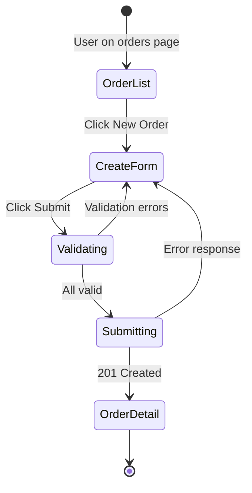

# SAAM Frontend Specification Template

## Purpose

Frontend services require a fundamentally different specification approach than backend services. Backend specs define algorithms and data transformations; frontend specs define user interactions, data bindings, navigation flows, and visual states.

This template produces specs that AI agents can implement into functional UIs without ambiguity. It is used AFTER backend services are implemented (or at least spec'd), because the frontend spec references their APIs.

## When to Use

- Modernizing a legacy UI (WinForms, WebForms, classic MVC views, green-screen terminals)
- Building a new frontend for SAAM-generated backend services
- Creating dashboards, admin panels, or operational UIs

## Brownfield Frontend Mode (Legacy UI Modernization)

When modernizing a system that ALREADY HAS a UI, the agent MUST preserve the existing UX structure. This is NOT "design a new frontend" — it is "re-implement the same frontend in modern tech."

**Principle:** The user already knows how to use the legacy system. The modernized frontend should feel familiar — same screens, same navigation, same workflow — just built with modern technology and backed by the new API.

### What to Preserve from Legacy UI

| Preserve | Why |
|----------|-----|
| Screen/page inventory (which screens exist) | Users expect the same pages |
| Navigation structure (how screens connect) | Users have muscle memory |
| Data layout on each screen (which fields, in what order) | Users scan familiar positions |
| Workflow sequence (what leads to what) | Training cost = zero if same flow |
| Terminology (labels, button text, menu items) | Users recognize their domain language |

### What to Modernize (Do NOT Preserve)

| Modernize | Why |
|-----------|-----|
| Visual style (colors, fonts, spacing) | Make it look current, not legacy |
| Responsive layout | Legacy may be fixed-width |
| Accessibility | Legacy often lacks WCAG compliance |
| Performance (loading, caching) | Modern frameworks handle this better |
| Interaction patterns (inline edit vs. modal, infinite scroll vs. pagination) | Use current UX conventions |
| Technology (WinForms → React, WebForms → Vue, etc.) | That's the point of modernization |

### Brownfield Frontend Spec Protocol

When generating a frontend spec for a legacy system with existing UI:

1. **Read the legacy UI source** — examine screens, forms, layouts from `initial-source/`
2. **Extract the screen inventory** — list every screen/page/form in the legacy system
3. **Map navigation** — how do users move between screens (menus, buttons, links)
4. **Document data layout** — for each screen, what fields are shown where
5. **Identify the API mapping** — which legacy screen maps to which new backend API endpoints
6. **Write the spec** using the standard template below, but with:
   - `02-screen-inventory.md` derived FROM the legacy UI (not invented from scratch)
   - `03-user-flows.md` derived FROM the legacy workflow (not redesigned)
   - `05-interaction-matrix.md` preserving legacy interaction patterns where sensible

### Anti-Pattern: Fresh Design When Brownfield

❌ **FORBIDDEN:** Ignoring the legacy UI and designing screens from scratch based only on API endpoints. This produces a technically correct but unfamiliar UI that requires user retraining.

✅ **REQUIRED:** Start from the legacy screen structure, preserve the navigation and layout, then improve visual design and interaction patterns while maintaining the same user workflow.

## Prerequisites

Before writing a frontend spec:
- [ ] Backend service specs exist (`spec/microservices/<service>/03-api-design.md`)
- [ ] API endpoints are defined with request/response schemas
- [ ] Authentication/authorization model is decided (Phase 2)
- [ ] Target frontend stack is selected (React, Angular, Vue, etc.)

## Specification Structure

Frontend specs live in `spec/frontend/<app-name>/` — always as SEPARATE FILES per section:

```
spec/frontend/<app-name>/
├── 00-overview.md              — App purpose, users, technology
├── 01-api-contract.md          — Full API surface consumed by this frontend
├── 02-screen-inventory.md      — Every screen with data bindings
├── 03-user-flows.md            — State machines for key workflows
├── 04-component-hierarchy.md   — Component tree with props/state
├── 05-interaction-matrix.md    — Every interactive element mapped
├── 06-design-tokens.md         — Visual system (from Figma or manual)
├── 07-frontend-test-plan.md    — E2E test assertions
└── 09-api-client/              — Generated typed API client (Phase 4c Stage 0b — copied verbatim to implementation)
    ├── index.ts                — Barrel export
    ├── client.ts               — Base HTTP client (auth injection, error handling)
    ├── types.ts                — Shared types (from backend DTOs)
    ├── identity.api.ts         — identity-service endpoints
    ├── team.api.ts             — team-service endpoints
    └── ...                     — One file per backend service
```

**Note on `09-api-client/`:** This directory is generated in Phase 4c (Stage 0b) AFTER all backend contracts and DTOs exist. It is the mechanical binding that prevents the frontend from inventing API paths. Phase 5 copies it verbatim into `sourcecode/<app>/src/api/`. See `.github/skills/saam-phase4c-test-suite-generation/SKILL.md` for the generation protocol.

### File Splitting Rule (MANDATORY)

**Each numbered section is ALWAYS a separate file** — never combine them into one document. This is not optional.

Additionally, if any single section exceeds ~300 lines, split it further by domain or screen:

```
spec/frontend/<app-name>/
├── 01-api-contract/
│   ├── INDEX.md                — Summary of all endpoints
│   ├── orders.md               — Order endpoints
│   ├── payments.md             — Payment endpoints
│   └── customers.md            — Customer endpoints
├── 02-screen-inventory/
│   ├── INDEX.md                — Screen map (all screens listed)
│   ├── order-screens.md        — Order List, Order Detail, Create Order
│   ├── payment-screens.md      — Payment screens
│   └── dashboard.md            — Dashboard screen
├── 05-interaction-matrix/
│   ├── INDEX.md                — Summary
│   ├── order-interactions.md   — Order screen interactions
│   └── payment-interactions.md — Payment screen interactions
```

**Why:** Large frontend specs that live in one file overload the agent context. Splitting by domain allows the agent to read ONLY the relevant section when implementing a specific screen or feature, producing higher quality output.

**Threshold:** If the app has > 10 screens or > 20 API endpoints, split into sub-files by default.

---

## 00-overview.md

```markdown
# Frontend Application: <App Name>

## Purpose
<One paragraph: what this app does for users>

## Target Users
| Role | Description | Key Tasks |
|------|-------------|-----------|
| <role> | <who they are> | <what they do in this app> |

## Technology Stack
| Layer | Choice |
|-------|--------|
| Framework | React 18 / Angular 17 / Vue 3 / Next.js |
| Language | TypeScript (strict mode) |
| State Management | Redux Toolkit / Zustand / Pinia / NgRx |
| HTTP Client | Axios / Fetch / Angular HttpClient |
| Styling | Tailwind CSS / CSS Modules / Styled Components |
| Component Library | shadcn/ui / Material UI / PrimeNG / Ant Design |
| Routing | React Router / Angular Router / Vue Router |
| Forms | React Hook Form / Formik / Angular Reactive Forms |
| Testing | Playwright (E2E) + Vitest/Jest (unit) |
| Build | Vite / Webpack / Next.js |

## Backend Services Consumed
| Service | Base URL | Auth | Purpose |
|---------|----------|------|---------|
| <service-name> | /api/v1/<service> | Bearer JWT | <what this frontend uses it for> |

## Figma Reference (if available)
- Design file: <Figma URL or "not available">
- Usage: Visual reference for layout and design tokens only — NOT a generation source for logic

## Out of Scope
- <things this frontend does NOT handle>
```

---

## 01-api-contract.md (CRITICAL FOR AGENT IMPLEMENTATION)

This is the most important section for preventing "functionally insane" frontends. Every API call the frontend makes is documented here with exact request/response shapes.

**CRITICAL DISTINCTION:** This file defines the URLs the FRONTEND calls — NOT the backend service URLs directly. If a gateway/BFF sits between the frontend and backend services, this file documents the GATEWAY paths (what the browser hits), and the routing table maps those to actual backend service endpoints.

```markdown
# API Contract: <App Name>

## Access Pattern (MANDATORY — decide before documenting endpoints)

How does the frontend reach backend services? This decision MUST be made explicitly — it cannot be left ambiguous.

| Pattern | Description | When to Use |
|---------|-------------|-------------|
| **API Gateway** | Single URL, gateway routes by path prefix to backend services | Multiple backend services, production deployment |
| **BFF (Backend-for-Frontend)** | Dedicated aggregation service that calls backends | Complex UI needs aggregated/transformed data |
| **Direct** | Frontend calls each backend service directly (different ports/URLs) | Development only, or single-service apps |

**Selected pattern:** <API Gateway / BFF / Direct>
**Frontend base URL:** `${NEXT_PUBLIC_API_URL}` or `${API_BASE_URL}` — resolves to <gateway URL / BFF URL / service URL>

## Gateway Routing Table (if pattern = API Gateway or BFF)

This table maps frontend-facing paths to backend service endpoints. The frontend ONLY knows about the left column. The gateway handles routing to the right column.

| Frontend Path (what browser calls) | Backend Service | Backend Path (actual endpoint) | Port |
|-------------------------------------|----------------|-------------------------------|------|
| `/api/v1/products/**` | catalog-service | `/api/v1/catalog/products/**` | 3001 |
| `/api/v1/orders/**` | order-service | `/api/v1/orders/**` | 3002 |
| `/api/v1/auth/**` | auth-service | `/api/v1/auth/**` | 3003 |
| `/api/v1/customers/**` | customer-service | `/api/v1/customers/**` | 3004 |

**Rules:**
- The frontend spec (`01-api-contract.md`) documents paths from the LEFT column — those are what the frontend code uses
- Backend `04-api-contract.yaml` documents paths from the RIGHT column — those are what the service implements
- The gateway configuration is an implementation artifact produced in Phase 5 (nginx config, API Gateway routes, etc.)
- If paths differ between frontend and backend (e.g., frontend drops service prefix), this table is the ONLY place that mapping is documented

**If pattern = Direct (no gateway):**
Document the full URL per service:
```
const API_URLS = {
  catalog: 'http://localhost:3001/api/v1/catalog',
  orders: 'http://localhost:3002/api/v1/orders',
  auth: 'http://localhost:3003/api/v1/auth',
};
```

## Authentication
- **Method:** Bearer token (JWT) in Authorization header
- **Token source:** <login endpoint or OAuth flow>
- **Refresh strategy:** <silent refresh / redirect to login>
- **Tenant header:** <if multi-tenant: X-Tenant-Id>

## Endpoints Consumed

### <Functional Group: e.g., Order Management>

#### GET /api/v1/orders
- **Used by screen:** Order List
- **Purpose:** Fetch paginated list of orders
- **Request:**
  ```
  GET /api/v1/orders?page=1&size=20&status=active&sort=createdAt:desc
  Headers: Authorization: Bearer <token>, X-Tenant-Id: <tenant>
  ```
- **Response (200):**
  ```json
  {
    "items": [
      {
        "id": "uuid",
        "orderNumber": "ORD-001",
        "customerName": "Acme Corp",
        "status": "active",
        "total": 1500.00,
        "createdAt": "2025-01-15T10:30:00Z"
      }
    ],
    "pagination": {
      "page": 1,
      "size": 20,
      "totalItems": 143,
      "totalPages": 8
    }
  }
  ```
- **UI Data Mapping:**
  | API Field | UI Element | Display Format |
  |-----------|-----------|----------------|
  | orderNumber | First column | As-is |
  | customerName | Second column | As-is |
  | status | Badge | Capitalize, color-coded (active=green, pending=yellow) |
  | total | Fourth column | Currency format ($1,500.00) |
  | createdAt | Fifth column | Relative time ("2 hours ago") |
- **Error responses:**
  | Status | Meaning | UI Behavior |
  |--------|---------|-------------|
  | 401 | Token expired | Redirect to login |
  | 403 | No access to tenant | Show "Access Denied" page |
  | 500 | Server error | Show toast "Unable to load orders" + retry button |
- **Loading state:** Skeleton rows (5 rows of shimmer animation)
- **Empty state:** "No orders found" with illustration + "Create Order" CTA
- **Pagination:** Infinite scroll OR page numbers (specify which)

#### POST /api/v1/orders
- **Used by screen:** Create Order Form
- **Purpose:** Create a new order
- **Request:**
  ```json
  {
    "customerName": "string (required, max 100)",
    "lineItems": [
      { "productId": "uuid", "quantity": "integer (min 1)", "unitPrice": "decimal" }
    ],
    "notes": "string (optional, max 500)"
  }
  ```
- **Response (201):** `{ "id": "uuid", "orderNumber": "ORD-002", ... }`
- **Validation (client-side, before API call):**
  | Field | Rule | Error Message |
  |-------|------|---------------|
  | customerName | Required, max 100 chars | "Customer name is required" / "Max 100 characters" |
  | lineItems | At least 1 item | "Add at least one line item" |
  | lineItems[].quantity | Integer, min 1 | "Quantity must be at least 1" |
- **Optimistic update:** No — wait for server confirmation
- **Success behavior:** Navigate to Order Detail screen, show toast "Order created"
- **Error behavior:**
  | Status | UI Behavior |
  |--------|-------------|
  | 400 | Show field-level errors from response body |
  | 409 | Show "Duplicate order" alert |
  | 500 | Show toast "Failed to create order" + keep form state |

### <Next Functional Group>
...
```

**Rules for 01-api-contract.md:**
- EVERY endpoint the frontend calls MUST be documented here
- Include exact request/response JSON shapes (not just "returns order object")
- Map EVERY response field to a UI element (table column, form field, badge, etc.)
- Document ALL error responses and what the UI does for each
- Specify loading states, empty states, and error states per endpoint
- Include pagination strategy (infinite scroll, page numbers, cursor-based)
- Document optimistic updates vs. server-confirmed updates

## Contract Binding (MANDATORY — prevents frontend/backend misalignment)

For EVERY endpoint the frontend consumes, this section maps the frontend's expectations to the ACTUAL backend contract (`04-api-contract.yaml`). This is where mismatches are caught BEFORE implementation.

**Generate this section by cross-referencing each frontend endpoint against the backend's `04-api-contract.yaml`.** Any difference = a gap that must be resolved.

### Identifier Binding

For each entity the frontend references by identifier:

| Entity | Frontend uses | Backend contract defines | Resolution |
|--------|--------------|------------------------|------------|
| Product | slug (`product-2`) | UUID (`id: string, format: uuid`) | Backend adds `GET /products?slug=X` OR frontend resolves slug→UUID via lookup |
| Order | orderNumber (`ORD-001`) | UUID | Frontend uses UUID internally, displays orderNumber |
| Customer | email | UUID | Backend adds `GET /customers?email=X` |

**Rule:** If the frontend expects to look up by a field the backend doesn't support as a query parameter, this is a GAP. Resolve it NOW by either:
- (a) Adding the lookup endpoint/param to the backend spec (update `04-api-contract.yaml`)
- (b) Adding a resolution step in the frontend (lookup ID first, then use it)
- (c) Adding the mapping to the BFF/gateway layer

### Query Parameter Binding

For each list/filter endpoint:

| Frontend param | Frontend meaning | Backend param (from contract) | Match? | Resolution |
|---------------|-----------------|------------------------------|--------|------------|
| `count` | Items per page | `pageSize` | NO | Frontend renames to `pageSize` in API client |
| `sortBy=newest` | Sort by creation date desc | Not in contract — no sort param exists | NO | Backend adds `sort` param OR frontend sorts client-side |
| `page` | Page number | `page` | YES | — |
| `status` | Filter by status | `status` | YES | — |

### Response Field Binding

For each response the frontend consumes:

| Frontend expects | Backend provides (from contract schema) | Match? | Resolution |
|-----------------|----------------------------------------|--------|------------|
| `friendlyUrl` | Not in schema | NO | Backend adds field OR frontend constructs from name/slug |
| `price` | `unitPrice` (contract schema) | NO | Frontend maps `unitPrice` → `price` in API client |
| `items[].imageUrl` | `items[].thumbnailUrl` | NO | Frontend maps `thumbnailUrl` → `imageUrl` |
| `pagination.total` | `pagination.totalItems` | NO | Frontend maps field name |
| `id` | `id` (uuid) | YES | — |

### Gap Resolution Summary

After filling the binding tables, compile all gaps:

| # | Gap | Severity | Resolution Chosen | Who |
|---|-----|----------|-------------------|-----|
| 1 | No slug lookup for products | High — frontend can't navigate to product pages | Add `GET /products?slug=X` to backend | Backend spec update |
| 2 | Frontend sends `count`, backend expects `pageSize` | Low — rename in API client | Map in frontend HTTP client | Frontend |
| 3 | `friendlyUrl` not in backend response | Medium — SEO needs it | Add to backend DTO | Backend spec update |
| 4 | No sort parameter | Medium — UI needs sorted results | Add `sort` query param to backend | Backend spec update |

**CRITICAL:** Gaps marked "Backend spec update" MUST be applied to `04-api-contract.yaml` (and `03-api-design.md`) BEFORE implementation begins. The backend comprehensive test suite must also be updated to test the new capability. Do NOT leave these as "will fix during implementation" — that creates the exact misalignment this section prevents.

---

## 02-screen-inventory.md

```markdown
# Screen Inventory: <App Name>

## Screen Map

| # | Screen | Route | Access | Parent | Data Source |
|---|--------|-------|--------|--------|-------------|
| 1 | Login | /login | Public | — | POST /auth/login |
| 2 | Dashboard | / | Authenticated | Layout | GET /api/v1/dashboard/summary |
| 3 | Order List | /orders | Authenticated | Layout | GET /api/v1/orders |
| 4 | Order Detail | /orders/:id | Authenticated | Layout | GET /api/v1/orders/:id |
| 5 | Create Order | /orders/new | Authenticated + role:editor | Layout | POST /api/v1/orders |

## Per-Screen Detail

### Screen 1: Login
- **Route:** /login
- **Layout:** Centered card, no sidebar
- **Data on load:** None
- **User actions:**
  | Action | Trigger | API Call | Success | Failure |
  |--------|---------|----------|---------|---------|
  | Submit credentials | Click "Sign In" | POST /auth/login | Redirect to / | Show error below form |
  | Forgot password | Click link | — | Navigate to /forgot-password | — |
- **States:**
  | State | Visual |
  |-------|--------|
  | Default | Email + password fields, Sign In button |
  | Submitting | Button disabled, spinner |
  | Error | Red text below form: "Invalid credentials" |
- **Responsive:** Stack vertically on mobile, card centered on desktop

### Screen 3: Order List
- **Route:** /orders
- **Layout:** Sidebar + content area
- **Data on load:** GET /api/v1/orders (first page)
- **URL params reflected in state:** ?status=active&page=2&sort=createdAt:desc
- **User actions:**
  | Action | Trigger | API Call | Result |
  |--------|---------|----------|--------|
  | Filter by status | Select dropdown | GET /api/v1/orders?status=<value> | Refresh table |
  | Sort column | Click column header | GET /api/v1/orders?sort=<col>:<dir> | Refresh table |
  | Navigate to detail | Click row | — | Navigate to /orders/:id |
  | Create new | Click "New Order" button | — | Navigate to /orders/new |
  | Delete | Click trash icon → confirm dialog | DELETE /api/v1/orders/:id | Remove row + toast |
- **States:**
  | State | Visual |
  |-------|--------|
  | Loading | Skeleton table (5 rows) |
  | Loaded | Data table with pagination |
  | Empty | Illustration + "No orders yet" + CTA |
  | Error | Error banner + retry button |
  | Filtering | Dimmed table + spinner overlay |
```

---

## 03-user-flows.md

**DERIVATION RULE (MANDATORY):** User flows MUST be derived from backend `07-workflows.md` files — NOT invented independently from screen specs. Every user flow that triggers a multi-step backend operation MUST reference the corresponding backend workflow ID and follow the same sequence.

**ENTITY-STATE RULE (Layer A):** where a flow acts on an entity that has an `### Entity State Model`
(backend `02-domain-model.md`), the flow's available actions at each step MUST respect the entity's
legal transitions — see "Entity-State-Gated Actions" in `05-interaction-matrix.md`. A flow must never
offer an action the entity's current state forbids.

**Input for generation:**
- `spec/microservices/*/07-workflows.md` — backend operation sequences (authoritative)
- `spec/07-cross-service-workflows.md` — cross-service choreographies
- `spec/frontend/<app>/02-screen-inventory.md` — which screens host which operations

**Mapping rule:** For each backend workflow with trigger = API call (user-initiated):
1. Identify which screen hosts the trigger (button, form submit, action menu)
2. Map the backend sequence to UI states (loading, success, error)
3. Document the SAME operation order (not rearranged for "better UX")
4. Reference the workflow ID: `**Backend workflow:** WF-AP-003`

**What the flow ADDS beyond the backend workflow:**
- UI state transitions (loading spinners, disabled buttons, optimistic updates)
- Client-side validation (before hitting the backend)
- Error presentation (which error messages map to which backend failures)
- Navigation (where does the user go after success/failure)
- Multi-step UI wizards (breaking one backend call into multiple UI pages)

```markdown
# User Flows: <App Name>

## Flow 1: Post Invoice

**Backend workflow:** WF-AP-003 (Invoice Posting — AP → GL → Notification)
**Screen:** Invoice Detail (`/invoices/:id`)
**Trigger:** User clicks "Post" button



### Flow Detail

| Step | Screen | User Action | System Response | Next Step |
|------|--------|-------------|-----------------|-----------|
| 1 | Order List | Clicks "New Order" | Navigate to /orders/new | 2 |
| 2 | Create Form | Fills fields | Client-side validation on blur | 3 |
| 3 | Create Form | Clicks "Submit" | Validate all → POST /api/v1/orders | 4 or 5 |
| 4 | Create Form | — | 201: Navigate to /orders/:id, toast "Created" | END |
| 5 | Create Form | — | Error: Show message, keep form state | 2 |

### Error Recovery
- Network timeout: Show "Connection lost" banner, retry button
- 401 during flow: Redirect to login, preserve form state in sessionStorage
- 409 conflict: Show dialog "Order already exists" with option to view existing

## Flow 2: <Next Flow>
...
```

---

## 04-component-hierarchy.md

```markdown
# Component Hierarchy: <App Name>

## Top-Level Structure

```
<App>
├── <AuthProvider>          — JWT token management, refresh logic
├── <TenantProvider>        — Current tenant context
├── <Router>
│   ├── <PublicRoutes>
│   │   └── <LoginPage>
│   └── <ProtectedRoutes>  — Redirects to /login if not authenticated
│       ├── <AppLayout>
│       │   ├── <Sidebar>
│       │   ├── <TopBar>
│       │   └── <ContentArea>
│       │       ├── <DashboardPage>
│       │       ├── <OrderListPage>
│       │       │   ├── <FilterBar>
│       │       │   ├── <DataTable>
│       │       │   │   └── <OrderRow> (per item)
│       │       │   └── <Pagination>
│       │       ├── <OrderDetailPage>
│       │       └── <CreateOrderPage>
│       │           └── <OrderForm>
│       │               ├── <CustomerSelect>
│       │               ├── <LineItemList>
│       │               │   └── <LineItemRow> (repeatable)
│       │               └── <FormActions>
│       └── <NotFoundPage>
└── <ToastContainer>        — Global notification overlay
```

## Shared Components

| Component | Props | State | Used By |
|-----------|-------|-------|---------|
| `<DataTable>` | columns, data, onSort, loading | sortColumn, sortDirection | OrderList, CustomerList |
| `<FilterBar>` | filters[], onFilterChange | activeFilters | OrderList, InvoiceList |
| `<ConfirmDialog>` | title, message, onConfirm, onCancel | isOpen | Delete actions |
| `<LoadingSkeleton>` | rows, columns | — | All list pages |
| `<EmptyState>` | title, description, actionLabel, onAction | — | All list pages |
| `<ErrorBanner>` | message, onRetry | — | All data-fetching pages |

## State Management

| Store/Slice | Data | Updated By | Consumed By |
|-------------|------|-----------|-------------|
| auth | token, user, tenant | login, refresh, logout | All API calls |
| orders | items[], pagination, filters | API responses | OrderList, OrderDetail |
| ui | sidebar collapsed, toasts[] | User actions | Layout, ToastContainer |
```

---

## 05-interaction-matrix.md

```markdown
# Interaction Matrix: <App Name>

Every interactive element is mapped with its trigger, action, feedback, and states.

## Order List Screen

| Element | Trigger | Action | API Call | Success Feedback | Error Feedback | Loading Feedback |
|---------|---------|--------|----------|-----------------|----------------|------------------|
| Status filter dropdown | onChange | Refetch with filter | GET /orders?status=X | Table updates | Toast "Filter failed" | Spinner in dropdown |
| Column header (sortable) | onClick | Refetch with sort | GET /orders?sort=X:Y | Table re-renders | Toast "Sort failed" | Column header spinner |
| Order row | onClick | Navigate | — | Route change | — | — |
| "New Order" button | onClick | Navigate | — | Route change | — | — |
| Delete icon | onClick | Show confirm dialog | — | Dialog opens | — | — |
| Confirm delete button | onClick | Delete order | DELETE /orders/:id | Row removed + toast | Toast "Delete failed" | Button spinner |
| Pagination next | onClick | Fetch next page | GET /orders?page=N+1 | Table updates | Toast "Load failed" | Table skeleton |
| Search input | onDebounce(300ms) | Refetch with search | GET /orders?q=X | Table updates | — | Spinner in input |

## Create Order Screen

| Element | Trigger | Action | API Call | Success Feedback | Error Feedback | Loading Feedback |
|---------|---------|--------|----------|-----------------|----------------|------------------|
| Customer name input | onBlur | Validate | — | Green checkmark | Red border + error text | — |
| "Add Line Item" button | onClick | Add row | — | New empty row appears | — | — |
| "Remove" line item | onClick | Remove row | — | Row removed | — | — |
| "Submit" button | onClick | Validate + submit | POST /orders | Navigate + toast | Inline errors or toast | Button spinner + disabled |
| "Cancel" button | onClick | Confirm + navigate | — | Navigate back | — | — |

## Entity-State-Gated Actions (Layer A — MANDATORY when the entity has a lifecycle)

**DERIVATION RULE:** If the backend `02-domain-model.md` defines an `### Entity State Model` for an
entity this screen shows, the UI MUST gate that entity's actions by its current state. An action whose
backend transition is illegal from the current state MUST be hidden or disabled — never shown as
available and then rejected by a 409/422 (that is a UX defect the state machine lets us prevent).

For each state-changing action on a lifecycle entity, map the states in which it is available:

| Action | Available in states | Hidden/Disabled in states | Backend transition (BR-ID) |
|--------|---------------------|---------------------------|----------------------------|
| Post batch | Validated | Draft (disabled — validate first), Posted/Voided (hidden — terminal) | BR-GL-PST-003 |
| Void batch | Draft, Validated | Posted, Voided (hidden — terminal) | BR-GL-VOID-001 |
| Edit lines | Draft | Validated/Posted/Voided (read-only) | — |

Rules:
- The available/disabled sets MUST match the entity's transitions table exactly (same source of truth).
- Terminal states expose NO state-changing actions (view-only).
- The screen reads the entity's current state from its GET response and derives availability client-side;
  it does NOT hardcode which buttons show — it maps state -> allowed transitions.
```

---

## 06-design-tokens.md

```markdown
# Design Tokens: <App Name>

## Source
- **Figma file:** <URL or "Manual definition">
- **Usage:** Tokens define the visual system. Implementation uses these values, NOT screenshots from Figma.

## Colors
| Token | Value | Usage |
|-------|-------|-------|
| --color-primary | #2563EB | Buttons, links, active states |
| --color-primary-hover | #1D4ED8 | Button hover |
| --color-danger | #DC2626 | Delete actions, error states |
| --color-success | #16A34A | Success toasts, confirmed states |
| --color-warning | #D97706 | Pending badges |
| --color-neutral-50 | #F9FAFB | Page background |
| --color-neutral-900 | #111827 | Primary text |

## Typography
| Token | Value | Usage |
|-------|-------|-------|
| --font-family | Inter, system-ui, sans-serif | All text |
| --font-size-sm | 14px | Table cells, secondary text |
| --font-size-base | 16px | Body text, form labels |
| --font-size-lg | 20px | Section headings |
| --font-size-xl | 28px | Page titles |

## Spacing
| Token | Value | Usage |
|-------|-------|-------|
| --spacing-xs | 4px | Inline element gaps |
| --spacing-sm | 8px | Form field internal padding |
| --spacing-md | 16px | Card padding, section gaps |
| --spacing-lg | 24px | Page margins |
| --spacing-xl | 32px | Section separators |

## Breakpoints
| Name | Value | Layout Change |
|------|-------|---------------|
| mobile | < 768px | Single column, bottom nav |
| tablet | 768-1024px | Collapsed sidebar |
| desktop | > 1024px | Full sidebar + content |

## Component Patterns
| Pattern | Spec |
|---------|------|
| Button height | 40px (default), 32px (compact) |
| Input height | 40px |
| Border radius | 8px (cards), 6px (inputs), 4px (badges) |
| Shadow | 0 1px 3px rgba(0,0,0,0.1) (cards) |
| Table row height | 52px |
```

---

## 07-frontend-test-plan.md

```markdown
# Frontend Test Plan: <App Name>

## E2E Tests (Playwright)

Every user flow from 03-user-flows.md gets at least one E2E test.

### Test Structure
```
e2e/
├── auth.spec.ts        — Login, logout, token refresh
├── orders.spec.ts      — Order CRUD flows
├── navigation.spec.ts  — Route guards, redirects
└── error-states.spec.ts — Network errors, 401/403/500 handling
```

### Test Assertions Per Flow

#### Flow 1: Create Order
| # | Step | Assertion |
|---|------|-----------|
| 1 | Navigate to /orders | Page shows order table or empty state |
| 2 | Click "New Order" | URL changes to /orders/new, form renders |
| 3 | Submit empty form | Validation errors appear on required fields |
| 4 | Fill valid data + submit | POST called, navigates to /orders/:id, toast shows |
| 5 | Verify order in list | Navigate to /orders, new order appears |

#### Flow 2: Error Handling
| # | Step | Assertion |
|---|------|-----------|
| 1 | Mock API 500 | Error banner shows with retry button |
| 2 | Click retry | API called again |
| 3 | Mock API 401 | Redirect to /login |

## Unit Tests (Vitest/Jest)

| Component | Tests |
|-----------|-------|
| `<DataTable>` | Renders columns, sorts on header click, shows loading skeleton |
| `<FilterBar>` | Emits filter changes, reflects active filters |
| `<OrderForm>` | Validates required fields, submits valid data, shows errors |
| `useOrders()` hook | Fetches on mount, handles pagination, handles errors |

## Accessibility Tests
- [ ] All form inputs have associated labels
- [ ] Focus order follows visual order
- [ ] Color contrast meets WCAG AA (4.5:1 for text)
- [ ] All interactive elements reachable via keyboard
- [ ] Screen reader announces dynamic content changes (toasts, errors)
```

---

## Figma Integration Guidelines

When Figma MCP is available:

**DO use Figma for:**
- Design tokens (colors, typography, spacing) → populate 06-design-tokens.md
- Component visual reference (what a card looks like, not what it does)
- Layout structure (sidebar width, content area proportions)
- Icon set identification

**DO NOT use Figma for:**
- Logic (what happens when user clicks X)
- Data flow (which API feeds which component)
- State management (what data lives where)
- Error/loading/empty states (often not in Figma designs)
- Validation rules (business logic, not visual)

**Bridge pattern:** Extract visual tokens from Figma, combine with functional spec from this template. The spec drives implementation; Figma drives styling.

---

## Generation Protocol

When producing a frontend spec:

1. Read ALL backend API specs first (`spec/microservices/*/03-api-design.md`)
2. Identify which endpoints this frontend consumes
3. Write `01-api-contract.md` — map every endpoint with request/response/UI-mapping/error-handling
4. Write `02-screen-inventory.md` — list every screen with its data sources
5. Write `03-user-flows.md` — state machines for the top 5-10 workflows
6. Write `04-component-hierarchy.md` — component tree with props and state
7. Write `05-interaction-matrix.md` — every clickable/editable element mapped
8. Write `06-design-tokens.md` — from Figma or manual definition
9. Write `07-frontend-test-plan.md` — E2E test assertions per flow

**Quality check:** Could an agent implement a functional (not just visual) frontend from this spec without asking questions? If any screen has a user action without a defined outcome, the spec is incomplete.

---

## Anti-Patterns (FORBIDDEN in Frontend Specs)

- "Displays order data" without specifying WHICH fields, in WHAT format, from WHICH endpoint
- "User can manage orders" without defining every action (create, edit, delete, filter, sort, export)
- "Shows error state" without defining WHICH errors, from WHERE, with WHAT recovery options
- Listing screens without data bindings (which API populates this screen?)
- Omitting loading states ("assume instant loads" — networks are never instant)
- Omitting empty states ("assume data always exists" — first-time users see empty)
- Referencing Figma as the sole implementation guide ("see Figma for details" is NOT a spec)
- Defining only happy paths without error/edge cases
- **Using backend service URLs directly as frontend API paths** — if the backend contract says `/api/v1/catalog/products` (catalog-service:3001), the frontend does NOT call that URL. The frontend calls the GATEWAY path (e.g., `/api/v1/products`). The routing table in `01-api-contract.md` maps between them. Without this mapping, the frontend will call URLs that don't exist at the gateway.
- **Omitting the Access Pattern / Gateway Routing Table** — every frontend spec MUST declare how it reaches backends (gateway/BFF/direct) and include the path mapping table. Without it, the implementation agent will generate HTTP client code pointing at non-existent URLs.
