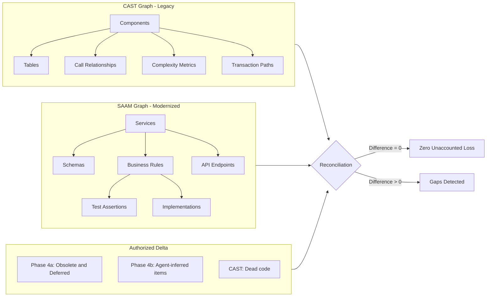

# SAAM Graph Validation Subsystem

## Purpose

The SAAM Knowledge Graph has two layers:

1. **Core Graph (always active)** — Lifecycle tracking, confidence scoring, context construction, impact analysis, inference. Available in ALL SAAM projects regardless of CAST.
2. **CAST Validation Layer (this file)** — Compares the modernized graph against the CAST Imaging legacy graph to detect unaccounted business logic loss. Only available when CAST is configured.

This steering file documents the **CAST Validation Layer** specifically — the reconciliation queries that compare what was built against what existed in legacy.

For the Core Graph features (lifecycle, confidence, context), see `saam-graph-context.md`.

## Activation Condition (CAST Validation Layer Only)

The CAST reconciliation tools are ONLY available when:
- CAST Imaging MCP is configured for the project (verified during Phase 0)
- The legacy application has been analyzed in CAST
- `SourceComponent` nodes have been populated in the graph from CAST data
- The agent can query CAST for components, call graphs, and data access patterns

**If CAST is not configured:** The CAST reconciliation tools (`graph_extraction_coverage`, `graph_unaccounted_loss`, `graph_call_pattern_preservation`, `graph_reconciliation_report`) are not available. The Core Graph (lifecycle tracking, confidence, context) still works fully — it just can't compare against legacy structural data.

**What you lose without CAST:** The "zero unaccounted loss" guarantee. Without CAST, you rely on heuristic extraction coverage (expected yield per LOC) and comprehensive test suites. With CAST, you get structural proof that every legacy component with business logic is accounted for.

## Core Concept: Two Graphs, One Reconciliation



## SAAM Graph Schema

### Nodes

| Node Type | Source | Created During | Properties |
|-----------|--------|---------------|------------|
| `SourceComponent` | CAST MCP query | Phase 1 | `castId`, `name`, `type`, `complexity`, `loc`, `module` |
| `BusinessRule` | Phase 1/4 extraction | Phase 1, Phase 4 | `brId`, `statement`, `intent`, `confidence`, `sourceRef` |
| `Service` | Phase 2 design | Phase 2 | `serviceId`, `name`, `port`, `priority` |
| `Table` | Phase 4 domain model | Phase 4 | `name`, `columns[]`, `service` |
| `Endpoint` | Phase 4 API contract | Phase 4 | `path`, `method`, `statusCodes[]`, `service` |
| `Field` | Phase 4 API contract | Phase 4 | `name`, `type`, `schema`, `endpoint` |
| `TestAssertion` | Phase 4c test suite | Phase 4c | `testNum`, `brId`, `endpoint`, `expectedStatus` |
| `Implementation` | Phase 5 code | Phase 5 | `className`, `methodName`, `brIds[]`, `service` |
| `Deviation` | Phase 5 deviation log | Phase 5/6 | `id`, `type`, `service`, `description`, `status` |
| `Decision` | Phase 4a BA review | Phase 4a | `brId`, `classification`, `weight`, `rationale` |

### Edges

| Edge | From | To | Meaning |
|------|------|----|---------|
| `extractedFrom` | BusinessRule | SourceComponent | This rule was found in this CAST component |
| `assignedTo` | BusinessRule | Service | Phase 3 convergence assigned this rule here |
| `implementedBy` | BusinessRule | Implementation | Code exists for this rule |
| `testedBy` | BusinessRule | TestAssertion | A test validates this rule |
| `owns` | Service | Table | Service owns this data |
| `exposes` | Service | Endpoint | Service serves this API |
| `calls` | Service | Service | Cross-service dependency |
| `mapsTo` | Table.Column | Field | DDL column maps to API contract field |
| `deviatesFrom` | Deviation | BusinessRule | Implementation deviates from this rule |
| `decidedAs` | Decision | BusinessRule | BA classified this rule |
| `castCallsTo` | SourceComponent | SourceComponent | CAST call relationship (legacy) |
| `castAccesses` | SourceComponent | Table | CAST data access (legacy) |

## Graph Generation Protocol

The SAAM graph is built incrementally as phases execute. It is stored in Neo4j (accessed via the `saam-graph` MCP server). The agent uses `graph_add_node`, `graph_add_edge`, and `graph_bulk_import` tools to populate the graph — never writes to a JSON file directly.

### Phase 1: Populate Source Components

After Phase 1 extraction, for each segment:
1. Query CAST for all components in the segment: `castId`, `name`, `type`, `complexity`, `loc`
2. Query CAST for call relationships between components
3. Query CAST for data access patterns (component → table, CRUD type)
4. Create `SourceComponent` nodes with `castCallsTo` and `castAccesses` edges
5. For each BR-ID extracted: create `BusinessRule` node + `extractedFrom` edge to the CAST component

### Phase 3: Populate Services and Assignments

After Phase 3 convergence:
1. Create `Service` nodes from the service catalog
2. For each BR-ID → service assignment: create `assignedTo` edge
3. Verify: every `BusinessRule` node has exactly one `assignedTo` edge (convergence guarantee)

### Phase 4: Populate Contracts and Models

After Phase 4 specification generation:
1. Create `Table` nodes from `02-domain-model.md` DDL
2. Create `Endpoint` nodes from `04-api-contract.yaml`
3. Create `Field` nodes from contract schemas
4. Create `mapsTo` edges (DDL column → contract field)
5. Create `owns` and `exposes` edges from Service → Table/Endpoint

### Phase 4a: Populate Decisions

After Phase 4a BA validation:
1. For each rule with a classification: create `Decision` node + `decidedAs` edge
2. Rules classified as Obsolete or Deferred become part of the "authorized delta"

### Phase 4c: Populate Test Assertions

After Phase 4c test generation:
1. For each test assertion: create `TestAssertion` node + `testedBy` edge from the BR-ID

### Phase 5: Populate Implementations and Deviations

During Phase 5 implementation:
1. For each BR-ID implemented: create `Implementation` node + `implementedBy` edge
2. For each deviation logged: create `Deviation` node + `deviatesFrom` edge

## Reconciliation Queries

### The denominator rule (READ THIS FIRST — it is what makes the guarantee real)

Every query below counts `SourceComponent` nodes. The guarantee is only valid if those nodes are the
**full CAST business inventory**, not the subset SAAM happened to extract a rule from. Therefore:

> **Phase 1 (CAST/Hybrid) MUST create a `SourceComponent` node for EVERY business-layer CAST component
> up front (`extracted=false`), BEFORE extraction** — see `saam-phase1-bottom-up.md` Step 0. A component
> that is never walked then still exists as a node with no `EXTRACTED_FROM` edge, so the queries can SEE
> it as a gap. If nodes are created only during extraction (one per component walked), the denominator
> collapses to the ingested subset and coverage falsely reports ~100% while the majority of the legacy is
> silently missing. This was a real historical bug: the tools are documented as "compare SAAM graph
> against CAST graph" but, without full-inventory ingestion, they compared the SAAM graph against ITSELF.

`businessLayer=false` components (infra, utility, getters, reports, framework, lookup/tax-table variants
that carry no distinct business logic) are excluded from the denominator so the guarantee does not
cry wolf on non-business code.

### Query 1: Extraction Coverage

**Question:** Are there CAST business-layer components that have NO BR-IDs extracted from them?

```
UNEXTRACTED =
  SourceComponent nodes WHERE businessLayer <> false
  AND NOT EXISTS (BusinessRule -[EXTRACTED_FROM]-> this component)
  AND NOT marked as dead code in CAST
DENOMINATOR = all SourceComponent WHERE businessLayer <> false AND not dead code   # the FULL inventory
```

**Interpretation:**
- Count = 0 → Full extraction coverage (against the full business inventory)
- Count > 0 → Business-layer components were missed during Phase 1/4
- **Denominator ≈ extracted-BR count → RED FLAG:** the full inventory was NOT ingested; the number is
  meaningless (see the denominator rule above). A "100%" here is FALSE until Step 0 ran.

**Read the coverage SHAPE, not just the number.** `graph_unaccounted_loss` breaks coverage down by
`intentCategory`. High `post` coverage with near-zero `entry`/`derive`/`distribute` is the classic
posting-bias miss — the posting spine captured, the body of entry/calculation/cross-module-fan-out logic
missed. That shape is a gap even if the headline percentage looks moderate.

**When to run:** At Phase 1 exit (catch misses before specs are built on the hole) AND after Phase 4.

### Query 2: Assignment Coverage

**Question:** Are there extracted BR-IDs that are not assigned to any target service?

```
ORPHANED = 
  BusinessRule nodes
  WHERE NOT EXISTS (this -[assignedTo]-> Service)
```

**Interpretation:**
- Count = 0 → Full convergence
- Count > 0 → Rules exist in specs but have no service home (Phase 3 gap)

**When to run:** After Phase 3

### Query 3: Implementation Coverage

**Question:** Are there Active/Core BR-IDs that have no passing test?

```
UNIMPLEMENTED = 
  BusinessRule nodes
  WHERE decision.classification IN ('Core', 'Active')
  AND NOT EXISTS (this -[testedBy]-> TestAssertion WHERE assertion.status = 'PASS')
```

**Interpretation:**
- Count = 0 → Full implementation with validation
- Count > 0 → Business rules are specified but not verifiably implemented

**When to run:** After Phase 5 (all services validated)

### Query 4: Unaccounted Loss (THE MASTER QUERY)

**Question:** Is there ANY business logic in the legacy system that is neither extracted+implemented NOR explicitly excluded?

```
UNACCOUNTED_LOSS =
  SourceComponent nodes WHERE businessLayer <> false AND not dead code
  MINUS components where ALL associated BR-IDs have:
    - (implementedBy / CLAIMS_IMPLEMENTATION edge) — implemented
    OR (decision.classification = 'Obsolete') — explicitly dropped
    OR (decision.classification = 'Deferred') — explicitly postponed
  ALSO UNACCOUNTED: any business-layer component with NO BusinessRule extracted at all
    (never walked — the dominant miss class the full-inventory denominator now exposes)
DENOMINATOR = all SourceComponent WHERE businessLayer <> false AND not dead code   # the FULL inventory
```

**Interpretation:**
- Count = 0 → **Zero unaccounted loss** — against the FULL business inventory, every component is either
  extracted+built or explicitly excluded by human decision. This is the guarantee, and it now means what
  it says (previously it measured only the ingested subset).
- Count > 0 → business logic is missing and nobody decided to exclude it.
- **Empty denominator → the reading is FALSE, not "clean."** If no full inventory was ingested, the query
  compares against an empty set. The tool prints a WARNING in this case — do NOT read it as zero loss.

**When to run:** At Phase 1 exit (against the ingested full inventory), after Phase 5 completion, and periodically during Phase 6.

**Where this BLOCKS depends on the phase — do NOT demand full extraction at P1.** P1 is a SURFACE sweep;
the deep extraction that produces the majority of rules is P4 (typically 2-3x the P1 count). At P1, low
coverage against the full inventory is EXPECTED and correct — the full unaccounted-loss guarantee is NOT
satisfiable at P1 and must not block it.
- **At Phase 1 exit:** run Query 1/4 for HONESTY and SHAPE, not height — confirm the denominator is real
  (not the ingested subset) and that the surface sweep didn't systematically skip a whole area (zero
  components touched in a major domain, or a `util`-inflated shape hiding business logic). What blocks P1
  is an un-dispositioned surface finding, not un-extracted depth. A low accountability % is normal.
- **After Phase 4/5:** the FULL unaccounted-loss guarantee is enforced — every business component must be
  extracted+implemented OR explicitly excluded (`businessLayer=false` on positive evidence, or an
  Obsolete/Deferred decision). THIS is where a full (assurance) run blocks on silent unaccounted business
  logic, against the same denominator P1 established.
- **PILOT:** the operator MAY accept a known thin slice at either gate — eyes-open, seeing the coverage
  shape, as a recorded decision. Never a silent pass. The distinction is deliberate: a pilot is chosen
  thinness; a full run with silent unaccounted loss (after P4/P5) violates the guarantee.

### Query 5: Call Pattern Preservation

**Question:** Does the modernized system preserve the call relationships from the legacy system?

```
For each CAST call relationship (ComponentA → ComponentB):
  1. Find BR-IDs extracted from ComponentA → assigned to ServiceX
  2. Find BR-IDs extracted from ComponentB → assigned to ServiceY
  3. If ServiceX != ServiceY: does ServiceX -[calls]-> ServiceY exist?
  4. If not: is the call relationship covered by an event (async) instead?
```

**Interpretation:**
- All legacy call paths are preserved (sync or async) in the modernized system
- Missing paths indicate lost integration (service A used to call logic in service B, but that call was lost in the boundary split)

**When to run:** After Phase 5

### Query 6: Data Access Preservation

**Question:** Does every table that was accessed (CRUD) by legacy components have equivalent access in the modernized services?

```
For each CAST data access (Component → Table, operation):
  1. Find the BR-IDs from that component
  2. Find the service those BR-IDs are assigned to
  3. Does that service's domain model include that table (or its equivalent)?
  4. Does the implementation have repository methods matching the operation type?
```

**Interpretation:**
- Identifies tables that legacy accessed but modernized services don't — potential data loss
- Especially important for WRITE operations (table was updated by legacy but no modern service writes to it)

**When to run:** After Phase 5

## Phase Gate Checkpoints

| Phase Gate | Reconciliation Run | Catches |
|------------|-------------------|---------|
| Phase 1 Step 0 | Full-inventory ingestion (all business components as SourceComponent, `extracted=false`) | Establishes the correct denominator BEFORE extraction |
| **At Phase 1 exit** | **Query 1 + Query 4 (against full inventory) + coverage shape** | **Denominator HONESTY + SHAPE (systematically-skipped area, `util`-inflation) — NOT an everything-extracted gate. Low coverage is expected at P1; full unaccounted-loss block is at P4/P5.** |
| After Phase 3 | Query 2 (assignment coverage) | Orphaned rules |
| After Phase 4a | Authorized delta snapshot | Records what was intentionally excluded |
| After Phase 5 | Queries 3, 4, 5, 6 (full reconciliation) | Implementation gaps, lost integrations, data access gaps |
| Phase 6 (ongoing) | Query 4 (unaccounted loss) on each iteration | Drift detection |

**Query 1/4 moved to Phase 1 exit (was: after Phase 4).** Catching unaccounted components before Phase 4
generates specs means the gap is re-extracted before anything is built on the assumption it doesn't
exist — not discovered after implementation.

## Report Format

After each reconciliation run, produce `assessment/graph-validation-report.md`:

```markdown
# SAAM Graph Validation Report

**Generated:** <date>
**CAST Application:** <name>
**Reconciliation scope:** Phases 0-<N> complete

## Summary

| Metric | Value | Target |
|--------|-------|--------|
| CAST components with business logic | <N> | — |
| BR-IDs extracted | <N> | — |
| Extraction coverage | <X>% | 100% |
| Assignment coverage | <X>% | 100% |
| Implementation coverage | <X>% | 100% |
| Unaccounted loss | <N> components | 0 |
| Call pattern preservation | <X>% | 100% |
| Data access preservation | <X>% | 100% |

## Authorized Delta (Intentional Exclusions)

| Category | Count | Rationale |
|----------|-------|-----------|
| Phase 4a Obsolete | <N> | BA decided: no longer needed |
| Phase 4a Deferred | <N> | Valid but postponed to later phase |
| CAST Dead Code | <N> | Unreachable — confirmed by CAST analysis |
| Phase 4b Agent-Inferred | <N> | Not SME-validated (flagged) |
| **Total authorized delta** | **<N>** | |

## Unaccounted Gaps (Requires Investigation)

| # | CAST Component | Complexity | Module | Issue | Severity |
|---|---------------|------------|--------|-------|----------|
| 1 | <name> | <N> | <module> | No BR-IDs extracted | High |
| 2 | <name> | <N> | <module> | BR-ID exists but not implemented | Medium |
| ... | | | | | |

## Lost Integrations (Call Patterns Not Preserved)

| Legacy Call | From Service | To Service | Status |
|------------|-------------|-----------|--------|
| CompA → CompB | ServiceX | ServiceY | No edge exists — MISSING |
| CompC → CompD | ServiceX | ServiceX | Internal — OK |

## Recommendations

1. <For each unaccounted gap: investigate and either extract/implement or explicitly exclude>
2. <For lost integrations: add cross-service call or event>
3. <For data access gaps: verify service owns the data or explicitly exclude>
```

## Graph Storage and Tooling

The SAAM Knowledge Graph is stored in Neo4j (Community Edition, running as a Podman container) and accessed via the `saam-graph` MCP server. The agent never manipulates the graph directly — it uses MCP tools.

### Infrastructure

```
graph-mcp/
├── compose.yaml          # Neo4j 5 Community container
├── pyproject.toml              # Python MCP server package
├── saam-graph-schema.yaml      # Formal schema definition
├── scripts/
│   ├── init_schema.py          # Schema initialization (constraints + indexes)
│   └── init_schema.cypher      # Equivalent raw Cypher
└── src/saam_graph/
    ├── server.py               # MCP server entry point
    ├── db.py                   # Neo4j connection manager
    └── tools/
        ├── mutations.py        # graph_add_node, graph_add_edge, graph_update_node, graph_bulk_import
        ├── queries.py          # graph_query_nodes, graph_traverse, graph_impact_analysis, graph_cypher
        ├── reconciliation.py   # graph_extraction_coverage, graph_unaccounted_loss, etc.
        ├── inference.py        # graph_run_inferences, graph_propagate_confidence
        └── context.py          # graph_implementation_context, graph_fix_context, graph_phase_status
```

### MCP Server Configuration

Add to `.kiro/settings/mcp.json` (created automatically by the enablement skill when CAST is configured):

```json
{
  "saam-graph": {
    "command": "uv",
    "args": ["--directory", "graph-mcp", "run", "saam-graph"],
    "env": {
      "NEO4J_URI": "bolt://localhost:7687",
      "NEO4J_USER": "neo4j",
      "NEO4J_PASSWORD": "saamgraph"
    },
    "disabled": false
  }
}
```

### Available MCP Tools

| Category | Tools | Use When |
|----------|-------|----------|
| **Mutations** | `graph_add_node`, `graph_add_edge`, `graph_update_node`, `graph_bulk_import` | Populating graph during each phase |
| **Queries** | `graph_query_nodes`, `graph_traverse`, `graph_impact_analysis`, `graph_cypher` | Exploring relationships, finding dependencies |
| **Reconciliation** | `graph_extraction_coverage`, `graph_assignment_coverage`, `graph_implementation_coverage`, `graph_unaccounted_loss`, `graph_call_pattern_preservation`, `graph_reconciliation_report` | Phase gate validation |
| **Inference** | `graph_run_inferences`, `graph_propagate_confidence`, `graph_detect_unused_tables` | After data changes — recalculate derived knowledge |
| **Context** | `graph_implementation_context`, `graph_fix_context`, `graph_phase_status` | Before implementation/fix work — get targeted context |

### How the Agent Uses These Tools

**During phase execution (populating the graph):**
```
After extracting BR-IDs → graph_bulk_import (nodes: BusinessRule[], edges: EXTRACTED_FROM[])
After defining services → graph_bulk_import (nodes: Service[], edges: ASSIGNED_TO[])
After generating contracts → graph_bulk_import (nodes: Endpoint[], Field[], edges: EXPOSES[], MAPS_TO[])
After test generation → graph_bulk_import (nodes: TestAssertion[], edges: TESTED_BY[])
After implementation → graph_add_node (Implementation) + graph_add_edge (CLAIMS_IMPLEMENTATION)
After validation → graph_add_node (Deviation) + graph_add_edge (DEVIATES_FROM)
```

**At phase gates (validation):**
```
graph_reconciliation_report(phase="phase-5")  → runs all relevant queries, produces report
```

**Before implementation (context construction):**
```
graph_implementation_context(serviceId="MS-01")  → replaces reading 4 spec files
graph_fix_context(deviationId="CAT-04")          → replaces investigating across files
```

**After changes (inference):**
```
graph_run_inferences()           → recalculates completeness, coverage, risks
graph_propagate_confidence()     → updates confidence scores
```

## Integration with Existing SAAM Phases

This subsystem does NOT change the SAAM phase workflow. It adds validation checkpoints that run AFTER each phase gate:

- Phase steering files remain unchanged
- Graph generation is an ADDITIONAL step at each phase gate (not a replacement)
- If graph validation fails (unaccounted loss > 0), it produces a report AND, on a FULL (assurance) run, BLOCKS the phase gate until each unaccounted component is human-resolved (re-extract, or explicitly exclude via `businessLayer=false` / an Obsolete/Deferred decision). On a PILOT run the operator MAY accept the gap — but as a recorded, eyes-open decision seeing the coverage shape, never a silent pass. A guarantee that never blocks is not a guarantee.
- The graph can be regenerated at any time from existing artifacts (specs, contracts, tracking files)

## CAST MCP Queries Used

The subsystem queries CAST Imaging MCP at reconciliation time:

```
# All components with complexity metrics
applications → stats → complexity per component

# Call relationships
transactions → transaction_details → call paths

# Data access
data_graphs → data_graph_details → component → table (CRUD)

# Dead code
objects → object_details → unreachable flag

# Module boundaries
packages → components per package
```

These queries are the SAME ones used during Phase 1 analysis — no additional CAST configuration needed.
