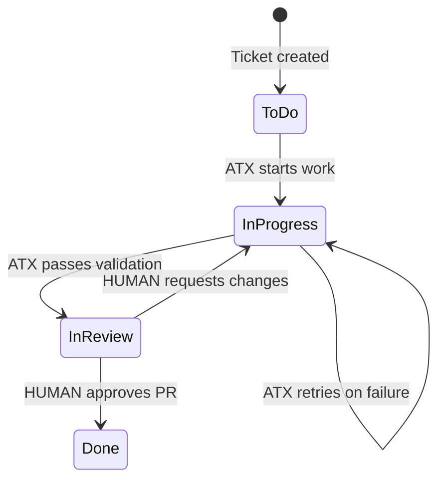
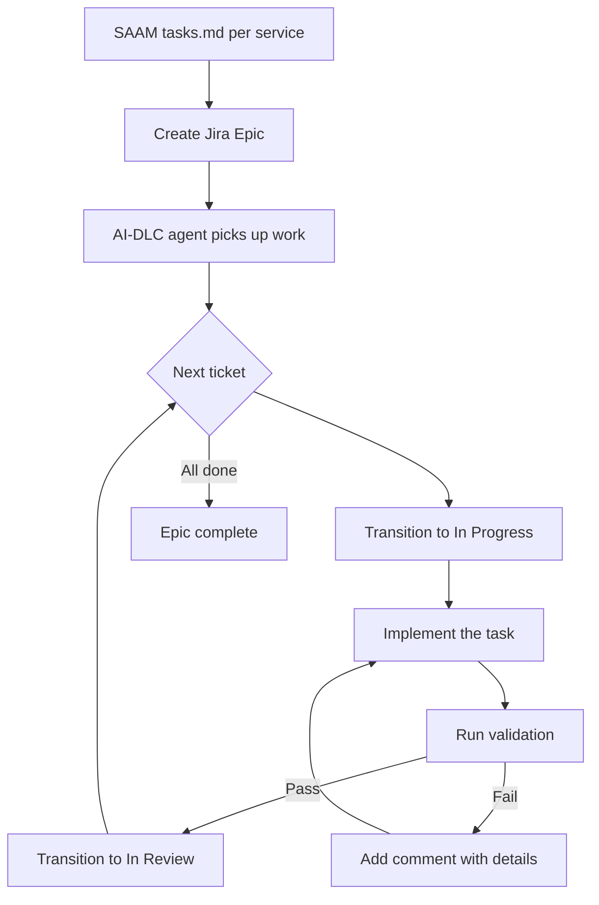

# SAAM: Jira Integration (Optional)

## Overview

SAAM optionally integrates with Jira to track implementation progress. When enabled, SAAM creates epics and tickets from `tasks.md` for each service, and the AI-DLC agent (Kiro or AWS Transform) transitions ticket statuses as work progresses.

This integration uses [sooperset/mcp-atlassian](https://github.com/sooperset/mcp-atlassian) — a community MCP server supporting Jira Cloud and Server/Data Center with 72+ tools.

## Prerequisites

- Jira Cloud or Server/Data Center (v8.14+)
- API token from [Atlassian Account Settings](https://id.atlassian.com/manage-profile/security/api-tokens) (Cloud) or Personal Access Token (Server/DC)
- Python `uv`/`uvx` installed
- A Jira project created for the modernization engagement

## Configuration

### Kiro MCP Config (`.kiro/settings/mcp.json`)

Add the `mcp-atlassian` server to enable Jira tools in Kiro:

```json
{
  "mcpServers": {
    "atlassian": {
      "command": "uvx",
      "args": ["mcp-atlassian"],
      "env": {
        "JIRA_URL": "https://your-company.atlassian.net",
        "JIRA_USERNAME": "your.email@company.com",
        "JIRA_API_TOKEN": "your_api_token"
      },
      "disabled": false,
      "autoApprove": [
        "jira_search",
        "jira_get_issue",
        "jira_create_issue",
        "jira_update_issue",
        "jira_transition_issue",
        "jira_get_transitions"
      ]
    }
  }
}
```

For Server/Data Center, use `JIRA_PERSONAL_TOKEN` instead of `JIRA_USERNAME` + `JIRA_API_TOKEN`.

### AWS Transform MCP Config (`~/.aws/atx/mcp.json`)

To enable Jira tracking during AWS Transform execution:

```json
{
  "mcpServers": {
    "atlassian": {
      "command": "uvx",
      "args": ["mcp-atlassian"],
      "env": {
        "JIRA_URL": "https://your-company.atlassian.net",
        "JIRA_USERNAME": "your.email@company.com",
        "JIRA_API_TOKEN": "your_api_token"
      }
    }
  }
}
```

## Workflow

### Jira Ticket Status Flow



**Key rule:** ATX can only move tickets forward to "In Review". Only a human can transition to "Done" after validating the pull request.



## SAAM-to-Jira Mapping

| SAAM Concept | Jira Issue Type | Notes |
|---|---|---|
| Service (from service catalog) | Epic | One epic per target microservice |
| Task group (from tasks.md) | Story | Groups of related implementation steps |
| Sub-task (from tasks.md) | Sub-task | Individual implementation units |
| Task dependency | Issue Link (blocks/is blocked by) | Preserves execution order |
| BR-ID references | Labels + description | Traceability to business rules |
| Service priority | Epic priority | Maps from service catalog priority 1/2/3 |

## Pre-flight: Creating Jira Tickets from tasks.md

Before implementation begins, the agent (Kiro or ATX) creates the Jira structure:

### Step 1: Create the Service Epic

```
jira_create_issue:
  project: <PROJECT_KEY>
  issueType: Epic
  summary: "[SAAM] <Service Name> Implementation"
  description: |
    SAAM microservice implementation for <Service Name>.
    Spec: spec/microservices/<service-name>.md
    Test suite: validation/<service-name>/comprehensive-test-suite.sh
    Business rules: BR-<DOM>-001 through BR-<DOM>-NNN
  priority: <mapped from service priority>
  labels: ["saam", "ai-dlc", "<service-id>"]
```

### Step 2: Create Task Tickets

For each task in `tasks.md`:

```
jira_create_issue:
  project: <PROJECT_KEY>
  issueType: Story (or Sub-task if child of a group)
  summary: "<Task title from tasks.md>"
  description: |
    <Task description>
    
    Acceptance criteria:
    <Sub-tasks / criteria from tasks.md>
    
    Business rules covered: <BR-IDs>
    Source references: <from spec>
  parent: <Epic key> (or Story key for sub-tasks)
  labels: ["saam", "<service-id>"]
```

### Step 3: Create Dependency Links

For each task dependency:

```
jira_link_issues:
  inwardIssue: <blocked ticket>
  outwardIssue: <blocking ticket>
  linkType: "Blocks"
```

## During Implementation: Status Tracking

The AI-DLC agent follows this protocol during execution:

### When starting a task:
1. Query Jira for the next unblocked ticket: `jira_search` with JQL `project = X AND status = "To Do" AND issueLinks NOT IN blockedBy(status NOT IN (Done, "In Review"))`
2. Transition to "In Progress": `jira_transition_issue`

### When a task succeeds:
1. Transition to "In Review": `jira_transition_issue`
2. Add completion comment: `jira_add_comment` with summary of what was implemented and a link to the pull request
3. The ticket stays in "In Review" until a human reviews the PR and transitions to "Done"

### When a task fails:
1. Add comment with failure details: `jira_add_comment` with test output / error
2. Keep status as "In Progress"
3. Retry implementation

### When all tasks complete:
1. Verify epic has no remaining tickets in "To Do" or "In Progress"
2. Run full `comprehensive-test-suite.sh`
3. If 100% pass: transition Epic to "In Review" — human approves the final state
4. Only a human can transition the Epic to "Done" after validating all PRs

## AWS Transform Skill for Jira Tracking

Create the following ATX client-side skill to enable Jira-aware execution:

**Location:** `~/.aws/atx/skills/jira-task-tracker/SKILL.md`

```markdown
---
name: jira-task-tracker
description: Track implementation progress in Jira during SAAM microservice transformations
---

# Jira Task Tracker

## When to Use
During any SAAM microservice implementation transformation.

## Process

1. At the start of transformation, query Jira for the service epic:
   - Use jira_search with JQL: `project = "<PROJECT>" AND issuetype = Epic AND labels = "saam" AND summary ~ "<service-name>"`
   - Get all child tickets of the epic

2. For each ticket in dependency order (respect "Blocks" links):
   a. Transition ticket to "In Progress"
   b. Read the ticket description for implementation requirements
   c. Implement what the ticket describes
   d. Run the comprehensive test suite
   e. If tests pass for this scope: transition to "In Review", add comment with PR link
   f. If tests fail: add comment with failure output, retry

3. After all tickets are in "In Review" or "Done":
   - Run the full comprehensive-test-suite.sh
   - If 100% pass: transition Epic to "In Review" — only a human moves to "Done"
   - If failures remain: leave Epic in progress, add comment listing failures

## Rules
- NEVER skip a ticket — all must be implemented
- NEVER transition to "Done" — only humans do that after PR review. Maximum ATX status is "In Review"
- ALWAYS add a comment when transitioning (what was done or what failed)
- RESPECT dependency links — do not start blocked tickets
```

## JQL Queries for SAAM

Useful JQL patterns for tracking SAAM progress:

```
# All SAAM tickets for a project
labels = "saam" AND project = "PROJ"

# Open work for a specific service
labels = "saam" AND labels = "ms-01" AND status != Done

# Blocked tickets (dependency not met)
labels = "saam" AND issueLinks IN blockedBy(status != Done)

# Ready to work (unblocked, not started)
labels = "saam" AND status = "To Do" AND NOT issueLinks IN blockedBy(status != Done)

# Implementation progress per epic
issuetype = Epic AND labels = "saam" ORDER BY priority
```

## Enablement in SAAM Bootstrap

The SAAM enablement skill should ask whether to configure Jira integration during project setup. If yes:

1. Request Jira URL, username, and API token
2. Request Jira project key for the engagement
3. Add `mcp-atlassian` to `.kiro/settings/mcp.json`
4. Create `~/.aws/atx/skills/jira-task-tracker/SKILL.md` (if ATX is used)
5. Store project key in a config file for reuse

## Constraints

- Jira integration is OPTIONAL — SAAM works without it
- If Jira is not configured, tasks.md remains the source of truth for progress
- The agent must never block on Jira failures — if Jira is unreachable, implementation continues and status updates are retried later
- No sensitive data (API keys, tokens) in committed files — use environment variables only

## Comprehensive Guide: Adding Jira Integration to AWS Transform

This section provides step-by-step instructions for configuring AWS Transform custom (`atx`) to track implementation tasks through Jira.

### Step 1: Install Prerequisites

```bash
# Install AWS Transform CLI
curl -fsSL https://transform-cli.awsstatic.com/install.sh | bash
atx --version

# Verify uvx is available (for mcp-atlassian)
uvx --version

# Verify Jira connectivity
curl -s -u "your.email@company.com:your_api_token" \
  "https://your-company.atlassian.net/rest/api/3/myself" | head -c 200
```

### Step 2: Configure MCP Server for ATX

Create or edit `~/.aws/atx/mcp.json`:

```json
{
  "mcpServers": {
    "atlassian": {
      "command": "uvx",
      "args": ["mcp-atlassian"],
      "env": {
        "JIRA_URL": "https://your-company.atlassian.net",
        "JIRA_USERNAME": "your.email@company.com",
        "JIRA_API_TOKEN": "your_api_token"
      }
    }
  }
}
```

Verify the MCP server is recognized:

```bash
atx mcp tools
atx mcp tools --server atlassian
```

You should see tools like `jira_search`, `jira_create_issue`, `jira_transition_issue`, etc.

### Step 3: Create the Jira Task Tracker Skill

```bash
mkdir -p ~/.aws/atx/skills/jira-task-tracker
```

Write `~/.aws/atx/skills/jira-task-tracker/SKILL.md`:

```markdown
---
name: jira-task-tracker
description: Track SAAM microservice implementation progress in Jira — transitions tickets as tasks are completed
---

# Jira Task Tracker for SAAM

## When to Use

Activate during any SAAM microservice implementation transformation where Jira tracking is configured.

## Pre-Implementation Setup

Before starting code generation, verify:
1. An Epic exists in Jira for this service (search with JQL below)
2. All task tickets are created under the Epic with proper dependency links
3. All tickets are in "To Do" status

Query to find the service epic:
```
project = "<PROJECT>" AND issuetype = Epic AND labels = "saam" AND summary ~ "<service-name>"
```

Query to get all tickets under the epic:
```
"Epic Link" = <EPIC-KEY> ORDER BY rank ASC
```

## Implementation Loop

For each ticket under the epic, in dependency order:

### 1. Check if ticket is unblocked
Query: tickets that block this one must all be "Done"

### 2. Transition to "In Progress"
Use jira_transition_issue with the ticket key.
Add comment: "Starting implementation — AI-DLC agent"

### 3. Implement the task
Read the ticket description and acceptance criteria.
Implement the code changes described.

### 4. Validate
Run the comprehensive test suite (or relevant subset).

### 5a. On success
- Transition ticket to "In Review"
- Add comment: "Implementation complete. Tests passing. PR: [link]. Ready for human review."
- The ticket stays in "In Review" until a human validates the PR and moves to "Done"

### 5b. On failure
- Keep status as "In Progress"
- Add comment: "Implementation attempted but validation failed:\n[test output / errors]"
- Retry with different approach

### 6. Repeat
Move to the next unblocked ticket.

## After All Tickets Complete

1. Run the full `comprehensive-test-suite.sh`
2. If 100% pass:
   - Transition Epic to "In Review" — only a human moves to "Done"
   - Add comment: "All tasks complete. Comprehensive test suite: X/X passed (100%). Ready for human review."
3. If failures:
   - Keep Epic "In Progress"
   - Add comment listing which tests fail and which tickets may need rework

## Rules

- NEVER skip a ticket — every ticket must be implemented
- NEVER transition any ticket to "Done" — only humans do that after PR review
- The MAXIMUM status ATX can set is "In Review"
- ALWAYS add a descriptive comment on every transition
- ALWAYS include PR link when moving to "In Review"
- ALWAYS respect "Blocks" dependency links — do not start blocked tickets
- If a ticket is ambiguous, add a comment asking for clarification rather than guessing
- If Jira is unreachable, continue implementation — retry status updates when connectivity resumes
```

### Step 4: Create the SAAM Transformation Definition

Start ATX and create the transformation that includes Jira awareness:

```bash
atx
```

Tell the agent:

```
Create a custom transformation called "saam-microservice-with-jira".
The goal is to implement a Java 17 Spring Boot microservice from a SAAM specification.
The agent should:
1. Query Jira for the service epic and its tickets
2. Implement tickets in dependency order, transitioning statuses as work progresses
3. Use the comprehensive-test-suite.sh as the validation command
4. Transition tickets to "In Review" (NOT "Done") when validation passes — only humans can mark Done after PR review
```

Provide the SAAM spec as reference material:

```
Take a look at the specification here: ./SAAM-SPEC.md
```

### Step 5: Create a Configuration File

Create `saam-atx-jira-config.yaml` per service:

```yaml
codeRepositoryPath: ./sourcecode/<service-name>
transformationName: saam-microservice-with-jira
buildCommand: mvn clean install -DskipTests
additionalPlanContext: |
  This is a SAAM microservice implementation with Jira task tracking.
  
  Jira project: <PROJECT_KEY>
  Service epic: <EPIC_KEY>
  
  CRITICAL: Before implementing each piece of functionality:
  1. Find the corresponding Jira ticket under the epic
  2. Transition it to "In Progress"
  3. After successful implementation + validation, transition to "In Review" (NOT "Done")
  4. Add a comment describing what was implemented and link to the PR
  5. Only a HUMAN can transition from "In Review" to "Done" after PR review
  
  Implementation order MUST follow Jira dependency links (Blocks relationships).
  
  The comprehensive-test-suite.sh is the acceptance gate.
  Every business rule must pass before a ticket can be moved to "In Review".
validationCommands: |
  mvn clean install
  podman build -t <service-name> .
  podman run -d --name <service-name>-test -p <port>:<port> <service-name>
  sleep 10
  ./comprehensive-test-suite.sh
  podman stop <service-name>-test && podman rm <service-name>-test
```

### Step 6: Execute the Transformation

Interactive mode (recommended for first run):

```bash
atx custom def exec -n saam-microservice-with-jira \
  -p ./sourcecode/<service-name> \
  -c "./comprehensive-test-suite.sh" \
  --configuration file://saam-atx-jira-config.yaml
```

Autonomous mode (for subsequent services after refinement):

```bash
atx custom def exec -n saam-microservice-with-jira \
  -p ./sourcecode/<service-name> \
  -c "./comprehensive-test-suite.sh" \
  --configuration file://saam-atx-jira-config.yaml \
  -x -t
```

### Step 7: Monitor Progress via Jira

While ATX runs, track progress using JQL:

```
# Overall progress
project = "PROJ" AND issuetype = Epic AND labels = "saam"

# What's currently being worked on
project = "PROJ" AND labels = "saam" AND status = "In Progress"

# What's awaiting human PR review
project = "PROJ" AND labels = "saam" AND status = "In Review"

# What's been approved by humans
project = "PROJ" AND labels = "saam" AND status = "Done"

# What's blocked
project = "PROJ" AND labels = "saam" AND status = "To Do" AND issueLinks IN blockedBy(status != Done AND status != "In Review")
```

### Step 8: Leverage Continual Learning

After the first service is implemented with Jira tracking, ATX captures knowledge items:

```bash
# See what was learned
atx custom def list-ki -n saam-microservice-with-jira

# Enable auto-approval for proven patterns
atx custom def update-ki-config -n saam-microservice-with-jira --auto-enabled TRUE
```

Subsequent services benefit from patterns learned in earlier implementations — including Jira interaction patterns.

### Troubleshooting

| Issue | Solution |
|-------|----------|
| ATX doesn't see Jira tools | Run `atx mcp tools --server atlassian` to verify. Check `~/.aws/atx/mcp.json` syntax. |
| MCP server fails to start | Ensure `uvx` is installed and `mcp-atlassian` can be resolved: `uvx mcp-atlassian --help` |
| Jira auth fails | Verify token at: `curl -u "email:token" "https://site.atlassian.net/rest/api/3/myself"` |
| Tickets not found | Check JQL filters match your project key and labels. Ensure epic was created with `saam` label. |
| ATX skips Jira transitions | Ensure the `jira-task-tracker` skill is in `~/.aws/atx/skills/` and not disabled. |
| Rate limiting | ATX's execution is naturally paced. If hitting Jira limits, add `--limit 30` for budget control. |

