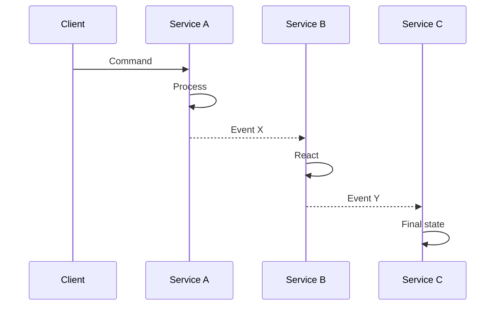

# SAAM Phase 2: Top-Down Analysis (Domain Architect)

## Role
The Domain Architect defines what the modernized system SHOULD look like using DDD principles, independent of legacy implementation details.

## Required Steering Files (Read Before Proceeding)

The agent MUST read the following steering files before executing Phase 2:

1. **`.github/skills/saam-human-guidance-protocol/SKILL.md`** — Prompt categories, decision register format, agent rules
2. **`.github/skills/saam-task-tracking/SKILL.md`** — Tracking file format and Jira dual-write protocol

Phase 2 does NOT require source reading guides or CAST integration — it operates from business knowledge and domain expertise, independent of legacy implementation details.

## Graph Population (Incremental — During Phase 2)

The agent MUST update the knowledge graph as architecture decisions are made — NOT wait until Phase 3 convergence.

**After defining the service catalog (Step 2.3):**
1. For each service: `graph_add_node(nodeType="Service", id=<serviceId>, properties={name, port, priority, schema})`
2. For each identified cross-service dependency: `graph_add_edge(edgeType="CALLS", sourceId=<callerId>, sourceType="Service", targetId=<providerId>, targetType="Service", properties={protocol: "REST"|"Event"})`

**Why now (not at Phase 3):** The graph should reflect architectural decisions as they're made. If Phase 2 defines 11 services and their dependencies, the graph should have those nodes immediately — enabling `graph_phase_status` and `graph_traverse` to show the target architecture before convergence begins. Phase 3 adds `ASSIGNED_TO` edges (rules → services) but services themselves exist from Phase 2.

## Task Tracking Activation

**PRECONDITION: The agent MUST NOT begin architecture design until `tracking/phase2-top-down.md` exists.** If it doesn't exist, create it NOW with all deliverables listed as PENDING.

**PhaseEvent (telemetry timestamp):** Immediately after creating the tracking file, write: `graph_add_node(nodeType="PhaseEvent", id="P2-started", properties={phase: "P2", event: "started", timestamp: <current ISO timestamp>})`.

After each architecture artifact is produced, update the tracking file immediately. If Jira is configured, create an Epic with Tasks. See `.github/skills/saam-task-tracking/SKILL.md` for format.

## 2.1 Business Domain Identification

**🔴 PROMPT HUMAN**: "What are the main business capabilities this system provides? List the top-level business functions users perform."

From transactions/modules and human input, identify bounded contexts:
| Domain | Description | Key Entities | Source Indicators |
|--------|-------------|--------------|-------------------|

## 2.2 Service Boundary Definition (DDD)

For each bounded context, determine:
- **Aggregate Roots**: Main entities that own their lifecycle
- **Invariants**: Rules that must be enforced within the boundary
- **Domain Events**: State changes that other contexts care about
- **Anti-Corruption Layer**: How to translate between contexts

**🔴 PROMPT HUMAN**: "Proposed service boundaries: [show list]. Are these correct? Any areas too tightly coupled to split?"

## 2.3 Service Catalog

Define each target microservice:
```markdown
| Service ID | Name | Port | DB Schema | Priority | Phase |
|-----------|------|------|-----------|----------|-------|
| MS-01 | <name> | 80XX | <name>_schema | 1-3 | Months X-Y |
```

Priority levels:
- 1 = Core (other services depend on it)
- 2 = Business (main business logic)
- 3 = Supporting (utilities, cross-cutting)

## 2.4 Target Architecture

Define:
- Communication style: Sync (REST) vs. Async (Events/Kafka)
- Data strategy: Database per service, eventual consistency
- Authentication: Centralized (OAuth2/OIDC) or service mesh
- Observability: Logging, metrics, tracing approach
- Deployment: Container orchestration (EKS, ECS, K8s)

## 2.5 Entity Relationship Design

Per service, design normalized data model:
- Proper relationships (1:1, 1:N, M:N)
- No cross-service foreign keys
- Reference data vs. transactional data separation
- DDL-ready schema definitions

## 2.6 Process Flow Mapping

For top 10 business processes, define target sequence using Mermaid sequence diagrams:



All architecture diagrams, ERDs, call graphs, and process flows MUST use Mermaid format in output documentation.

## 2.7 Technology Stack Decision

**🔴 PROMPT HUMAN (MANDATORY)**: "What is your target technology stack for the modernized system?"

The agent MUST NEVER assume the target stack from the source stack. Even if the source is Java, the target might be .NET, Go, TypeScript, or a different Java version. This decision belongs to the human — ALWAYS ask, NEVER infer.

Present the options and wait for explicit confirmation:

| Layer | Options |
|-------|---------|
| Language | Java 17, Java 21, C# (.NET 8+), Go, TypeScript, Kotlin |
| Framework | Spring Boot 3.x, ASP.NET Core, Micronaut, Quarkus, NestJS, Gin |
| Database | PostgreSQL, MySQL, SQL Server, DynamoDB, MongoDB |
| Messaging | Apache Kafka, SQS/SNS, RabbitMQ, Azure Service Bus |
| Cache | Redis, ElastiCache, Memcached |
| Container | Podman/Docker + EKS, ECS Fargate, Lambda, AKS |
| CI/CD | GitHub Actions, CodePipeline, GitLab CI, Azure DevOps |

**Anti-pattern (FORBIDDEN):** "The source is Java 11, so I'll target Java 17 with Spring Boot." — This is an assumption. The client may want .NET, Go, or a completely different architecture. ASK.

## Deliverables

The following files MUST be created during Phase 2 — NOT deferred to later phases. The agent MUST write these files before asking for human approval at the exit gate.

### Mandatory Artifact Creation (DO NOT SKIP)

The agent MUST create ALL of the following files under `modernization/` during Phase 2 execution. These are NOT optional, NOT deferred, and NOT "to be created later":

1. `modernization/modernized-architecture.md` — Target architecture (communication style, data strategy, auth, observability, deployment)
2. `modernization/services-composition.md` — Service catalog with IDs, ports, schemas, priorities
3. `modernization/<system>-entity-relationship-diagram.md` — ERD per service using Mermaid
4. `modernization/<system>-sequence-diagrams.md` — Process flow diagrams using Mermaid
5. `modernization/<system>-modernization-roadmap.md` — Implementation roadmap with phases and timeline
6. `modernization/<system>-risk-analysis.md` — Risk register with severity and mitigation

### Artifact Existence Gate

Before presenting the exit gate prompt to the human, the agent MUST verify:
- [ ] All 6 files above exist and contain substantive content (not empty templates)
- [ ] Architecture document includes decisions for ALL categories (communication, data, auth, observability, deployment)
- [ ] Roadmap includes implementation phases with service assignments
- [ ] Risk analysis has at least 3 identified risks with mitigation strategies

If any artifact is missing or empty, the agent MUST create it BEFORE asking for human approval. Do NOT present the exit gate with missing deliverables.

### Checklist
- [ ] Domain boundary map with justification
- [ ] Service catalog (ID, name, port, schema, priority)
- [ ] Target ERD per service
- [ ] Sequence diagrams for key processes
- [ ] Technology stack decisions
- [ ] Implementation roadmap with phases
- [ ] Risk register

## Exit Gate

**PRECONDITION: The agent MUST produce `.saam/telemetry/phase2-top-down.yaml` BEFORE presenting the exit gate.** If the file does not exist, create it now.

**PhaseEvent (completed):** Write: `graph_add_node(nodeType="PhaseEvent", id="P2-completed", properties={phase: "P2", event: "completed", timestamp: <current ISO timestamp>})`.

**Telemetry data to capture:**
- Timing (started_at, completed_at, duration_hours), actor
- Metrics: bounded_contexts_identified, services_designed, shared_kernel_entities, integration_patterns_count, data_stores_planned, adrs_produced

**Schema:** See `.github/skills/saam-telemetry/SKILL.md` → `phase2-top-down.yaml` for the full YAML structure.

**🔴 PROMPT HUMAN**: "Target architecture complete. Please review service boundaries and approve before convergence."

**How to review (don't rubber-stamp — this gate has no independent automated check, unlike Phase 4):**
Boundaries and stack are human judgment; the agent can only confirm the artifacts EXIST, not that they
are RIGHT. Before approving, eyeball:
- **Boundary cohesion:** does each service own one coherent capability? A service that spans two
  unrelated domains, or a capability split across three services, is a boundary smell.
- **Transaction integrity:** are operations that must be atomic kept inside ONE service? A business
  transaction split across services (needing a distributed transaction) is a red flag — raise it now.
- **Data ownership:** each table owned by exactly one service; shared-table needs were resolved in a
  DATA_OWNERSHIP decision, not left implicit.
- **Coupling:** the CALLS graph isn't a mesh — if every service calls every other, the boundaries are
  wrong. Check `modernization/*-sequence-diagrams.md` for chatty cross-service chains.
- **Stack ownership:** the stack was a deliberate human `STACK_CONFIRM` answer, NOT inferred from the
  legacy ("source is Java 11 so target Java 17" is the forbidden anti-pattern). It is preliminary — 4b
  reconciles it with evidence — so it is fine to say "TBD, decide at 4b."
This is a preliminary architecture; if unsure, approve-with-notes and let Phase 4b's evidence-based
reconciliation catch stack/boundary issues rather than blocking here.

**Next steps after human approval:**
- Activate `.github/skills/saam-phase3-convergence/SKILL.md` (once Phase 1 is also complete)
- Phase 3 requires BOTH Phase 1 and Phase 2 outputs — do not start convergence until both tracks finish
- Update the root `README.md` — add Phase 2 completion summary: target services defined, technology stack chosen, architecture decisions documented
- **Graph update (always):** Verify Service nodes and CALLS edges were populated incrementally during Phase 2. Run `graph_run_inferences(rules=["transitive_dependencies"])` to compute transitive service dependencies.
