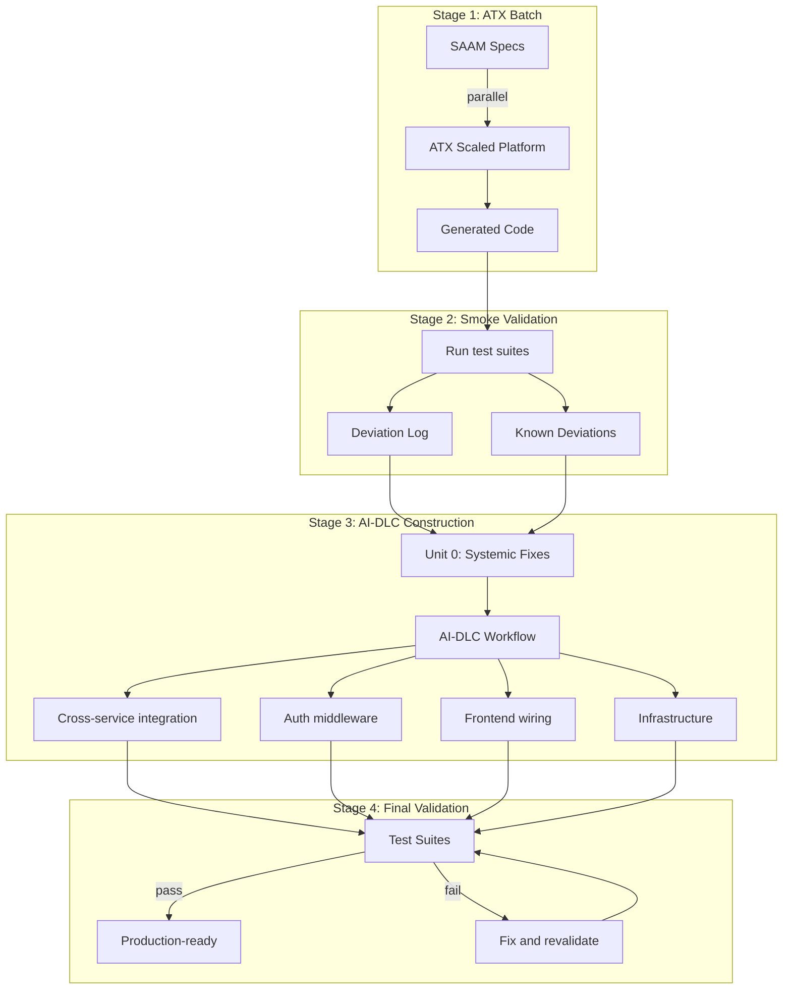

# SAAM Phase 5: AI-DLC Implementation

## Objective
Use AI-driven SDLC to generate running microservices from SAAM specifications. Every service must pass its comprehensive test suite.

## Knowledge Graph Population (Orchestrator-Only — Unified Across All Modes)

The knowledge graph is a **projection of the source tree**, maintained by ONE actor — the GitHub Copilot
orchestrator — via ONE idempotent operation: `detect_br_ids.py --all` (scans `sourcecode/` for
BR-ID annotations, MERGEs CLAIMS_IMPLEMENTATION edges). This is the single, mode-independent
mechanism. There is no per-file-save hook — it fragmented per mode and silently missed bulk-landed
code.

**Why orchestrator-only:** generation, test, and validate agents (especially Model C — ATX batch on
Fargate) run sandboxed with NO Neo4j access. Only the GitHub Copilot orchestrator has BOTH the local Neo4j
connection AND visibility of landed code (it pulls the branches, reads results, drives the loop).
So graph population is NEVER delegated to those agents. Their only graph-related responsibility is to
leave BR-ID annotations in the code (`// BR-XX-YYY-NNN`). The orchestrator HARVESTS those annotations
into the graph after pulling.

**The contract between sandboxed agents and the orchestrator:**
- Generation/fix agents (any mode): write code WITH BR-ID annotations. Never touch the graph.
- Orchestrator (GitHub Copilot, always): after code lands in its view, run `detect_br_ids.py --all`.

**Reconcile checkpoints (all are orchestrator actions with Neo4j access — mode-independent):**

1. **After ANY operation that lands code into `sourcecode/`** — `git pull`, branch merge, ATX output
   retrieval, fix-loop commit pull. The orchestrator KNOWS it just brought code into view; the next
   action is reconcile. This is the universal "code landed" signal — it does not matter HOW the code
   arrived (inline edit, batch generation, someone else's push).
2. **Phase 5 exit gate** — reconcile BEFORE producing the Implementation Fidelity report (the report
   READS the graph, so it must be current).
3. **SessionStart** — the SessionStart hook reconciles so every session opens with a true graph,
   correcting any drift since the last session.

**Idempotent:** `--all` uses MERGE, so running it after every pull is safe and cheap; it always
converges the graph to match disk. A missed reconcile (crash, offline, wrong port) self-heals at the
next checkpoint — nothing is lost forever.

**Invocation (from workspace root, where Neo4j is reachable — NOT `--directory`, which changes CWD):**
```bash
uv run --project graph-mcp python graph-mcp/scripts/detect_br_ids.py --all
```

## Graph as an Active Input: The Reconcile-In / Export-Out Dispatch Protocol

Ingest keeps the graph TRUE. Egress makes the graph USEFUL — it feeds the graph's actionable state
back into the sandboxed generation/fix agents so each pass is targeted, not blind. Both are
orchestrator-only (the agents have no Neo4j); egress is delivered as a committed file.

**Before dispatching ANY generation or fix job for a service, the orchestrator MUST run this
sequence (all local, where Neo4j is reachable):**

```
RECONCILE IN (make the graph true):
  1. git pull                                          # bring landed code into view
  2. detect_br_ids.py --all                            # code annotations -> graph
  3. fidelity_audit.py --all                           # reachability -> Implementation.reachable / deadCode
  4. reconcile_validation.py <artifact>                # test results -> deviations, behavioralStatus, attemptLog
     (steps 3-4 only apply once code + validation results exist; skip on first generate)

EXPORT OUT (make the graph useful to the agent):
  5. graph_context_export.py --all                     # graph actionable state -> _graph-context.md per service
  6. git add sourcecode/*/_graph-context.md && commit && push   # the ONLY channel into a sandboxed container

DISPATCH:
  7. submit the generation/fix job                     # agent clones the branch, reads _graph-context.md via its TD
```

**The order is load-bearing:** export MUST run after reconcile (steps 2-4), so `_graph-context.md`
reflects the freshest truth — including what the PREVIOUS pass did (its attempts, regressions,
newly-stubbed rules). Export before reconcile = the agent fixes against stale state.

**Delivery is git, not gitignore.** `_graph-context.md` MUST be committed. It is the only way a
sandboxed agent (ATX Fargate, fix container) receives it — the container clones the branch. It is
regenerated every dispatch (never hand-edited); the orchestrator overwrites it before pushing.

**Mode split (this is the one real branch — do not pretend it's uniform):**
- **Model B / C (sandboxed agents, no Neo4j):** use the file path above — export + commit + the TD
  reads `_graph-context.md`.
- **Model A (GitHub Copilot inline, has Neo4j):** the orchestrator IS the code author and can call the MCP
  tools live (`graph_implementation_context`, `graph_fix_context`) — no file needed. Exporting a
  file for Model A is redundant; skip it.

**What the agent does with it:** see the fix/generation TD "Read the Graph Context FIRST" section —
dead code → wire it; stub → implement the effect; regressed deviation → don't re-try that approach;
cross-service call → use the reconciled shape. This turns the fix loop from blind-retry into
targeted-fix, which is what bounds the loop count (especially critical for Model C).

## Required Steering Files (Read Before Proceeding)

The agent MUST read the following steering files before executing Phase 5 implementation:

0. **`.github/skills/saam-dotnet-reference-implementation/SKILL.md`** — **AUTHORITATIVE, read FIRST and IN FULL.** The single authority for HOW every service and its xUnit integration test suite are structured: project layout, `Program.cs` composition, Npgsql persistence, error model, auth/tenancy, events, code style, and the BR-ID annotation contract. All other steering files link here rather than restate these conventions.
1. **`.github/skills/saam-phase5-setup/SKILL.md`** — Setup wizard (MUST be run FIRST if not already completed for this engagement)
2. **`.github/skills/saam-human-guidance-protocol/SKILL.md`** — Prompt categories, decision register format, agent rules
3. **`.github/skills/saam-task-tracking/SKILL.md`** — Tracking file format and Jira dual-write protocol (especially the Phase 5 append-only log model)
4. **`.github/skills/saam-api-contract/SKILL.md`** — API contract is the naming authority for ALL code generation
5. **`.github/skills/saam-jira-integration/SKILL.md`** — (Only if Jira is configured) Session-start sync protocol, ticket transitions, reopen handling
6. **`.github/skills/saam-backend-fidelity/SKILL.md`** — (Read before the Events / Integration Wiring layers) The 8 cross-service and persistence fidelity checkpoints + grep-able wiring-defect self-audit. This is the procedure the Events and Integration Wiring layer names imply.

**Note:** The agent does NOT need to re-read the spec template or test suite template during Phase 5 — it reads the actual generated specs and test suites in the workspace.

## Source of Truth for Code Generation (MANDATORY)

**Specifications are the SOLE input for code generation. Test suites are the SOLE quality gate. The API contract is the NAMING AUTHORITY. DTOs from `08-dtos/` are the CONCRETE BINDING for request/response shapes.**

| Artifact | Role | Used For |
|----------|------|----------|
| Service specs (`spec/microservices/<service>/`) | **Source of truth** | Driving all implementation decisions — data model, business rules, API design, events |
| API contract (`spec/microservices/<service>/04-api-contract.yaml`) | **Naming authority** | ALL field names, endpoint paths, status codes, response shapes — both code and tests MUST match this |
| Workflows (`spec/microservices/<service>/07-workflows.md`) | **Operation sequencing** | HOW BR-IDs chain together to form complete business operations. Defines call order, state transitions, cross-service choreography, error paths. |
| DTOs (`spec/microservices/<service>/08-dtos/`) | **Concrete binding** | Pre-generated target-language DTO files — copied VERBATIM into implementation. Eliminates naming drift between tests and code. |
| Infrastructure patterns (`spec/shared/infrastructure-patterns.md`) | **Cross-cutting code patterns** | Auth guards, tenant isolation, error handling, logging, health checks — ALL services use these SAME patterns. |
| Event schemas (`spec/shared/event-schemas/`) | **Async message contracts** | Exact payload shapes for domain events. Publishers and consumers both reference these. |
| Common schemas (`spec/shared/common-schemas.yaml`) | **Shared types** | PaginationMeta, ErrorResponse, ListResponse, AuditFields — defined ONCE, used everywhere. |
| Env schema (`spec/shared/env-schema.md`) | **Configuration contract** | Required environment variables per service. Compose and production configs derive from this. |
| Cross-service workflows (`spec/07-cross-service-workflows.md`) | **System choreography** | End-to-end multi-service operation sequences. Drives system integration tests and frontend user flows. |
| .NET reference implementation (`.github/skills/saam-dotnet-reference-implementation/SKILL.md`) | **Implementation pattern authority** | HOW services and tests are structured — project layout, `Program.cs` composition, Npgsql persistence, error model, auth/tenancy, events, code style, BR-ID annotation format. Structure conforms to this; naming conforms to the API contract. |
| xUnit integration suite (`sourcecode/Shopizer.IntegrationTests/<Service>ComprehensiveTests.cs`) | **Quality gate only** | Validating the implementation AFTER code is written (run via `dotnet test`) — never as input to code generation |

**Rules:**
- The agent MUST derive all implementation from the service specification (BR-IDs, DDL, API design, event contracts)
- The agent MUST use `04-api-contract.yaml` for ALL naming decisions (field names, paths, status codes, response shapes)
- **The agent MUST copy `spec/microservices/<service>/08-dtos/*.cs` into `sourcecode/Shopizer.<Service>/DTOs/` VERBATIM as the FIRST implementation step — before writing any controller, service, or entity code.** These `.cs` DTOs are pre-generated in Phase 4c and are mechanically consistent with the API contract and test suites.
- **The agent MUST NOT regenerate, rename, restructure, or "improve" the copied DTOs.** If a DTO field looks wrong, the agent checks the contract — if the contract matches the DTO, the DTO is correct.
- **The agent MUST NOT create additional request/response DTOs that duplicate shapes already in `08-dtos/`.** Internal-only types (never crossing the API boundary) are allowed, but per the reference they live in `Models/Domain.cs` — NOT as extra files in `DTOs/`.
- The agent MUST NOT read, parse, or reverse-engineer the test suite to determine what to implement
- The agent MUST NOT use test assertions as a substitute for reading the spec or contract
- The agent MUST NOT modify the test suite to make tests pass — code must conform to tests, never the reverse
- If a test fails on a naming mismatch, the agent reads the API CONTRACT and the COPIED DTOs — both should agree. If they don't, it's a Phase 4c generation bug (flag for human review).

**API Contract as the bridge between tests and code:**

The contract (`04-api-contract.yaml`) eliminates the need to read test suites for field names. Both the test suite and the code are generated FROM the same contract. If both follow the contract, they will match.

```
04-api-contract.yaml (naming authority)
    ↓                                       ↓
08-dtos/ (concrete binding — generated in Phase 4c Stage 0)
    ↓ copied verbatim                      ↓ payload reference
Code Generator (Phase 5/ATX)             Test Suite (Phase 4c)
    ↓ produces                               ↓ produces
Running Service ←── validates ──── sourcecode/Shopizer.IntegrationTests/<Service>ComprehensiveTests.cs (dotnet test)
```

**Why DTOs eliminate drift:** Previously, both the test generator and the code generator independently interpreted the contract into their own DTO shapes — leading to ~60% of integration failures being naming/shape mismatches (not logic bugs). Now both sides consume the SAME pre-generated DTOs. The implementation copies them, the tests reference them. Zero interpretation room.

**What the agent MUST reference from the API contract:**
- JSON field names (casing, exact spelling) — from contract schemas
- HTTP endpoint paths (exact format) — from contract paths
- Response status codes per operation — from contract responses
- Response envelope structure (e.g., `{ items: [], pagination: {} }`) — from contract schemas
- Query parameter names — from contract parameters

**What the agent MUST NEVER derive from test suites:**
- Business rule logic or decision trees
- Calculation formulas or thresholds
- State transitions or workflow sequences
- Data model structure (tables, columns, relationships)
- Validation rules or error conditions
- Authorization logic
- Field names (use the contract instead)

**Why:** Test suites verify behavior; they don't define it. If the agent implements from tests, it produces code that passes tests but may miss business intent, edge cases, and architectural decisions that only exist in the spec. The spec is the contract; the test suite is the verification.

## Implementation State Tracking (MANDATORY)

Implementation progress for each service is tracked in `tracking/phase5-implementation/<service-name>.md` (as defined in `.github/skills/saam-task-tracking/SKILL.md`). This file is the SINGLE source of truth for:
- What has been done
- What is in progress
- What is pending
- Session resumption after context compaction or breaks

There is NO separate `implementation-state.md` file. The tracking system handles all state.

### Tracking File Content for Phase 5

The `tracking/phase5-implementation/<service-name>.md` file includes:

```markdown
# Phase 5: Implementation — <Service Name>

## Jira Epic: <PROJ-XXX> — Implementation: <Service Name>
<!-- Present only if Jira configured -->

## Status: IN_PROGRESS | COMPLETE | BLOCKED

## Summary
| Metric | Value |
|--------|-------|
| Total BR-IDs | <N> |
| BR-IDs implemented | <N> |
| Total tasks | <N> |
| Tasks completed | <N> |
| Started | <date> |
| Last updated | <date> |

## Layer Status
| Layer | Status | Files Created | Jira | Notes |
|-------|--------|---------------|------|-------|
| Scaffolding | DONE / IN_PROGRESS / PENDING | pom.xml, Containerfile, ... | PROJ-101 | |
| Domain Model | DONE / IN_PROGRESS / PENDING | Entity.java, ... | PROJ-102 | |
| Repository | DONE / IN_PROGRESS / PENDING | Repo.java, ... | PROJ-103 | |
| Service | DONE / IN_PROGRESS / PENDING | Service.java, ... | PROJ-104 | |
| Controller | DONE / IN_PROGRESS / PENDING | Controller.java, ... | PROJ-105 | |
| Events | DONE / IN_PROGRESS / PENDING / N/A | | PROJ-106 | |
| Unit Tests | DONE / IN_PROGRESS / PENDING | | PROJ-107 | |
| Validation | DONE / IN_PROGRESS / PENDING | | PROJ-108 | |

## BR-ID Implementation Status
| BR-ID | Status | Implemented In | Jira | Notes |
|-------|--------|----------------|------|-------|
| BR-XX-001 | DONE | ServiceClass.methodName() | PROJ-110 | |
| BR-XX-002 | DONE | ServiceClass.otherMethod() | PROJ-111 | |
| BR-XX-003 | IN_PROGRESS | | PROJ-112 | Blocked: need rate clarification |
| BR-XX-004 | PENDING | | PROJ-113 | |

## Validation Status
| Check | Status | Result |
|-------|--------|--------|
| Compiles | PASS / FAIL / NOT_RUN | |
| Unit tests | PASS / FAIL / NOT_RUN | X/Y pass |
| Container build | PASS / FAIL / NOT_RUN | |
| Service starts | PASS / FAIL / NOT_RUN | |
| Comprehensive suite | PASS / FAIL / NOT_RUN | X/Y pass |

## Blockers
- <description of any blocking issues>

## Session Log
| Timestamp | Action | BR-IDs Covered | Notes |
|-----------|--------|----------------|-------|
| <ISO> | Started implementation | — | Read spec: X rules, Y tables, Z endpoints |
| <ISO> | Completed domain model | — | 12 entities created |
| <ISO> | Implemented BR-XX-001 through BR-XX-015 | 15 | Service layer batch 1 |
| <ISO> | Context compaction — resuming | — | Continuing from BR-XX-016 |
```

### Tracking Rules

1. **Create on first action** — the tracking file is created when Step 1 (Read Spec) completes
2. **Update after every layer completion** — when a layer moves to DONE
3. **Update after every BR-ID batch** — when a group of BR-IDs is implemented
4. **Update on session break** — before any context compaction or session end
5. **Read on session start** — if the tracking file exists, the agent reads it FIRST to determine where to resume
6. **Jira sync** — every status change in the file is mirrored to Jira (if configured)

### Session Resumption Protocol

When the agent starts a session and `tracking/phase5-implementation/<service-name>.md` exists:
1. **If Jira configured: sync first** — run the Jira Sync Check from `.github/skills/saam-task-tracking/SKILL.md` BEFORE any other action. This may create fix tasks or confirm completed work.
2. Read the tracking file (now up-to-date after sync)
3. Identify the current layer status and next pending BR-ID
4. Re-read the relevant section of the service spec (only the pending BR-IDs)
5. Resume implementation from where it left off
6. State: "Resuming implementation of <service>. Progress: X/Y BR-IDs complete. Continuing from BR-XX-NNN."

## Brownfield Detection (Partial Implementation Recovery)

Before starting implementation, the agent MUST check if a previous implementation attempt exists:

**Check:** Does `sourcecode/<service-name>/src/` already contain Java/TypeScript/Python files?

**If YES (brownfield):**
1. Read `tracking/phase5-implementation/<service-name>.md` if it exists — resume from tracked state
2. If no tracking file but code exists: scan existing code to identify which BR-IDs are already implemented (grep for BR-ID references in comments or method names)
3. Create the tracking file retroactively by marking discovered implementations as DONE
4. Resume from the first PENDING BR-ID
5. **NEVER create duplicate files** (no `ServiceV2.java`, `Service_new.java`, etc.) — modify existing files in place

**If NO (greenfield):** proceed normally from Step 1

## Per-Service Implementation Loop

For engagements with multiple services, the agent implements services in dependency order (from the implementation roadmap). Each service follows the COMPLETE loop before moving to the next:

```
For each service (in dependency order):
  ┌──────────────────────────────────────────────────────────┐
  │ Step 0: Test suite prerequisite check                     │
  │ Step 0.5: Copy DTOs from spec (08-dtos/*.cs → DTOs/)      │
  │ Step 1: Read full spec + the .NET reference implementation │
  │ Step 2: Create GitHub Copilot spec                        │
  │ Step 3: Implement (spec-driven, no stubs — reference order):│
  │     ├── DTOs/ (copied VERBATIM from 08-dtos/*.cs — first) │
  │     ├── Models/Domain.cs (entities + internal types)      │
  │     ├── Data/SchemaInitializer.cs (idempotent DDL)        │
  │     ├── Data/<Area>Repository.cs (Npgsql, no ORM)         │
  │     ├── Services/<Area>Services.cs (per BR-ID)            │
  │     ├── Middleware/ (Error, Token, HttpIdentity)          │
  │     ├── Controllers/<Aggregate>Controller.cs (thin)       │
  │     ├── Services/EventPublisher.cs (outbox → RabbitMQ)    │
  │     ├── Register service+db in Shopizer.AppHost/AppHost.cs │
  │     └── Integration test class (migrate-on-touch):        │
  │         rewrite the service's existing ComprehensiveTestBase-│
  │         derived class to the new self-contained standard   │
  │         (sourcecode/Shopizer.IntegrationTests/<Service>Comprehensive-│
  │         Tests.cs)                                          │
  │ Step 4: Validation gate                                   │
  │ Step 5: Fix failures (spec-first)                         │
  │ Step 6: CI/CD pipeline                                    │
  │ Step 7: Per-service deliverables (README.md,              │
  │         implementation-audit.md, Dockerfile)              │
  └──────────────────────────────────────────────────────────┘
  → Update tracking/phase5-implementation/<service-name>.md: COMPLETE
  → Move to next service
  → IF this was the LAST service: write `graph_add_node(nodeType="PhaseEvent", id="P5-completed", properties={phase: "P5", event: "completed", timestamp: <current ISO>})` + produce `.saam/telemetry/phase5-implementation/summary.yaml`
```

**Rules for multi-service implementation:**
- Complete ONE service fully before starting the next
- Foundation services (priority 1) before business services (priority 2) before supporting (priority 3)
- If Service B depends on Service A's API: implement A first, verify its tests pass, then start B
- Cross-service integration tests run after ALL services in a dependency group are complete

## Implementation Audit Trail

The agent maintains an audit log at `sourcecode/<service-name>/implementation-audit.md` tracking decisions made during implementation:

```markdown
# Implementation Audit: <Service Name>

## Decisions Made During Implementation

| Timestamp | BR-ID | Decision | Rationale |
|-----------|-------|----------|-----------|
| <ISO> | BR-XX-005 | Used BigDecimal for amount fields | Spec says "currency calculations must not lose precision" |
| <ISO> | BR-XX-012 | Added retry logic with 3 attempts | Spec references "resilient delivery" for event publishing |
| <ISO> | — | Chose @Transactional at service method level | Multiple BR-IDs require atomic operations |

## Spec Ambiguities Encountered

| BR-ID | Ambiguity | Resolution | Needs Human Review? |
|-------|-----------|------------|---------------------|
| BR-XX-008 | Spec says "recent orders" but doesn't define time window | Used 30 days based on similar rules | Yes |
| BR-XX-015 | Two rules appear to conflict on status transition | Implemented BR-XX-015 as override of BR-XX-009 | Yes |

## Test Failure Analysis

| Test # | First Failure | Root Cause | Fix Applied | BR-ID |
|--------|--------------|------------|-------------|-------|
| 14 | Expected 422, got 500 | Missing validation in controller | Added @Valid annotation | BR-XX-003 |
| 27 | Wrong calculation result | Used integer division | Changed to BigDecimal | BR-XX-011 |
```

### Audit Trail Rules

1. **Log every non-trivial decision** — technology choice, design pattern selection, ambiguity resolution
2. **Log every spec ambiguity** — anything where the spec wasn't clear enough and the agent had to interpret
3. **Log every test failure root cause** — what failed, why, and what was fixed
4. **Flag items needing human review** — ambiguities that could have been resolved differently
5. **Never log routine operations** — creating standard CRUD endpoints, boilerplate config, etc.

## Frontend Implementation (After ALL Backend Services Complete)

If a frontend app exists (`spec/frontend/<app-name>/`), implement it AFTER all backend services pass validation. The frontend depends on backend APIs being stable.

### Source of Truth for Frontend

| Artifact | Role | Used For |
|----------|------|----------|
| `spec/frontend/<app>/09-api-client/` | **CONCRETE BINDING — copied verbatim** | ALL API calls. Pages import from this. NEVER construct URLs. |
| `spec/frontend/<app>/02-screen-inventory.md` | Screen definitions | What each page shows and its data bindings |
| `spec/frontend/<app>/03-user-flows.md` | Navigation logic | State machines, route transitions |
| `spec/frontend/<app>/01-api-contract.md` | Gateway routing reference | Path mapping (only if api-client needs debugging) |

### Hard Rules (Frontend Implementation)

1. **Copy `spec/frontend/<app>/09-api-client/` into `sourcecode/<app>/src/api/` VERBATIM as the FIRST step.** This is identical to backend DTOs — no modification, no renaming, no "improvement."

2. **Every page that fetches data MUST import from `src/api/`.** Example:
   ```typescript
   // CORRECT:
   import { listTeams, createTeam } from '@/api/team.api';
   
   // FORBIDDEN:
   fetch('/api/teams')                    // invented path
   axios.get('/api/v1/teams/me')          // invented path
   fetch(`${BASE_URL}/teams?member=${id}`) // constructed URL
   ```

3. **NEVER construct API URLs in page/component files.** All HTTP communication goes through the api-client functions. No `fetch()`, no `axios.get()`, no URL string construction in pages/components.

4. **If a page needs an endpoint that doesn't exist in the api-client** — the endpoint is MISSING from the backend spec. Flag it as a gap (create a Phase 6 feature request), do NOT invent a path.

5. **If the api-client function signature doesn't match what the page needs** (e.g., page needs filtering that the function doesn't support) — the api-client is the source of truth. Either the backend doesn't support that filter, or the api-client generation missed it. Flag for investigation, don't work around it.

### Frontend Fidelity Checkpoints (the "renders 200 but is broken" class)

The api-client rules above prevent invented paths. They do NOT prevent the defects that render as a
clean 200 but a useless screen — the frontend twin of the backend "200 is not proof" lesson. These are
the systemic frontend failures that survive to QC precisely because everything *looks* fine:

- **F1 — Empty rows from column-key mismatch.** A table's column `key`s don't match the response
  field names (or casing: the page reads `amountPaid` while the API returns `netAmount`, or camelCase
  vs snake_case), so data loads but every row renders blank. Verify: every DataTable/grid column `key`
  exists in the DTO it binds
  (`spec/shared/common-schemas.yaml` + the service response schema). A column key not present in the
  response shape is a defect, not a styling choice.
- **F2 — List-envelope unwrap mismatch.** The page unwraps `{items}` but the service returns `{data}`
  (or nested `{data.data}`), so the list is always empty. Verify: the unwrap matches the shared list
  envelope. (This is downstream of the Stage 1.5 shared-convention reconciliation — if envelopes were
  normalized, there is ONE unwrap; if a service legitimately differs, the page must match it.)
- **F3 — Fail-open entitlement / nav gating.** The entitlement fetch fails (wrong endpoint, wrong
  response shape, case mismatch) and a fail-open catch renders ALL modules regardless of subscription.
  This is a security-adjacent defect that renders "fine." Verify: the entitlement call hits the real
  endpoint and shape; nav gating actually gates (a module the tenant lacks is NOT shown); the fetch
  does NOT fail-open on error.
- **F4 — Nav lands on the wrong screen.** Navigation points at an arbitrary read-only list instead of
  the designed workflow entry point (e.g. lands on a read-only "periods" list, not the
  process→review→post wizard). The screens exist and load; the journey is just unwired. Verify: each
  module's nav landing route is the workflow entry point named in `03-user-flows.md` /
  `spec/07-cross-service-workflows.md`, not an incidental list.

### Frontend Render-and-Walk Gate (MANDATORY — the frontend analogue of the Stage 5 smoke gate)

Per-call verification (right path, right DTO) cannot catch F1–F4 — they only appear when a real user
loads the screen with real data and walks the journey. This gate does exactly that, and it is the
frontend counterpart to the backend Integration Runtime Smoke Gate.

**Protocol (against the deployed app, with seeded data and a real token):**

```
1. Authenticate as a real user (real token, real tenant/company) — not a mock.
2. For each in-scope module's landing screen:
   - The screen RENDERS ROWS (not blank rows) for seeded data — catches F1/F2.
   - A real 200-empty (no seed) shows an honest empty-state, NOT broken columns.
3. Entitlement gating is REAL — a module the tenant is NOT entitled to is NOT shown
   (assert the nav does not fail-open) — catches F3.
4. For each primary user journey (from 03-user-flows.md / 07-cross-service-workflows.md):
   - Nav lands on the workflow ENTRY POINT, not an incidental list — catches F4.
   - Walk the full multi-step flow end to end; each write action posts and the effect is
     confirmed (the same round-trip discipline as the backend — a 200 is not proof).
   - Multi-service actions show honest progress: integrated legs done, un-integrated legs
     shown as "not integrated", never fake-green.
```

**Gate outcome:**
- PASS: every in-scope landing screen renders real rows (or an honest empty state), entitlement gating
  actually gates, and each primary journey lands on its entry point and completes end to end.
- FAIL: any screen renders blank rows on seeded data, nav fails-open or lands wrong, or a journey
  cannot complete → log as a systemic frontend deviation, fix before the frontend is considered done.

**Honest-empty vs broken:** a screen with no seed data showing an empty-state message is a PASS (the
data isn't there yet — a seeding task, not a frontend defect). A screen with seed data showing blank
rows is a FAIL (column/envelope mismatch). The gate must distinguish these, not conflate them.

### Parent Verification (After Frontend Subagent Returns)

- [ ] `sourcecode/<app>/src/api/` contains files matching `spec/frontend/<app>/09-api-client/` (same files, same function names)
- [ ] **NO `fetch()` or `axios.*()` calls in any page/component file** (grep for `fetch(` and `axios.` in `src/pages/`, `src/app/`, `src/components/`)
- [ ] All API imports come from `@/api/*` or `../api/*` paths
- [ ] No URL string construction (grep for `http://`, `https://`, `/api/` in page files)
- [ ] **F1:** every table column `key` exists in the bound DTO (no blank-row column mismatches)
- [ ] **F2:** list-envelope unwrap matches the shared/service list envelope
- [ ] **F3:** entitlement gating hits the real endpoint/shape and does NOT fail-open (a non-entitled module is not shown)
- [ ] **F4:** each module's nav landing route is the workflow entry point, not an incidental list
- [ ] **Render-and-Walk Gate** run against seeded data with a real token (rows render, gating gates, journeys complete)

## Build-and-Test Stage (Separate from Implementation)

Code generation (Step 3) and validation (Step 4) are DISTINCT stages with NO overlap:

| Stage | What Happens | Test Suite Access |
|-------|-------------|-------------------|
| **Step 3: Implementation** | Agent writes ALL code from spec | Test suite MUST NOT be read or executed |
| **Step 4: Validation** | Agent runs tests, observes results | Test suite executed, failures analyzed |
| **Step 5: Fix Failures** | Agent fixes code based on spec + failure info | Test assertions read for field names only |

**The boundary is absolute:** Step 3 ends when the agent has implemented ALL BR-IDs and written unit tests. Only then does Step 4 begin. There is no "implement a bit, test a bit" cycle during Step 3.

**Build-and-Test checklist (Step 4 expanded):**
1. Build the solution — `dotnet build sourcecode/Shopizer.slnx` — fix any compilation errors from spec (NOT from test expectations)
2. Run the service's integration tests — `dotnet test sourcecode/Shopizer.IntegrationTests --filter "FullyQualifiedName~<Service>ComprehensiveTests"` — fix failures by re-reading spec
3. Build container image — fix Dockerfile issues
4. Start service on local profile — verify health endpoint
5. Run the xUnit suite via `validation/run-and-reconcile.sh <service>` (the wrapper now invokes `dotnet test`) — produces structured artifact + updates graph + generates remediation tasks
6. If < 100% pass → proceed to Step 5 (Fix Failures) using generated `tracking/phase5-implementation/<service>.md` (or `.github/specs/<service>/tasks.md`)
7. If 100% pass → proceed to Step 6 (CI/CD)

**A skipped or non-executed suite is a FAILED gate, never a pass** — these tests boot a real Aspire `DistributedApplication` requiring a container runtime with PostgreSQL and RabbitMQ.

## Subagent Delegation (Per-Service Implementation)

When delegating per-service implementation work to a subagent (Model A — Pure GitHub Copilot):

**contextFiles to include:**
- `.github/skills/saam-phase5-ai-dlc-implementation/SKILL.md`
- `.github/skills/saam-api-contract/SKILL.md`

**Delegation prompt template:**
```
Implement service <service-name> following SAAM Phase 5 protocol.

READ THESE FILES FIRST (included in your context):
- .github/skills/saam-phase5-ai-dlc-implementation/SKILL.md (implementation protocol)
- .github/skills/saam-api-contract/SKILL.md (naming authority protocol)

INPUT (read these from the workspace):
- spec/microservices/<service>/01-business-rules.md (source of truth for logic)
- spec/microservices/<service>/02-domain-model.md (DDL)
- spec/microservices/<service>/03-api-design.md (endpoints)
- spec/microservices/<service>/04-api-contract.yaml (NAMING AUTHORITY — all field names from here)
- spec/microservices/<service>/07-workflows.md (operation sequences — HOW BR-IDs chain together)
- spec/microservices/<service>/08-dtos/ (PRE-GENERATED DTOs — copy verbatim as first step)

PRODUCE: sourcecode/<service>/ (complete service implementation)

FIRST STEP (MANDATORY): Copy spec/microservices/<service>/08-dtos/*.cs into sourcecode/Shopizer.<Service>/DTOs/ UNCHANGED. These are the implementation DTOs. Do not regenerate them.

Rules:
- DTOs from 08-dtos/ are copied VERBATIM — do not rename fields, restructure, or "improve"
- API contract is the NAMING AUTHORITY — all field names, paths, status codes from 04-api-contract.yaml
- Controllers MUST use the copied DTOs for request/response types
- NEVER read the test suite (sourcecode/Shopizer.IntegrationTests/<Service>ComprehensiveTests.cs) to determine implementation logic
- Every method implementing a BR-ID MUST carry a `// @<BR-ID>: <intent sentence>` comment immediately above it (stacked one per line for multiple rules) — see saam-dotnet-reference-implementation §1.11
- PostgreSQL via Aspire `builder.AddNpgsqlDataSource("<service>db")`; schema created idempotently by Data/SchemaInitializer.cs; NO ORM
- No stubs, no shell implementations, no algorithm simplification
- Structure MUST match the .NET reference implementation (project layout, composition, persistence, error model, auth, events)
- Implement per-layer: DTO copy → Models/Domain.cs → Data/SchemaInitializer.cs → Data/<Area>Repository.cs → Services/<Area>Services.cs → Middleware → Controllers → Services/EventPublisher.cs → AppHost registration → integration test class

NEVER invent field names. NEVER regenerate DTOs. NEVER read test files. NEVER create empty methods.
```

**Parent verification after subagent returns:**
- [ ] `sourcecode/<service>/` contains compilable project structure
- [ ] **DTO integrity check (MECHANICAL — not spot-check):**
  - List all `.cs` files in `spec/microservices/<service>/08-dtos/`
  - List all files in `sourcecode/Shopizer.<Service>/DTOs/`
  - **File count must match** (same number of DTO files)
  - **File names must match** (same names, same extensions)
  - **Field names must match** — for each DTO file, compare the property/field declarations:
    - Extract field names from spec DTO (class properties)
    - Extract field names from implementation DTO
    - **ANY difference = FAILURE** — the subagent modified a DTO (reject and re-delegate)
  - If diff shows ONLY added imports or framework boilerplate (e.g., `@Module` decorators added by NestJS wiring) but field names are identical → PASS
  - If diff shows renamed fields, added/removed properties, or changed types → FAIL
- [ ] BR-ID annotations present (grep for BR-ID pattern in source)
- [ ] Controllers use the copied DTOs for request/response types (not reinvented shapes)
- [ ] No test file reading evidence (implementation derived from spec, not tests)
- [ ] Database configuration uses env vars (not hardcoded H2-only)

### Frontend Subagent Delegation

When delegating frontend implementation to a subagent:

**contextFiles to include:**
- `.github/skills/saam-phase5-ai-dlc-implementation/SKILL.md`
- `.github/skills/saam-frontend-spec-template/SKILL.md`

**Delegation prompt template:**
```
Implement the frontend application <app-name> following SAAM Phase 5 protocol.

READ THESE FILES FIRST (included in your context):
- .github/skills/saam-phase5-ai-dlc-implementation/SKILL.md (Frontend Implementation section — hard rules)
- .github/skills/saam-frontend-spec-template/SKILL.md (spec structure reference)

FIRST STEP (MANDATORY): Copy spec/frontend/<app>/09-api-client/* into sourcecode/<app>/src/api/ UNCHANGED. This is the API client. All pages MUST import from it.

INPUT (read these from the workspace):
- spec/frontend/<app>/09-api-client/ (PRE-GENERATED API CLIENT — copy verbatim, all API calls go through this)
- spec/frontend/<app>/02-screen-inventory.md (what each page shows)
- spec/frontend/<app>/03-user-flows.md (navigation, state machines)
- spec/frontend/<app>/04-component-hierarchy.md (component tree)
- spec/frontend/<app>/01-api-contract.md (Gateway Routing Table — reference only, paths already in api-client)

PRODUCE: sourcecode/<app>/ (complete frontend application)

HARD RULES:
- Copy 09-api-client/ into src/api/ VERBATIM — do not modify
- EVERY page that fetches data MUST import from src/api/<service>.api.ts
- NEVER use fetch(), axios.get(), or URL string construction in page/component files
- NEVER invent API paths — if a function doesn't exist in the api-client, the endpoint doesn't exist
- If a page needs data not available in the api-client → leave a TODO comment, do NOT guess a URL

NEVER construct URLs. NEVER bypass the api-client. NEVER invent endpoints.
```

**Parent verification after frontend subagent returns:**
- [ ] `sourcecode/<app>/src/api/` contains files matching `spec/frontend/<app>/09-api-client/`
- [ ] **Zero `fetch()` or `axios.*()` calls in page/component files** (grep `src/pages/` and `src/app/` and `src/components/`)
- [ ] All API imports reference `@/api/*` or relative `../api/*` paths
- [ ] No hardcoded URL strings in page files (grep for `/api/`, `http://`, `localhost`)
- [ ] TODO comments present where api-client gaps were found (these become Phase 6 items)

### Reconciliation Pipeline (All Models)

Every time the comprehensive test suite runs (regardless of model), use the reconciliation pipeline:

```bash
# Run tests + produce artifact + update graph + generate remediation tasks
./validation/run-and-reconcile.sh <service-name> <trigger>

# Triggers: model_a_inline | model_b_post_atx | stage2_smoke | stage4_final | ci_pipeline
```

**What this does:**
1. Runs the service's xUnit suite (`sourcecode/Shopizer.IntegrationTests/<Service>ComprehensiveTests.cs`) via `dotnet test` and captures results
2. Writes a structured YAML artifact to `.saam/reconciliation/<service>/validation-run-<id>.yaml`
3. Calls `graph-mcp/scripts/reconcile_validation.py` which:
   - Advances passing BR-IDs to `Passing` state + creates `VALIDATED_BY` edges
   - Creates `Deviation` nodes for failing BR-IDs
   - Regresses previously-passing rules that now fail
   - Updates service completeness and confidence scores
4. Generates/updates remediation tasks in `.github/specs/<service>/tasks.md` with remaining fixes (systemic patterns first, then per-BR-ID tasks)

**The generated tasks.md is the bridge between validation and the next fix cycle.** The agent picks it up naturally as GitHub Copilot spec tasks.

**Per-model usage:**

| Model | When to run | Trigger value |
|-------|-------------|---------------|
| A (GitHub Copilot) | After Step 4 validation | `model_a_inline` |
| B (Transform + GitHub Copilot) | After ATX output lands + after each GitHub Copilot fix cycle | `model_b_post_atx` |
| C (ATX Batch) | Stage 2 smoke + Stage 4 final | `stage2_smoke` / `stage4_final` |

**ATX `-c` flag integration (Model B):** To make ATX iterate against the comprehensive suite during generation, copy and customize `validation/atx-check.sh.template` for each service:

```bash
cp validation/atx-check.sh.template validation/<service>/atx-check.sh
# Edit: set PORT, BUILD_CMD, START_CMD for this service's stack
chmod +x validation/<service>/atx-check.sh

# Then use with ATX:
atx custom def exec -n "$TD_NAME" -p "spec/microservices/$SERVICE" \
    -c "../../validation/$SERVICE/atx-check.sh" -x -t
```

This wrapper builds the service, starts it, runs the comprehensive suite, and returns exit 0 (pass → ATX stops) or exit 1 (fail → ATX iterates).

## Execution Engine Selection (MANDATORY FIRST DECISION)

**When the user asks to start Phase 5, the agent MUST first activate `.github/skills/saam-phase5-setup/SKILL.md`.** That file contains the full setup wizard: model selection prompt, parameter gathering, and artifact creation. Only after setup is complete does the agent proceed with the implementation workflow below.

**Before selecting an engine:** If using AWS Transform, the agent MUST read the "AWS Transform Execution Protocol" section in this file (Steps T1-T3) and the "Scaled Execution" section BEFORE running any `atx` commands or advising the user on Transform setup. Do not rely on memory or general knowledge about ATX — follow the documented protocol exactly.

Phase 5 supports three execution models. The choice is made at the start of implementation for the engagement:

| Model | When to Use | Speed | How It Works |
|-------|-------------|-------|--------------|
| **A: Pure GitHub Copilot** | Small systems (1-3 services), complex integrations | Slowest (sequential) | Agent works through tasks.md one by one per service |
| **B: Transform + GitHub Copilot** | Mid-scale (3-10 services), clear boundaries | Medium | ATX generates per service, GitHub Copilot tasks fix/extend |
| **C: ATX Batch + AI-DLC** | Large-scale (5+ services), maximum velocity | Fastest | ATX bulk generates ALL services (backend + frontend) in parallel, AI-DLC handles wiring/integration/polish |

**🔴 PROMPT HUMAN**: "Ready for Phase 5 implementation. Based on the engagement scope ([N] services), I recommend:
- **Pure GitHub Copilot** — fully interactive, task by task (best for 1-3 services)
- **Transform + GitHub Copilot** — ATX generates each service, GitHub Copilot polishes (best for 3-10 services)
- **ATX Batch + AI-DLC Pipeline** — maximum velocity: ATX generates ALL services in parallel, AI-DLC handles cross-cutting wiring (best for 5+ services)

Which model?"

---

### Model C: ATX Batch → AI-DLC Polish (Pipeline Model)

For maximum velocity on multi-service engagements. This is a four-stage pipeline where each stage does what it's best at:



#### Why This Model Works

| Stage | Tool | Strength | Weakness (handled by next stage) |
|-------|------|----------|----------------------------------|
| 1: Bulk generation | ATX (scaled) | Fast, parallel, generates per-service code in isolation | No cross-cutting awareness, may have systemic deviations |
| 2: Smoke validation | SAAM tests | Identifies systemic patterns early (status codes, naming, headers) | Doesn't fix them — just catalogs |
| 3: System wiring | AI-DLC (deviation-aware) | Fixes systemic issues FIRST, then handles integration with clean base | Slower than ATX, sequential |
| 4: Final validation | SAAM tests | Authoritative acceptance gate, produces final deviation log | — |

#### Stage 1: ATX Batch Execution

Run ALL services through ATX in parallel. The primary output mechanism is **git branches** — each service gets its own branch (`atx/<service-name>`). The agent then checks out these branches to bring generated code into the workspace.

```bash
# Submit all services as batch — output to git branches (primary)
for service in $(ls spec/microservices/); do
  atx custom def exec \
    -n "$TD_NAME" \
    -p "spec/microservices/$service" \
    --output-repo "$CODE_REPO" \
    --output-path "sourcecode/$service" \
    --output-branch "atx/$service" \
    -x -t &
done
wait  # All run in parallel

# After all jobs complete, checkout each branch to bring code into workspace
for service in $(ls spec/microservices/); do
  git checkout "atx/$service" -- "sourcecode/$service/"
done
```

**Input per service:** `spec/microservices/<service>/` (including `04-api-contract.yaml`)
**Output per service:** Git branch `atx/<service-name>` containing `sourcecode/<service>/`
**Time:** 30-60 min per service, ALL running in parallel
**Expected result:** ~80% of each service is functional (domain model, repository, service layer, controllers, unit tests)

**After git checkout — run BR-ID detection (L4 graph tracking):**
```bash
# Reconcile the graph after ATX code lands (orchestrator-only, idempotent — one call, all services)
uv run --project graph-mcp python graph-mcp/scripts/detect_br_ids.py --all
```

#### Stage 2: Smoke Validation + Deviation Log

After ATX completes ALL services, run a smoke validation pass. The goal is NOT to achieve 100% pass — it's to identify systemic patterns that AI-DLC should fix before building on top of them.

**Protocol:**

```bash
# Build the solution once, then run each service's xUnit suite, catalog results.
# The xUnit tests boot a real Aspire DistributedApplication (PostgreSQL + RabbitMQ via a
# container runtime), so services are NOT built/started individually here.
dotnet build sourcecode/Shopizer.slnx 2>&1 | tee build-solution.log

for service in $(ls spec/microservices/); do
  echo "=== Smoke validating $service ==="
  # Run the service's suite (expect some failures — that's OK). A skipped/non-executed
  # suite is a FAILED gate, never a pass.
  dotnet test sourcecode/Shopizer.IntegrationTests \
    --filter "FullyQualifiedName~${service}ComprehensiveTests" 2>&1 | tee test-$service.log || true
done
```

**After running all services, analyze failure patterns:**

1. Catalog EVERY test failure across all services
2. Classify each as: DEV-CODE (bug), DEV-TEST (spec mismatch), or SPEC-DRIFT (ambiguous)
3. Identify SYSTEMIC patterns (same failure across 3+ services = systemic)
4. Produce two outputs:

**Output 1: `validation/spec-deviation-log.md`** (full deviation log per the template defined in Step 5)

**Output 2: `.github/aws-aidlc-rule-details/extensions/saam/known-deviations.md`** — a condensed file that AI-DLC reads during Stage 3:

```markdown
# Known Deviations from ATX Generation (Stage 2 Smoke Validation)

## SYSTEMIC — Fix these in Unit 0 (before any other construction)

### Status Code Defaults
- Pattern: POST endpoints return 201 when contract says 200 (N services affected)
- Fix: Add @HttpCode(HttpStatus.OK) to POST endpoints where contract specifies 200
- Affected services: <list>

### Store/Tenant Header Pattern  
- Pattern: Services use ?storeId= query param; contract specifies X-Store-Code header
- Fix: Replace query param extraction with header extraction in guards/decorators
- Affected services: <list>

### Delete Response Shape
- Pattern: DELETE returns 200 with {deleted:true}; contract says 204 no body
- Fix: Add @HttpCode(204) and return void
- Affected services: <list>

### TypeORM Alias Collision
- Pattern: 'desc' alias in QueryBuilder crashes with pagination
- Fix: Rename all 'desc' aliases to 'description' or 'pdesc'
- Affected services: <list>

## PER-SERVICE — Non-systemic issues AI-DLC should be aware of

### <service-name>
- <specific deviation that only affects this service>
```

**Stage 2 is intentionally FAST** — it does NOT fix anything. It catalogs problems so Stage 3 can fix them efficiently in bulk. Expected duration: 30-60 minutes for all services (mostly build + startup time).

#### Stage 3: AI-DLC Construction (Deviation-Aware)

After Stage 2 produces the deviation log and known-deviations file, install AI-DLC rules and proceed with construction. AI-DLC now operates on code that has KNOWN issues — and its first job is to fix them.

**Setup AI-DLC in the workspace:**
```bash
# Install AI-DLC rules
mkdir -p .github/skills
cp -R <aidlc-rules>/aws-aidlc-rules .github/skills/
cp -R <aidlc-rules>/aws-aidlc-rule-details .github/

# known-deviations.md was already generated by Stage 2 into the extensions folder
```

**Tell AI-DLC this is brownfield:**
AI-DLC's workspace detection will find existing code in `sourcecode/` and enter brownfield mode. Its reverse-engineering stage reads the ATX-generated code to understand the system structure.

**Construction units for AI-DLC (ORDERED — Unit 0 runs FIRST):**

| Unit | What It Does | Inputs | Priority |
|------|-------------|--------|----------|
| **Unit 0: Systemic Fixes** | Fix all DEV-TEST patterns across ALL services before any wiring | `known-deviations.md` + all `04-api-contract.yaml` files | **FIRST — before everything** |
| Unit 1: Cross-service integration | HTTP clients, service discovery, circuit breakers | API contracts from all services | After Unit 0 |
| Unit 2: Auth/tenancy middleware | JWT validation, tenant isolation, RBAC | Phase 2 architecture decisions | After Unit 0 |
| Unit 3: Event wiring | Kafka/SQS producers and consumers across services | Event contracts from specs | After Unit 0 |
| Unit 4: Frontend polish | Fix ATX-generated frontend, wire to backend APIs, add auth/state management | `spec/frontend/<app>/` + ATX output | After Units 1-2 |
| Unit 5: Infrastructure | Podman Compose, K8s manifests, CI/CD pipelines | All services | After Unit 0 |
| Unit 6: Integration tests | Cross-service test scenarios | API contracts + business flows | Last |

**Unit 0 detail — Systemic Fixes:**

For each systemic pattern in `known-deviations.md`:
1. Read the pattern description and affected services list
2. For each affected service: apply the fix (add decorator, rename alias, change header extraction, etc.)
3. After fixing ALL instances of a pattern: re-run the affected test assertions to verify
4. Move to next systemic pattern
5. After all patterns fixed: update `validation/spec-deviation-log.md` — mark fixed items as DEV-CODE (resolved)

**Why Unit 0 is critical:** If AI-DLC builds cross-service integration on top of services that return wrong status codes or use wrong header patterns, the integration code will encode the bugs. Fixing systemic issues FIRST means all subsequent units operate on a correct base.

**AI-DLC execution per unit:**
1. AI-DLC creates a code generation plan for the unit (Part 1 — Planning)
2. Human approves the plan
3. AI-DLC executes the plan step by step (Part 2 — Generation)
4. Human reviews the result

**SAAM guardrails still apply during AI-DLC execution:**
- No stubs, no shell implementations
- No algorithm simplification
- API contract is the naming authority
- Database must use PostgreSQL via Aspire (`AddNpgsqlDataSource("<service>db")`), schema from `SchemaInitializer.cs`, **no ORM** (see SAAM-04)

To enforce SAAM rules within AI-DLC, add a SAAM extension file:

```markdown
# .github/aws-aidlc-rule-details/extensions/saam/saam-rules.md

## Rule SAAM-01: No Shell Implementations (Anti-Skeleton)
Every method that implements a BR-ID MUST perform the effect the workflow recipe specifies —
the reads, the writes (with the named values/formulas), the computation, and the side effects.
Forbidden skeleton patterns:
- Returning a well-shaped response (`{ posted: true, linesPosted: 0 }`) without performing the operation
- Hardcoding a computed field to a placeholder (`amount = 0`, `balanced = true`) instead of computing it
- Logging "Completed" / "Processed" without the writes or events the recipe names
- Injecting a dependency (event publisher, service client) and never calling it
Consult `07-workflows.md` Executable Step Recipe for each operation: it names the writes, formulas,
and side effects. If the code does not produce them, it is a skeleton — not an implementation.

## Rule SAAM-08: BR-ID Annotation Requires Reachability
A BR-ID annotation is ONLY valid on a method that is reachable from a registered route/entry point.
Never annotate a BR-ID on dead code (a method no endpoint reaches). If the workflow requires an
operation, WIRE it to an endpoint in this same generation — do not leave the logic unreferenced.

## Rule SAAM-09: No Placeholder Literals for Computed Fields
Any field the spec/DTO marks as computed (carries a `// computed: <expr>` provenance annotation)
MUST be computed from its source expression. A literal `0`/`""`/`true` in a computed field is a
spec violation, not an implementation.

## Rule SAAM-02: No Algorithm Simplification
Implement EXACTLY the complexity described in the spec. Never collapse conditions, skip branches, or simplify formulas.

## Rule SAAM-03: API Contract Naming Authority
ALL field names, paths, and status codes MUST come from 04-api-contract.yaml. Never invent names.

## Rule SAAM-04: Database Configuration
PostgreSQL is the primary store, provisioned via Aspire: `builder.AddNpgsqlDataSource("<service>db")`.
The connection name MUST match the database registered in `Shopizer.AppHost/AppHost.cs`
(e.g. `postgres.AddDatabase("customeridentitydb")`). Schema is created idempotently by
`Data/SchemaInitializer.cs` using raw Npgsql (`CREATE SCHEMA/TYPE/TABLE IF NOT EXISTS`). **No ORM**
(no EF Core, no Dapper). Never query another service's schema — cross-service data comes over its API
or via events. See saam-dotnet-reference-implementation §1.5.

## Rule SAAM-05: Test Suites Are Quality Gates Only
Never read the xUnit integration suite (`sourcecode/Shopizer.IntegrationTests/<Service>ComprehensiveTests.cs`)
to determine implementation logic. Use the API contract for naming. The suite is run via `dotnet test`
AFTER code is written.

## Rule SAAM-06: Known Deviations
Read .github/aws-aidlc-rule-details/extensions/saam/known-deviations.md BEFORE construction. Unit 0 fixes these systemic issues. Do NOT build on top of known-broken patterns.

## Rule SAAM-07: BR-ID Annotation (Traceability)
Every method that implements a business rule MUST carry the canonical reference annotation.
**Source code:** a `// @<BR-ID>: <intent sentence>` line immediately above the implementing method,
stacked one per line for multiple rules — e.g.
`// @BR-CUS-001: Login and email uniqueness are checked inside the tenant/store boundary.`
**Tests:** a `// @BR-ID: <BR-ID>` comment plus a matching `[Trait("BR", "<BR-ID>")]` — the comment and
trait value MUST be identical. Both flat (`BR-CUS-001`) and grouped (`BR-CUS-NN-005`) BR-ID forms are
valid and both match `br_id_pattern.regex` in `.github/saam-calibration.yaml`.
Verification: grep for the BR-ID pattern in generated code; count must match assigned rules.
This enables graph tracking — the orchestrator runs `detect_br_ids.py --all` after code lands (see "Knowledge Graph Population" above) to project these annotations into CLAIMS_IMPLEMENTATION edges. See saam-dotnet-reference-implementation §1.11.
```

#### Stage 4: Final Validation Gate

After AI-DLC completes ALL construction units (including Unit 0 fixes), run the full xUnit integration suites:

```bash
# Build once, then run each service's xUnit suite via the reconciliation wrapper.
dotnet build sourcecode/Shopizer.slnx
for service_dir in validation/ms-*/; do
  service="${service_dir%/}"
  service="${service##*/}"
  echo "=== Final validation: $service ==="
  # run-and-reconcile.sh wraps `dotnet test` and produces the graph-reconciliation artifact.
  ./validation/run-and-reconcile.sh "$service" stage4_final
done
```

**A skipped or non-executed suite is a FAILED gate, never a pass** — these tests boot a real Aspire `DistributedApplication` requiring a container runtime with PostgreSQL and RabbitMQ.

**Expected result:** Significantly higher pass rate than Stage 2 smoke run (Unit 0 fixed systemic issues, Units 1-5 added missing wiring).

**If tests still fail:** Use SAAM's spec-first debugging protocol (read the API contract + spec, fix the code). Log new deviations in the deviation log. AI-DLC or Coding agent can handle fixes — the guardrails apply regardless of which tool is used.

**Final deviation log update:** After all services pass (or reach human-accepted state), update `validation/spec-deviation-log.md` with final statistics:
- Items resolved during Stage 3 (Unit 0): moved from DEV-TEST to DEV-CODE
- New items discovered during Stage 4: added to the log
- Remaining DEV-TEST items: become Jira tickets

#### Implementation Fidelity (Anti-Skeleton) — Unified Pipeline

The most dangerous defect is the "annotated skeleton": a service where the BR-ID comments are
present, the endpoints exist, the DTOs are right, the build passes, and the shape-level tests pass —
but the behavior is a stub (returns 200, does nothing; computed fields hardcoded to 0; real logic
present but unwired). Every structural gate passes it. Only behavioral truth catches it.

**The prevention pipeline is UNIVERSAL across execution modes. Only ONE step branches by mode:
the loop-closer that runs when behavioral validation fails.**

**Steps 1-4 are mode-independent (prevention):**

1. **Spec density (Phase 4/4b):** executable workflow recipes (reads/writes-with-values/formulas/
   side-effects per step) + computed-field provenance in DTOs + high algorithm_completeness.
   A dense spec makes a stub an INVALID reading of the spec — the generator's least-resistance path
   becomes the real implementation. This is the primary lever.

2. **Behavioral test suite (Phase 4c):** asserts EFFECT (state changed, computed value non-zero,
   side effect emitted), not just shape. Quarantined from the generator (never shown to it — a
   generator that sees tests writes the minimum to pass them, killing real logic).

3. **Generation-time self-audit (TD rule, in the generation pass the generator DOES see):**
   before committing a service, the generator verifies its OWN output against the workflow recipe:
   - Every BR-ID annotation sits on a route-reachable method (SAAM-08)
   - Every write named in the recipe is performed (SAAM-01)
   - Every computed field is computed, not a placeholder literal (SAAM-09)
   - Every side effect named in the recipe (event/cross-service call) is invoked
   This is a self-check against the held spec — NOT running the hidden test suite.

4. **Behavioral validation, then reachability audit — TWO DIFFERENT ACTORS:**
   - **Behavioral validation (validate TD — any mode, incl. sandboxed):** run the behavioral suite.
     This needs only the running service, not the graph, so it is the one part a sandboxed ATX/fix
     container CAN do.
   - **Reachability audit + fidelity report (ORCHESTRATOR ONLY — GitHub Copilot, post-pull):** `fidelity_audit.py`
     reads landed code and WRITES `Implementation.reachable` / `BusinessRule.deadCode` to Neo4j. This
     is a graph operation, so it is NEVER run by a sandboxed agent (they have no Neo4j — see
     "Knowledge Graph Population"). The orchestrator runs it after it pulls the code into view, as
     step 3 of the reconcile-in sequence, then generates the fidelity report from the now-current
     graph. Under Model C this is the specific thing that must happen on the orchestrator AFTER the
     `git checkout atx/<service>` — the Fargate containers cannot and do not do it.
   Then compare the graph's semantic-preservation vectors against the implementation: a BR whose
   source had data-writes/computation but whose code has neither is a condensation/skeleton flag.

   **Heuristic caveats (why the unreachable classification is operator-confirmed, not automatic):**
   - `detect_br_ids.py` scans a fixed source-extension set (`.java .kt .ts .js .py .cs .go .rs .rb
     .php .scala .groovy`). A target language outside that set — or a legacy tier persisted as
     SQL/COBOL/RPG/etc. — is silently skipped and its BR-IDs never enter the graph. If the target
     stack is not in the set, add the extension before relying on graph counts.
   - `fidelity_audit.py` reachability is an HTTP-shaped heuristic (it recognizes route-registration
     signals for ASP.NET, Spring, Flask/FastAPI/Django, Express/Nest — not a full call graph).
     **Non-HTTP entry surfaces — message-queue consumers, scheduled/batch jobs — can be flagged as
     false dead code**, because the heuristic cannot see that surface. Calibrate the audit to the
     project's entry surfaces ONCE, right after the stack is settled — see the one-time audit
     calibration step in the OPERATOR-GUIDE Phase 5 section (bounded prompt: extend only
     `ROUTE_REGISTRATION_TOKENS` / `ROUTE_SURFACE_HINTS` / `SOURCE_EXTENSIONS`, human validates the
     diff). Until calibrated, a dead-code flag is a PROMPT TO VERIFY — which is why the
     dead-vs-orphaned-vs-false-flag call below is a human confirmation.

   **An unreachable BR-annotated method is NOT automatically dead code — classify it (agent
   proposes, operator confirms).** There are two very different cases behind the same
   `reachable=false` flag, and they need opposite fixes:

   | Classification | What it is | Correct action |
   |----------------|------------|----------------|
   | **Dead code** | Unreachable AND performs no real effect (empty, duplicate, or superseded) | Remove it / downgrade the BR claim to a gap |
   | **Orphaned capability** | Unreachable BUT performs the effect the spec's workflow recipe names (real reads/writes/side effects) | The logic is DONE; the route is MISSING. Wire an endpoint to it, then assert the behavioral round-trip. Do NOT delete. |
   | **False flag (heuristic blind spot)** | Actually reachable, but via a surface the audit does not model (queue consumer, scheduled/batch job, or a language outside the scan set) | Not a gap. Confirm the real entry surface; extend the audit's route tokens for that stack so it stops mis-flagging. |

   **Orchestrator step (mechanical):** for each `reachable=false` BR-annotated Implementation, inspect
   the method body against the spec's named effect and propose a classification (dead code / orphaned
   capability / false flag) with the evidence (what effect the method performs, which workflow step it
   satisfies, and — if it appears reachable via a non-HTTP surface — which surface).

   **Operator cross-validation (judgment):** the human confirms or overrides each classification.
   The "does this perform the spec's named effect" judgment is exactly what goes wrong on a thin or
   not-yet-current graph, and the reachability heuristic is blind to non-HTTP entry surfaces — so
   this is a human touchpoint, not an auto-decision. An orphaned capability wrongly called dead code
   is a silent capability loss; dead code wrongly called orphaned wires a route to nothing; a false
   flag deleted as dead code destroys working batch/queue logic.

   **Precondition:** this classification reads `reachable` from the graph, so it assumes the graph
   is a current from-disk projection of the source tree (see "Knowledge Graph Population" above). If
   there is any doubt the graph is current, reconcile first (`detect_br_ids.py --all` + the fidelity
   audit) — a stale graph invents orphans and hides real ones.

**Step 5 is the ONE mode-conditional step — the loop-closer when behavioral validation FAILS:**

| Mode | Loop-closer |
|------|-------------|
| A (GitHub Copilot inline) | In-session: the agent sees the failing behavioral result and fixes it live before marking the task done |
| B (ATX + GitHub Copilot) | `-c` fix loop: GitHub Copilot remediates against the behavioral suite |
| C (ATX batch) | fix-logic/validate loop: behavioral-aware remediation, bounded passes, escalate on stall (a behavioral gap fix-logic can't close in N passes = genuinely missing logic → focused extraction or human) |

**Criticality gradient (same steps, different stakes):** prevention steps 1-3 are advisory-strong
for Model A (a human closes gaps in-session), essential for Model B, and LOAD-BEARING for Model C.
For Model C they are HARD PRE-GENERATION GATES — batch generation is one-shot, isolated, and
headless, so a thin spec guarantees a stub-storm and a thin behavioral suite means nothing forces
the behavior. For Model C: do NOT start batch generation until spec density (algorithm_completeness
gate) and the behavioral suite are complete.

**Fidelity report (Phase 5 exit criterion):** per service, produce a fidelity summary at
`validation/<service>/fidelity-report.md` — spec promises (workflows + side-effect BRs) vs. code
reality (reachable + behavior-asserted). Any BR-ID that is annotated-but-unreachable, or
reachable-but-behaviorally-failing, is a fidelity gap that must be resolved or explicitly accepted
before exit. For each annotated-but-unreachable BR-ID, the report MUST carry the operator-confirmed
classification (dead code vs orphaned capability) — an orphaned capability is resolved by wiring a
route (and the behavioral round-trip), not by accepting the gap.

The report is generated at the Phase 5 exit gate for each service (AFTER the reconcile-in sequence,
so it reads a current graph) and lives alongside that service's deviation log under `validation/`.
It is the artifact the operator eyeballs at the exit gate (see the OPERATOR-GUIDE Phase 5 section)
and the source of the annotated-but-unreachable list that feeds Phase 6 orphaned-capability intake.

```markdown
# Fidelity Report — <Service Name>

## Summary
| Metric | Value |
|--------|-------|
| BR-IDs in scope | N |
| Reachable + behavior-asserted | N |
| Annotated-but-unreachable | N |
| Reachable-but-behaviorally-failing | N |

## Annotated-but-unreachable (operator-confirmed classification)
| BR-ID | Method | Performs spec's named effect? | Class (orchestrator proposed) | Class (operator confirmed) | Action |
|-------|--------|-------------------------------|-------------------------------|----------------------------|--------|
| BR-XX-YYY-NNN | Class.method() | yes | orphaned capability | orphaned capability | wire route + round-trip |
| BR-XX-YYY-NNN | Class.method() | no | dead code | dead code | remove / downgrade claim |
| BR-XX-YYY-NNN | Class.method() | yes (via queue/batch) | false flag | false flag | confirm surface; extend audit route tokens |

## Reachable-but-behaviorally-failing
| BR-ID | Method | Failing assertion | Action |
|-------|--------|-------------------|--------|

## Resolution
- Gaps resolved before exit: N
- Gaps explicitly accepted (with rationale): N
```

#### Stage 5: Integration Runtime Smoke Gate (MANDATORY — against deployed environment)

Per-service test suites validate each service against its OWN suite. They CANNOT catch runtime
integration defects: authentication wiring, cross-service header propagation, auth enforcement,
schema lifecycle. A service can be "green" on its own suite, healthy, and 1/1 Ready — while the
system is fundamentally broken (e.g., every token silently fails validation, or unauthenticated
requests pass through with no tenant scoping).

**This gate walks a REAL request through the FULL runtime chain against the deployed environment.**

**Protocol (per deployment group):**

```
1. Obtain a REAL auth token (not a test stub) from the configured identity provider
2. Walk the full chain for a representative operation:
   - Request hits the gateway/entry point WITH the real token
   - Auth is ENFORCED (assert: same request WITHOUT a token is rejected 401/403)
   - Tenant/context is extracted and propagated to the backend
   - Backend returns tenant-scoped data (assert: 200 with correct scoping)
3. Walk at least one cross-service call (consumer → provider) end to end
4. Assert against the deployed environment, NOT localhost mocks
5. Round-trip assertion — for at least one write operation, read the resulting state
   directly from the database (independent of the write path) and assert the specific
   values the workflow recipe named: correct tenant/context, non-zero computed value,
   resolved linkage. A 200/201 is necessary, NOT sufficient — an API-level check reads
   back through the same path that wrote and can share its blind spot. See the 8 fidelity
   checkpoints in `.github/skills/saam-backend-fidelity/SKILL.md`.
```

**What this gate specifically catches (invisible to unit/contract tests):**
- Auth metadata misconfiguration (e.g., malformed JWKS/metadata URL → all tokens silently fail)
- Auth NOT enforced (middleware populates identity but rejects nothing → unauthenticated passthrough)
- Header/context propagation gaps (tenant/company ID not forwarded to backend)
- Schema lifecycle drift (entities evolved but tables didn't → 500 on read)
- Cross-service contract divergence at runtime (consumer calls an endpoint/shape the provider doesn't serve)
- Effect-not-persisted defects that pass an API check but fail a DB round-trip (write went to the wrong tenant, a column silently didn't persist, a computed field stayed at its placeholder)

**Gate outcome:**
- PASS: a real token walks the full auth → context → backend read chain and returns correctly scoped data, AND an unauthenticated request is rejected
- FAIL: any step breaks → log as a SYSTEMIC deviation, fix before Phase 5 exit

**Critical caveat (record in exit gate summary):** "Deployed and healthy" is NOT "correct." Images
can be 1/1 Ready while tenancy, auth, or cross-service contracts are broken. This gate is the only
control that surfaces that class. It MUST run before the Phase 5 exit gate is presented.
- SPEC-DRIFT items: flagged for BA/human decision

#### Timeline Comparison

| System Size | Pure GitHub Copilot (Model A) | Transform + GitHub Copilot (Model B) | ATX Batch + AI-DLC (Model C) |
|-------------|--------------------|-----------------------------|-------------------------------|
| 3 services | 3-6 weeks | 1-2 weeks | 1 week |
| 10 services | 10-20 weeks | 4-6 weeks | 2-3 weeks |
| 20 services | 20-40 weeks | 8-12 weeks | 3-5 weeks |

Model C achieves velocity through:
- **Parallelism** — all services generated simultaneously (Stage 1)
- **Specialization** — each tool does what it's best at
- **Per-concern units** — wiring is done once for the system, not per-service

---

### Model B: Transform + GitHub Copilot (Dual-Workflow)

For most services, a solid approach is **Transform first, then GitHub Copilot for polish:**

```
┌─────────────────────────────────────────────────────────────┐
│ WORKFLOW A: AWS Transform Custom (bulk code generation)      │
│                                                             │
│  TD + spec/<service>/ ──► atx exec ──► sourcecode/<svc>/   │
│                                                             │
│  Output: ~80% of the service code, compilable, tests green  │
│  Time: 30-60 min per service                                │
└─────────────────────────────────────────────────────────────┘
          │
          │ Transform output lands in sourcecode/
          ▼
┌─────────────────────────────────────────────────────────────┐
│ WORKFLOW B: GitHub Copilot Tasks (iterative fix + extend)             │
│                                                             │
│  .github/specs/<service>/tasks.md              │
│    Task 1: Fix Transform output compilation                 │
│    Task 2: Add cross-cutting concerns (auth, tenancy, etc.) │
│    Task 3: Wire integration (cross-service calls)           │
│    Task 4: Run comprehensive test suite                     │
│    Task 5: Fix test failures                                │
│                                                             │
│  Output: final polished service, 100% test suite passing    │
└─────────────────────────────────────────────────────────────┘
```

### What Transform Generates vs. What GitHub Copilot Tasks Handle

| Component | Transform Generates? | GitHub Copilot Task Needed? |
|-----------|---------------------|-------------------|
| Domain entities + DTOs | Yes | Only if fixes needed |
| Repository layer | Yes | Only if fixes needed |
| Service layer (business logic) | Yes | Fix if incomplete |
| Controller layer (REST APIs) | Yes | Fix if incomplete |
| Unit tests | Yes | Fix if failing |
| Containerfile | Yes | Rarely needs fixes |
| Cross-cutting middleware (auth, tenancy) | No — not per-service | Yes |
| Cross-service integration (HTTP clients) | No — requires runtime context | Yes |
| Event publishing/consuming | Partial | Yes — wiring |
| Comprehensive test suite gate | No — it's the validator | Yes — run + fix |

### AWS Transform Execution Protocol

#### Step T1: Publish Transformation Definition

If not already published, create the TD:

```bash
atx -t
# Interactive session:
# - Describe the transformation (SAAM spec → target stack)
# - Point to reference materials (coding patterns, conventions)
# - ATX publishes the TD to your account
```

The TD is reusable across ALL services in the engagement — publish once, run many times.

#### Step T2: Run Transform on Service Spec

```bash
atx custom def exec \
  -n "<td-name>" \
  -p spec/microservices/<service-name>/ \
  -c "dotnet test sourcecode/Shopizer.IntegrationTests --filter FullyQualifiedName~<Service>ComprehensiveTests" \
  -x -t
```

**Input folder** (what ATX reads as source material):
```
spec/microservices/<service-name>/
├── 01-business-rules.md
├── 02-domain-model.md
├── 03-api-design.md
├── 04-api-contract.yaml    (naming authority — ATX MUST follow field names from here)
└── 04-event-contracts.md (if applicable)
```

**Output** lands in `sourcecode/<service-name>/` — a complete project.

#### Step T3: Assess Transform Output

After Transform completes, evaluate:
1. Does `dotnet build` / `mvn compile` / `npm run build` pass?
2. Do unit tests pass?
3. Does the comprehensive test suite pass?

Record the result in the tracking file.

### tasks.md for Transform-First Workflow

When using Transform + GitHub Copilot, the generated `tasks.md` looks different from pure GitHub Copilot:

```markdown
# Tasks: <Service Name> (Transform + GitHub Copilot)

## Task 1: Run AWS Transform Custom
- **Status:** PENDING
- **BR-IDs:** ALL (bulk generation)
- **Deliverables:**
  - [ ] TD published (or confirmed existing)
  - [ ] Transform executed on spec/<service>/
  - [ ] Output exists in sourcecode/<service>/
  - [ ] Compilation status: PASS / FAIL (document issues)

## Task 2: Fix Transform Output
- **Status:** PENDING
- **BR-IDs:** <IDs where transform output is incomplete>
- **Deliverables:**
  - [ ] Resolve compilation errors
  - [ ] Fix entity mapping issues
  - [ ] Fix service layer logic gaps (per spec)
  - [ ] Verify unit tests pass

## Task 3: Add Cross-Cutting Concerns
- **Status:** PENDING
- **BR-IDs:** —
- **Deliverables:**
  - [ ] Authentication middleware
  - [ ] Multi-tenancy (if required)
  - [ ] Global error handling
  - [ ] Logging/observability

## Task 4: Integration Wiring
- **Status:** PENDING
- **BR-IDs:** <IDs involving cross-service calls>
- **Deliverables:**
  - [ ] HTTP clients for cross-service calls
  - [ ] Event publisher wiring
  - [ ] Event consumer wiring
  - [ ] Idempotency/correlation logic

## Task 5: Validation Gate
- **Status:** PENDING
- **BR-IDs:** ALL
- **Deliverables:**
  - [ ] Run <Service>ComprehensiveTests (`dotnet test`)
  - [ ] Fix all failures (spec-first debugging)
  - [ ] 100% pass rate achieved

## Task 6: CI/CD & Documentation
- **Status:** PENDING
- **Deliverables:**
  - [ ] CI/CD pipeline
  - [ ] K8s manifests
  - [ ] README.md
```

### Model A: Pure GitHub Copilot (No Transform)

If the user chooses GitHub Copilot-only (Model A), the agent follows the full Step 0-7 workflow documented in the "AI-DLC Workflow Per Service (Model A)" section below.

### Scaled Execution (Multi-Service Parallel via AWS Batch)

For engagements with 5+ services, running Transform locally one at a time is slow. AWS provides two infrastructure options that run ATX in parallel containers on AWS Batch (Fargate):

#### Option A: Scaled Execution Containers (Headless Fleet)

A lightweight infrastructure that containerizes the ATX CLI and runs it at scale via an API.

**Architecture:**
```
S3 (specs uploaded)
     ↓
API Gateway → Lambda → AWS Batch (Fargate)
                            ↓ (one container per service)
                       ATX CLI executes transform
                            ↓
                       S3 (output: generated code)
```

**Setup (one-time, ~30 min):**
```bash
# Clone the samples repo
git clone https://github.com/aws-samples/aws-transform-custom-samples.git
cd aws-transform-custom-samples/scaled-execution-containers/deployment

# Configure
cp config.env.template config.env
# Edit: AWS_REGION, FARGATE_VCPU, FARGATE_MEMORY, JOB_TIMEOUT

# Deploy
./check-prereqs.sh
./1-build-and-push.sh     # Build ATX container, push to ECR (~15 min)
./2-deploy-infrastructure.sh  # Batch, S3, IAM (~10 min)
./3-deploy-api.sh         # API Gateway + Lambdas (~5 min)
```

**Running transforms at scale:**
```bash
# Get your API endpoint
API_ENDPOINT=$(aws cloudformation describe-stacks \
  --stack-name atx-api-stack \
  --query 'Stacks[0].Outputs[?OutputKey==`ApiEndpoint`].OutputValue' \
  --output text)

# Submit one job per service — git output (primary)
for service in $(ls spec/microservices/); do
  python3 utilities/invoke-api.py \
    --endpoint "$API_ENDPOINT" \
    --path "/jobs" \
    --data "{
      \"source_repo\": \"$SPEC_REPO\",
      \"source_path\": \"spec/microservices/$service\",
      \"source_branch\": \"main\",
      \"output_repo\": \"$CODE_REPO\",
      \"output_path\": \"sourcecode/$service\",
      \"output_branch\": \"atx/$service\",
      \"transform_name\": \"$TD_NAME\"
    }"
done

# Monitor jobs
python3 utilities/invoke-api.py --endpoint "$API_ENDPOINT" --path "/jobs" --method GET

# After all jobs complete — checkout branches
for service in $(ls spec/microservices/); do
  git fetch origin "atx/$service"
  git checkout "origin/atx/$service" -- "sourcecode/$service/"
done

# Reconcile graph after pulling code (orchestrator-only, idempotent — one call, all services)
uv run --project graph-mcp python graph-mcp/scripts/detect_br_ids.py --all
```

**S3 fallback (sealed containers without git access):**
```bash
# Upload specs to S3
aws s3 cp spec/microservices/ s3://atx-source-bucket/specs/ --recursive
aws s3 cp validation/ s3://atx-source-bucket/validation/ --recursive

# Submit jobs with S3 source/output
for service in $(ls spec/microservices/); do
  python3 utilities/invoke-api.py \
    --endpoint "$API_ENDPOINT" \
    --path "/jobs" \
    --data "{
      \"source\": \"s3://atx-source-bucket/specs/$service\",
      \"command\": \"atx custom def exec -n $TD_NAME -p /source/$service -x -t\"
    }"
done

# Pull results from S3
aws s3 cp s3://atx-output-bucket/ sourcecode/ --recursive
```

#### Option B: Agentic ATX Platform (Intelligent Orchestrator)

A full-featured platform with web UI, AI orchestration (Bedrock AgentCore), and knowledge item management. Best for larger teams or ongoing engagements.

**Architecture:**
```
Web UI (CloudFront) → HTTP API → Lambda → AgentCore Orchestrator
                                              ├── find_transform_agent
                                              ├── execute_transform_agent → AWS Batch (Fargate)
                                              └── create_transform_agent → Bedrock AI + Batch publish
```

**Capabilities beyond Scaled Containers:**
- Web UI for non-CLI users (submit, track, create transforms)
- AI orchestrator that can discover and recommend transforms
- Knowledge items (continual learning) that improve across runs
- Metrics dashboard (CloudWatch) for job monitoring
- Conversational interface for ad-hoc requests

**Setup:** Follow the [agentic-atx-platform README](https://github.com/aws-samples/aws-transform-custom-samples/tree/main/agentic-atx-platform) — deploys via CDK + SAM.

**When to use which:**

| Criterion | Local ATX | Scaled Containers | Agentic Platform |
|-----------|-----------|-------------------|------------------|
| Services count | 1-3 | 4-20 | 10+ |
| Team size | 1 developer | Small team | Multiple teams |
| Parallelism | Sequential | All in parallel | All in parallel |
| Infrastructure | None (laptop) | Batch + Git (S3 fallback) + API | Full stack (AgentCore + Batch + UI) |
| Setup time | 0 | ~30 min | ~1 hour |
| Continual learning | Local only | No | Yes (knowledge items) |
| Monitoring | Terminal | API + CloudWatch | Dashboard + DynamoDB |
| Best for | PoCs, single service | Mid-scale engagements | Enterprise-scale, ongoing modernization |

#### Scaled Execution + GitHub Copilot Tasks Integration

Regardless of which scaled option is used, the output still needs GitHub Copilot tasks for polish:

```
Scaled ATX (parallel, all services)
     ↓ Output lands in git branches (primary) or S3 (fallback)
     ↓
git checkout atx/<service> -- sourcecode/<service>/
     ↓
Orchestrator reconciles graph: detect_br_ids.py --all (L4 tracking)
     ↓
Per-service: Assess Transform output (Stage 2 smoke validation)
     ↓
Per-service: AI-DLC fixes + integration (Stage 3)
     ↓
Validation gate: <Service>ComprehensiveTests passes 100% (`dotnet test`)
```

**Output mechanism:**
- **Primary (git):** ATX pushes generated code to git branches (`atx/<service-name>`). Agent checks out branches to bring code into workspace. Works with local ATX, Scaled Containers, and Agentic Platform.
- **Fallback (S3):** For sealed container execution where git push isn't available, ATX writes to S3. Agent pulls from S3 to `sourcecode/`. Use only when git is not configured for the ATX environment.

**Tracking for scaled execution:**
- The tracking file gets ONE "Run Transform" task per service (Status: IN_PROGRESS while Batch job runs)
- When the Batch job completes: mark IN_REVIEW, create assessment tasks
- GitHub Copilot tasks for fixes/integration are appended after Transform output is assessed
- If using the Agentic Platform: Jira transitions can be triggered by the orchestrator directly

**tasks.md for scaled execution:**
```markdown
## Task 1: Run AWS Transform (Scaled — Batch Job)
- **Status:** PENDING
- **Batch Job ID:** <filled after submission>
- **BR-IDs:** ALL (bulk generation)
- **Deliverables:**
  - [ ] Specs uploaded to S3
  - [ ] Batch job submitted
  - [ ] Job completed successfully
  - [ ] Output pulled to sourcecode/<service>/
  - [ ] Compilation status assessed

## Task 2-N: (Same as Transform-First workflow — Fix, Cross-cutting, Integration, Validation)
```

---

## AI-DLC Workflow Per Service (Model A: Pure GitHub Copilot Path)

### Step 0: Test Suite Prerequisite Check (MANDATORY)

Before ANY implementation work begins (including decomposing SAAM specs into GitHub Copilot specs), verify that the service's xUnit integration suite exists for the service being developed.

**Check**: Does `sourcecode/Shopizer.IntegrationTests/<Service>ComprehensiveTests.cs` exist?

- **If YES** → proceed to Step 1
- **If NO** → this means Phase 4c was not executed for this service. The agent MUST:
  1. Inform the user: "No test suite found for <service-name>. Phase 4c (Test Suite Generation) should have produced this. Would you like me to generate it now?"
  2. If user confirms: generate the xUnit integration suite following `.github/skills/saam-dotnet-reference-implementation/SKILL.md` (the reference `CustomerIdentityComprehensiveTests.cs`) and the service specification from `spec/microservices/`. Every BR-ID in the spec must map to at least one test with a matching `[Trait("BR", "<BR-ID>")]`. Save to `sourcecode/Shopizer.IntegrationTests/<Service>ComprehensiveTests.cs`.
  3. If user declines: Issue a strong warning and proceed at user's risk:
     > "WARNING: Proceeding without a test suite means there is NO automated acceptance gate for this service. Implementation quality cannot be verified programmatically. The comprehensive test suite is the ONLY mechanism that validates all business rules are correctly implemented. You will need to verify correctness manually."
     
     Then proceed to Step 1. Log this decision in the tracking file as a risk.

**This check is non-negotiable.** Implementation must never begin without a test suite in place — it is the acceptance contract that drives code generation. The test suite comes from Phase 4c; Phase 5 Step 0 is a safety gate ensuring Phase 4c was not accidentally skipped.

### Step 1: Read the Full Service Specification (MANDATORY FIRST ACTION)

Before writing ANY code, the agent MUST read these files in full:
1. `spec/microservices/<service>/01-business-rules.md` — ALL BR-IDs with Statements and Logic
2. `spec/microservices/<service>/02-domain-model.md` — DDL, entity relationships
3. `spec/microservices/<service>/03-api-design.md` — endpoints, request/response schemas
4. `spec/microservices/<service>/04-api-contract.yaml` — OpenAPI contract (naming authority for ALL field names, paths, status codes)

The agent MUST NOT begin implementation until it has read all four files completely. If context limits prevent reading all at once, read in batches but complete all before writing service layer code.

**The API contract (`04-api-contract.yaml`) takes precedence for naming.** If the contract says `serviceLevelTarget` (camelCase), the code MUST use `serviceLevelTarget` — regardless of what the DDL column is named or what the agent would naturally choose.

**After reading, the agent must state:** "I have read X business rules, Y tables, Z endpoints, and the API contract (naming convention: <camelCase/snake_case>). Beginning implementation."

### Step 2: Generate GitHub Copilot Spec from SAAM Specification (MANDATORY)

The agent transforms the SAAM service specification into GitHub Copilot's standard requirements → design → tasks structure. This is NOT a summary — it is a structured reformatting of the SAAM spec into GitHub Copilot's format for task execution.

Generate `.github/specs/<service-name>/`:

#### 2.1 Generate `requirements.md`

Source: `spec/microservices/<service>/01-business-rules.md` + `03-api-design.md`

```markdown
# Requirements: <Service Name>

## Functional Requirements

### FR-1: <Business Capability from BR-ID group>
- **Source:** BR-<DOM>-<GRP>-001 through BR-<DOM>-<GRP>-00N
- **Description:** <What the service must do — derived from BR-ID Statements>
- **Acceptance Criteria:**
  - [ ] <Criterion derived from BR-ID concrete examples>
  - [ ] <Criterion derived from BR-ID concrete examples>
  - [ ] <Error case from BR-ID>

### FR-2: <Next Business Capability>
...

## API Requirements

### AR-1: <Endpoint Group>
- **Method:** <GET/POST/PUT/DELETE>
- **Path:** <from 03-api-design.md>
- **Request:** <schema from spec>
- **Response:** <schema from spec>
- **Source:** BR-<IDs> that this endpoint serves

## Data Requirements

### DR-1: <Entity/Table>
- **Source:** `02-domain-model.md`
- **Fields:** <list from DDL>
- **Constraints:** <from DDL>
- **Relationships:** <FK references>

## Non-Functional Requirements
- Performance: <from spec NFRs if present>
- Database: <target DB from technology stack>
- Messaging: <if events defined>
```

**Mapping rules:**
- Each BR-ID group (sharing a domain+group prefix) becomes ONE functional requirement
- Each API endpoint becomes ONE API requirement
- Each DDL table becomes ONE data requirement
- Acceptance criteria come from BR-ID concrete examples (Input/Output pairs)

#### 2.2 Generate `design.md`

Source: `spec/microservices/<service>/02-domain-model.md` + technology stack decisions from Phase 2

```markdown
# Design: <Service Name>

## Architecture

### Technology Stack
- **Language:** <from Phase 2 decision>
- **Framework:** <from Phase 2 decision>
- **Database:** <from Phase 2 decision — production target>
- **Messaging:** <if events defined>

### Project Structure
```
src/
├── main/<lang>/com/<org>/<domain>/
│   ├── config/
│   ├── controller/
│   ├── dto/
│   ├── event/
│   ├── exception/
│   ├── model/
│   ├── repository/
│   └── service/
└── test/
```

## Data Model

### Entities
<For each table in 02-domain-model.md: entity name, fields, relationships>

### Database Configuration
- Production: <target DB> via environment variables
- Fallback: H2 in-memory (local dev only)

## API Design

### Endpoints
<Table from 03-api-design.md reformatted>

## Business Logic Design

### Service Layer Components
| Service Class | BR-IDs Implemented | Responsibility |
|---------------|-------------------|----------------|
| <ServiceClass> | BR-XX-001 to BR-XX-010 | <domain area> |
| <ServiceClass> | BR-XX-011 to BR-XX-020 | <domain area> |

### Event Design (if applicable)
<Events published/consumed from spec>

## Dependencies
- Upstream: <services this depends on>
- Downstream: <services that depend on this>
```

#### 2.3 Generate `tasks.md`

Source: All SAAM spec files + implementation order from Phase 5 Step 3

```markdown
# Tasks: <Service Name>

## Task 1: Project Scaffolding
- **Status:** PENDING
- **BR-IDs:** —
- **Deliverables:**
  - [ ] pom.xml / package.json with all dependencies
  - [ ] Containerfile (multi-stage build)
  - [ ] application.yml (production DB config)
  - [ ] application-local.yml (H2 fallback)
  - [ ] .containerignore

## Task 2: Domain Model
- **Status:** PENDING
- **BR-IDs:** — (driven by 02-domain-model.md DDL)
- **Deliverables:**
  - [ ] Entity: <EntityName> (N fields, relationships)
  - [ ] Entity: <EntityName> ...
  - [ ] Enums: <list>
  - [ ] Exceptions: <list>
  - [ ] DTOs: request/response per endpoint

## Task 3: Repository Layer
- **Status:** PENDING
- **BR-IDs:** — (driven by data access patterns in rules)
- **Deliverables:**
  - [ ] Repository: <EntityName>Repository
  - [ ] Custom queries for: <list complex queries from BR-IDs>

## Task 4: Service Layer — <Business Group 1>
- **Status:** PENDING
- **BR-IDs:** BR-XX-001, BR-XX-002, BR-XX-003, ...
- **Deliverables:**
  - [ ] BR-XX-001: <rule name> — full implementation
  - [ ] BR-XX-002: <rule name> — full implementation
  - [ ] BR-XX-003: <rule name> — full implementation

## Task 5: Service Layer — <Business Group 2>
- **Status:** PENDING
- **BR-IDs:** BR-XX-010, BR-XX-011, ...
- **Deliverables:**
  - [ ] BR-XX-010: <rule name> — full implementation
  - [ ] ...

## Task N: Controller Layer
- **Status:** PENDING
- **BR-IDs:** — (maps to all API requirements)
- **Deliverables:**
  - [ ] Controller: <endpoint group> (N endpoints)
  - [ ] Request validation for all DTOs
  - [ ] Error handling (4xx/5xx responses)

## Task N+1: Event Publishing/Consuming (if applicable)
- **Status:** PENDING
- **BR-IDs:** <IDs that trigger/consume events>
- **Deliverables:**
  - [ ] Publisher: <event name>
  - [ ] Consumer: <event name>

## Task N+2: Unit Tests
- **Status:** PENDING
- **BR-IDs:** ALL
- **Deliverables:**
  - [ ] Test class per service class
  - [ ] Minimum 1 test per BR-ID
  - [ ] Edge cases from spec concrete examples

## Task N+3: Build & Validation
- **Status:** PENDING
- **Deliverables:**
  - [ ] Project compiles
  - [ ] Unit tests pass
  - [ ] Container image builds
  - [ ] Service starts on local profile
  - [ ] <Service>ComprehensiveTests passes 100% (`dotnet test`)

## Task N+4: CI/CD & Documentation
- **Status:** PENDING
- **Deliverables:**
  - [ ] GitHub Actions workflow
  - [ ] K8s manifests
  - [ ] README.md
  - [ ] DEVELOPER-QUICK-START.md
```

**Task generation rules:**
- Service layer tasks are split by BR-ID group (one task per logical group of 5-15 BR-IDs)
- Each task lists the specific BR-IDs it covers
- Tasks are ordered by the mandatory implementation order (scaffolding → domain → repo → service → controller → events → tests → validation)
- Every BR-ID in the spec MUST appear in exactly one service layer task
- If the service has > 50 BR-IDs, create multiple service layer tasks (one per business function group)

#### 2.4 Cross-Reference Protocol (SAAM Spec ↔ SDD Spec ↔ Tracking ↔ Jira)

All four systems MUST be interlinked so that any artifact can be traced back to its origin:

```
SAAM Spec (source of truth)
  spec/microservices/<service>/01-business-rules.md → BR-IDs
       ↓ feeds into
GitHub Copilot SDD Spec (implementation plan)
  .github/specs/<service-name>/tasks.md → Task items referencing BR-IDs
       ↓ mirrors into
Tracking File (progress visibility)
  tracking/phase5-implementation/<service-name>.md → Status per task/BR-ID
       ↓ syncs to (if configured)
Jira (external visibility)
  Epic → Tasks → Sub-tasks with BR-ID and spec file references
```

**Every task in `tasks.md` MUST include:**

```markdown
## Task 4: Service Layer — Payment Validation
- **Status:** PENDING
- **SAAM Spec:** `spec/microservices/payment-service/01-business-rules.md#BR-PA-VAL`
- **BR-IDs:** BR-PA-VAL-001, BR-PA-VAL-002, BR-PA-VAL-003
- **Tracking:** `tracking/phase5-implementation/payment-service.md#task-4`
- **Jira:** PROJ-145
- **Deliverables:**
  - [ ] BR-PA-VAL-001: Payment amount validation [PROJ-146]
  - [ ] BR-PA-VAL-002: Credit limit check [PROJ-147]
  - [ ] BR-PA-VAL-003: Currency validation [PROJ-148]
```

**Every entry in the tracking file MUST include:**

```markdown
| # | Task | Status | SDD Spec Task | Jira | BR-IDs | Notes |
|---|------|--------|---------------|------|--------|-------|
| 4 | Service Layer — Payment Validation | IN_PROGRESS | tasks.md#task-4 | PROJ-145 | BR-PA-VAL-001..003 | 2/3 done |
```

**Jira ticket description MUST include:**

```
SAAM Spec: spec/microservices/<service>/01-business-rules.md
SDD Spec Task: .github/specs/<service-name>/tasks.md#Task-N
BR-IDs: BR-XX-001, BR-XX-002, BR-XX-003
Tracking: tracking/phase5-implementation/<service-name>.md
```

### Linking Rules

1. **SAAM Spec → tasks.md**: Each task in `tasks.md` references which SAAM spec file and BR-ID group it implements
2. **tasks.md → Tracking**: The tracking file has a column pointing to the corresponding SDD task
3. **Tracking → Jira**: The tracking file has a column with the Jira ticket ID
4. **Jira → SAAM Spec**: Every Jira ticket description includes the SAAM spec file path and BR-IDs
5. **Bidirectional**: When a task completes, ALL linked systems update (tasks.md status, tracking status, Jira transition)

### Status Sync Between tasks.md and Tracking

The agent MUST keep `tasks.md` and the tracking file in sync:

| Action                      | Update tasks.md              | Update tracking              | Update Jira                       |
| -----------------------------| ------------------------------| ------------------------------| -----------------------------------|
| Start a task                | Status → IN_PROGRESS         | Status → IN_PROGRESS         | Transition to In Progress         |
| Complete a BR-ID            | Mark deliverable [x]         | Update BR-ID row to DONE     | Transition sub-task to Done       |
| Finish agent work on a task | Status → IN_REVIEW           | Status → IN_REVIEW           | Transition to In Review           |
| Human merges PR             | Status → DONE (human action) | Status → DONE (human action) | Transition to Done (human action) |
| Hit a blocker               | Add note                     | Status → BLOCKED             | Flag ticket + comment             |

**CRITICAL: The agent MUST NEVER set a task to DONE.** The maximum status the agent can set autonomously is **IN_REVIEW** (implementation complete, PR submitted, awaiting human review). The DONE transition happens only after human PR merge + CI tests pass.

**Reopened tickets:** On session start, if the agent detects a Jira ticket linked to an IN_REVIEW task has been Reopened, it creates a new fix task in `tasks.md` with the reopen reason, transitions Jira back to In Progress, and implements the fix following the same spec-driven protocol. See `.github/skills/saam-task-tracking/SKILL.md` for the full reopen handling protocol.

### Task Completion Triggers

When a task in `tasks.md` moves to IN_REVIEW (agent finished):
1. Update `tasks.md`: `**Status:** IN_REVIEW`, all deliverables `[x]`
2. Update tracking file: row status → IN_REVIEW, timestamp
3. If Jira: transition ticket to In Review, add comment with PR link
4. Log in session log section of tracking file

When a task moves to DONE (human action after PR merge):
- This happens OUTSIDE the agent workflow — human updates tracking file and Jira
- Agent observes DONE status on session resumption and moves to next pending task

#### 2.5 Task Tracking Integration

After generating the GitHub Copilot spec and establishing cross-references, the agent MUST:
1. Create/update `tracking/phase5-implementation/<service-name>.md` with tasks from `tasks.md` (including SDD spec links)
2. If Jira is configured:
   - Create Epic: "SAAM Phase 5: Implementation — <Service Name>"
   - Create one Jira Task per task in `tasks.md` (include SAAM spec path + BR-IDs in description)
   - Create Sub-tasks for individual BR-IDs in service layer tasks (if > 5 BR-IDs per task)
   - Record Jira IDs back into BOTH the tracking file AND `tasks.md`
3. Verify all cross-references are consistent (every task appears in all three/four systems)
4. Mark Step 2 as DONE in `tracking/phase5-implementation/<service-name>.md`

### Step 3: Agentic Implementation (Spec-Driven, No Stubs)

**CRITICAL RULE: NO STUBS.** Every method the agent writes MUST contain real business logic from the spec. A method that returns a hardcoded value, throws `NotImplementedException`, or contains a `// TODO` comment is NOT acceptable at any point during implementation. If the agent cannot implement a method fully, it must re-read the relevant BR-ID from the spec.

**Implementation order (MANDATORY):**

Each layer is driven by a specific spec file. The agent MUST re-read the relevant file when starting each layer — do NOT rely on memory from Step 1.

1. **Project scaffolding** — pom.xml/package.json, Containerfile, config files
   - Source: Technology stack from Phase 2 decisions

2. **Domain model** — entities with ALL fields from DDL, enums, value objects, exceptions
   - **Source: `02-domain-model.md`** — every CREATE TABLE becomes an entity class. Every column becomes a field. Every constraint becomes a validation annotation. Every index informs query design.
   - Entity field names come from DDL column names (snake_case in DB → camelCase in Java/TS, per framework convention)
   - DTO/response field names come from `04-api-contract.yaml` (the mapping between entity and DTO happens in a mapper layer)
   - **Verification:** count tables in DDL vs entity classes created — must match

3. **Repository layer** — data access with real queries (not stubs)
   - **Source: `02-domain-model.md`** (relationships, indexes) + **`01-business-rules.md`** (data access patterns noted in "Data Dependencies" of each rule)
   - Every table referenced in business rules must have a repository
   - Custom queries for complex lookups referenced in rule Logic sections

4. **Service layer — THIS IS THE CORE WORK:**
   - **Source: `01-business-rules.md`** — each BR-ID's Statement drives WHAT to implement, Logic section shows HOW the legacy does it
   - For EACH BR-ID in the spec, implement the full business logic
   - The agent MUST reference the BR-ID Statement and Logic while writing each method
   - Every conditional, calculation, and state transition from the spec MUST appear in code
   - After implementing each BR-ID group, the agent states which BR-IDs were covered

5. **Controller layer** — REST endpoints mapping to service methods, request validation
   - **Source: `03-api-design.md`** (what each endpoint DOES — operation semantics, error scenarios, which BR-IDs it invokes) + **`04-api-contract.yaml`** (exact paths, methods, status codes, field names)
   - `03-api-design.md` tells you: "POST /orders creates an order by invoking BR-OR-001 through BR-OR-005"
   - `04-api-contract.yaml` tells you: "the path is exactly `/api/v1/orders`, response is 201, body shape is `{id, orderNumber, status, ...}`"
   - **Verification:** every endpoint in `04-api-contract.yaml` has a corresponding controller method

6. **Event publishing/consuming** — if spec defines events
   - **Source: `01-business-rules.md`** (Side Effects sections that mention "Publishes: <event>") + event contracts from spec (if `04-event-contracts.md` exists)

7. **Unit tests** — one test per BR-ID minimum
   - **Source: `01-business-rules.md`** (Concrete Example sections provide test input/output pairs)
   - Test the SERVICE layer (not the controller) — unit tests validate business logic in isolation

**API Contract Enforcement Per Layer:**

| Layer | What comes from `04-api-contract.yaml` |
|-------|----------------------------------------|
| DTOs (request/response) | Field names, types, required/optional, nested structure |
| Controller | Endpoint paths, HTTP methods, response status codes, query parameter names |
| Error responses | Error response shape (`ErrorResponse` schema), status codes per error type |
| Pagination | Page/pageSize param names, response envelope structure (`items`, `pagination`) |
| Domain entities | NOT from contract — entities use DDL column names from `02-domain-model.md`. The mapping between DDL names and API names happens in the DTO/mapper layer. |

**The agent MUST verify at controller completion:** For every endpoint in `04-api-contract.yaml`, does the controller serve that exact path with the exact method and return the exact status codes defined? If any mismatch exists, fix the code (not the contract).

**Per-BR-ID implementation protocol:**

For each business rule, the agent MUST:
1. Re-read the BR-ID Statement (what it means)
2. Re-read the BR-ID Logic (how legacy implements it)
3. Write the implementation that satisfies the Statement
4. Verify the implementation covers ALL conditions in the Logic
5. Move to the next BR-ID

**Anti-patterns (STRICTLY FORBIDDEN):**
- Writing a controller that delegates to an empty service method
- Writing a service method that returns mock/default data
- Implementing only the happy path and skipping error/rejection cases
- Writing `// TODO: implement business logic` anywhere
- Reading the test suite to determine what logic to write
- Implementing the minimum code needed to pass one test at a time (test-driven development from the test suite is NOT the workflow — spec-driven development IS)
- **Simplifying, flattening, or reducing algorithm complexity during implementation** — if the spec defines a multi-step calculation with 5 conditions, the code MUST have all 5 conditions. Simplification decisions belong in Phase 4a (BA Review), NOT in Phase 5.
- **Shell implementations that simulate behavior without performing real operations** — if the spec defines a job/task/workflow that calls external services, the code MUST make real HTTP calls to those services. Writing a method that logs "Completed" or appends a status string without performing the actual operation is NEVER acceptable.

### No Algorithm Simplification During Implementation (MANDATORY)

The agent MUST implement EXACTLY the algorithm complexity described in the spec. The agent is NOT authorized to:

- Collapse multiple conditions into a single check ("these are all just validation, I'll combine them")
- Skip branches that seem redundant ("this else-case can never happen in practice")
- Replace multi-step calculations with simpler approximations ("this formula is equivalent to X")
- Remove rate tiers, brackets, or threshold logic ("I'll simplify to a single rate for now")
- Defer edge cases to "future iteration" ("the happy path is sufficient for MVP")
- Flatten nested decision trees into flat if/else chains that lose business semantics

**Every conditional, every formula term, every threshold, every edge case in the spec MUST appear in the implementation.** If the spec says:

```
Rate is calculated as:
- 0-30 days: base_rate × 1.0
- 31-60 days: base_rate × 1.5
- 61-90 days: base_rate × 2.0
- 90+ days: base_rate × 3.0 + flat_penalty
```

Then the code MUST have all four tiers plus the flat penalty. The agent MUST NOT implement `return base_rate * multiplier` with a single lookup — it must implement the full tiered logic as specified.

**If the algorithm seems overly complex:** That is a SPEC problem, not an implementation problem. The correct action is to flag it in `implementation-audit.md` under "Spec Ambiguities" and continue implementing as written. Simplification happens in Phase 4a (BA Review) or via human decision — never autonomously during code generation.

**Depth verification:** After implementing a BR-ID with algorithmic logic, the agent MUST count:
- Number of conditional branches in the spec Logic → same number in code
- Number of formula terms → same number in code
- Number of distinct outcomes/paths → same number in code

If any count is lower in the implementation than in the spec, the implementation is INCOMPLETE.

### No Shell Implementations (Real Operations Required)

The agent MUST implement real, functional operations — not orchestration shells that simulate behavior. This is the most critical failure mode in Phase 5: the agent builds the correct structure and sequencing but fills each operation with a no-op that writes "Completed" to a log.

**What "shell implementation" looks like (FORBIDDEN):**

```java
// WRONG — this does nothing
public CompletableFuture<JobResult> executeJob(Job job) {
    log.info("Executing job: {}", job.getName());
    results.add(new JobResult(job.getId(), "Completed", Instant.now()));
    return CompletableFuture.completedFuture(result);
}
```

**What real implementation looks like (REQUIRED):**

```java
// CORRECT — actually calls the downstream service
public CompletableFuture<JobResult> executeJob(Job job) {
    HttpRequest request = buildRequestFromJobSpec(job);
    HttpResponse<String> response = httpClient.send(request, BodyHandlers.ofString());
    
    if (response.statusCode() >= 400) {
        return handleFailure(job, response);
    }
    return CompletableFuture.completedFuture(
        new JobResult(job.getId(), parseResponse(response), Instant.now())
    );
}
```

**The rule is simple:** If the spec says a component CALLS another service, EXECUTES a query, SENDS a message, or TRIGGERS a process — the code MUST contain the actual HTTP call, database query, message publish, or process invocation. Returning a hardcoded success status without performing the operation is equivalent to a stub.

**Specific patterns that violate this rule:**
- Orchestration services that sequence jobs but each job is a no-op
- Event publishers that log "event published" without actually publishing to Kafka/SQS
- Integration services that return mock responses instead of calling the external API
- Batch processors that iterate over items but skip the actual processing logic
- Schedulers that trigger at the right time but execute empty handlers

**How to detect this during implementation:**
For every method that implements a BR-ID involving external interaction (calls, events, queries):
- Does the method contain an HTTP client call, message producer call, or repository call?
- Does it handle the response/result from that call?
- Does it handle failure cases from that call?

If the answer to any of these is NO, the implementation is a shell and MUST be completed with real operations.

### Recurring Wiring Defects (grep-able self-audit)

The anti-skeleton rules above govern a single method in isolation. The defects below live at
the layer where services meet each other and the database — event emission, cross-service
calls, and schema persistence. A service can pass its own unit tests and return a clean `200`
while the event never left the process, the tenant context never reached the callee, or a new
column was never written. Structural gates do not catch this class.

Run this table as a mechanical self-check during the Events and Integration Wiring layers,
**before the service is containerized**. Each row is a language-agnostic pattern; the
detection heuristic is a grep, not a judgment call.

| # | Defect (pattern) | Detection | Fix |
|---|------------------|-----------|-----|
| W1 | Publisher injected, never called | Injected publisher/producer with zero call sites on the rule's path | Invoke the publish where the spec Side-Effect names it |
| W2 | Monotonic ID via read-max-then-insert | Read of `MAX(seq)` inside a loop / batch insert → collisions on multi-row writes | Use a DB sequence / identity, or compute the range once outside the loop |
| W3 | ORM shadow relationship on a read path | An un-ignored/unmapped collection navigation triggers a phantom join/FK → error on a core read | Map the relationship explicitly or exclude it from the read model |
| W4 | Async publish inherits the request's cancellation | Request-scoped cancellation token passed into a fire-and-forget publish → publish is cancelled when the request completes | Use a non-request-scoped token for the in-flight publish |
| W5 | Publish-only bus, no receive side declared | A broker configured for publishing only never deploys its send topology | Declare the topology (e.g. a no-op consumer) so the send side is materialized |
| W6 | Wrong in-cluster port | Outbound call to an external-facing port for an in-cluster service | Call the in-cluster service port, not the ingress/external one |
| W7 | Consumer DTO drifts from provider | Consumer's client DTO differs from the provider's actual request/response shape | Align the consumer DTO to the provider's published contract |
| W8 | Added column, no migration | Entity field with no corresponding column on an existing table → runtime failure under schema `validate` | Add a migration change set; assert the round-trip read |

**The single most important check is the round-trip: a `200` is necessary, not sufficient.**
An API-level behavioral test reads back through the *same* code path that wrote — if that path
writes to the wrong tenant, drops a column, or no-ops the effect, the read-back can still
return a plausible value and the test passes. After an operation succeeds, assert the effect
directly against the database (the row exists, the computed value is non-zero and correct, the
new column holds the written value), not just the response shape.

**Full procedure:** `.github/skills/saam-backend-fidelity/SKILL.md` — the 8 fidelity checkpoints (symptom → why it
passes every structural gate → what to verify), with Java examples. Read it when implementing
the Events and Integration Wiring layers.

**The agent MUST NOT run the test suite until Step 4.** Running tests during Step 3 creates a feedback loop where the agent fixes code to pass tests rather than implementing from the spec.

### Step 4: Validation Gate (MANDATORY)

Only AFTER all BR-IDs are implemented (Step 3 complete), run validation:

**Step 4.0: API Contract Compliance Check (before running tests)**

Before starting the service or running tests, verify the implementation matches the API contract:

1. For every path in `04-api-contract.yaml`: does a corresponding controller endpoint exist with the exact path, method, and mapped status codes?
2. For every schema in the contract: does the corresponding DTO class have fields with the exact names from the contract?
3. For every response definition: does the controller return the exact status code (201 for creation, not 200)?

If mismatches are found, fix them NOW — they will cause test failures later.

```bash
# Build the solution
dotnet build sourcecode/Shopizer.slnx

# Container image must build
docker build -t <service> sourcecode/Shopizer.<Service>/

# xUnit integration suite must achieve 100%
# Note: the suite lives in sourcecode/Shopizer.IntegrationTests/, and boots a real Aspire
# DistributedApplication (PostgreSQL + RabbitMQ via a container runtime).
dotnet test sourcecode/Shopizer.IntegrationTests --filter "FullyQualifiedName~<Service>ComprehensiveTests"
# Required: all tests pass — a skipped or non-executed suite is a FAILED gate, never a pass.
```

**A service is NOT complete until `<Service>ComprehensiveTests` passes via `dotnet test` with 0 failures and 0 skips.**

### Step 5: Fix Failures (Spec-First Debugging)

If tests fail after Step 4:
1. Read the failing test assertion to understand WHAT is expected
2. **Check `04-api-contract.yaml` FIRST** — most failures are naming mismatches (wrong field name, wrong path, wrong status code). The contract is authoritative.
3. If not a naming issue: re-read the relevant BR-ID in the spec to understand the business logic
4. Fix the service code to match the CONTRACT (for naming) and SPEC (for logic)
5. Re-run only the failing tests
6. Repeat until all tests pass

**Common fix categories:**
| Failure Pattern | Root Cause | Fix Source |
|----------------|-----------|------------|
| Expected field `serviceLevelTarget`, got `service_level_target` | Naming mismatch | Read `04-api-contract.yaml` schema |
| Expected 201, got 200 | Wrong status code | Read `04-api-contract.yaml` response codes |
| Expected path `/api/v1/orders`, got `/orders` | Missing path prefix | Read `04-api-contract.yaml` paths |
| Expected `{"items":[...]}`, got `[...]` | Missing response envelope | Read `04-api-contract.yaml` list response schema |
| Expected 422, got 500 | Missing validation logic | Read BR-ID from `01-business-rules.md` |
| Wrong calculation result | Business logic error | Read BR-ID Logic section |

### Test Modification Policy (Spec Deviation Log)

**Default rule: Fix the CODE to match the test/contract.**

However, in practice, some test adaptations are unavoidable (framework defaults, serialization quirks, ORM behavior). When the agent must modify a test assertion because the service legitimately behaves differently than the spec anticipated:

1. **Fix the code first** if possible (this is a `DEV-CODE` fix — log it but no follow-up needed)
2. **If the code cannot reasonably be changed** (framework default, ORM serialization order, legitimate architectural choice): adapt the test BUT log it as a `DEV-TEST` deviation
3. **If spec and implementation genuinely disagree on intent** (not just naming — actual business behavior): log as `SPEC-DRIFT` and flag for human/BA decision

**EVERY test modification MUST be logged in `validation/spec-deviation-log.md`.** A test suite that passes 100% with 15 undocumented test adaptations is NOT acceptable — the adaptations must be visible.

### Spec Deviation Log (MANDATORY)

The agent MUST maintain `validation/spec-deviation-log.md` throughout Step 5. Every time the agent modifies a test OR fixes code to pass a test, an entry is added.

**Location:** `validation/spec-deviation-log.md`

**Template:**

```markdown
# Spec Deviation Log

**Generated:** <date>
**Purpose:** Documents cases where test suites or code were adapted during Phase 5 validation. Each DEV-TEST item is a candidate for service-side fix.

## Classification

- **DEV-TEST**: Test adapted to match implementation (service SHOULD be fixed to match spec — creates follow-up ticket)
- **DEV-CODE**: Service code was fixed during testing (bug found and resolved — no follow-up needed)
- **SPEC-DRIFT**: Spec describes behavior differently than what was implemented — needs BA/human decision on which is correct

---

## <Service Name> (MS-XX)

| ID | Type | Deviation | Spec Says | Service Does | Fix Recommendation |
|----|------|-----------|-----------|--------------|-------------------|
| <SVC>-01 | DEV-TEST | <short description> | <what spec/contract defines> | <what service actually does> | <recommended fix to align service with spec> |
| <SVC>-02 | DEV-CODE | <short description> | N/A (runtime bug) | <what was broken> | **FIXED** — <what was done> |
| <SVC>-03 | SPEC-DRIFT | <short description> | <spec behavior> | <implemented behavior> | Needs BA decision |

---

## Summary Statistics

| Category | Count | Description |
|----------|-------|-------------|
| DEV-CODE (bugs fixed) | X | Service couldn't run or crashed — fixed in source |
| DEV-TEST (test adapted) | X | Test changed to match implementation behavior |
| SPEC-DRIFT (needs decision) | X | Ambiguous — spec vs implementation needs BA input |

## Top Systemic Issues

<Patterns that appear across multiple services — fix these globally>

1. **<Pattern>** (N occurrences): <description and fix>
2. ...

## Recommended Next Steps

1. Create Jira tickets for each DEV-TEST item
2. <Global fixes needed>
3. Re-run test suites after fixes to validate spec compliance
```

**Deviation Log Rules:**
1. The log is APPEND-ONLY during Phase 5 — never delete entries
2. Every `DEV-TEST` entry represents technical debt — the service doesn't match its spec
3. `DEV-CODE` entries are informational — they show the agent caught and fixed bugs
4. `SPEC-DRIFT` entries require human resolution before the service can be considered "spec-compliant"
5. The log is reviewed at the Phase 5 exit gate — humans decide priority for DEV-TEST fixes
6. If Jira is configured: each `DEV-TEST` item becomes a ticket after Phase 5 exit gate approval

**NEVER modify the test suite.** If a test seems wrong, flag it for human review — do not change it.

### Step 6: CI/CD Pipeline
Generate GitHub Actions workflow:
1. Unit tests
2. Container build
3. Start container + run comprehensive test suite
4. Push to ECR (on main)
5. Deploy to EKS (with approval)

**SAAM Governance CI Integration (offer to human):**

After the first service's CI pipeline is generated, ask:

> "Want to enable SAAM governance on PRs? This adds automatic spec drift detection and merge blocking for Critical rules. I'll copy the governance workflow from the SAAM framework."

If yes:
```bash
mkdir -p .github/workflows
# Download from SAAM repo (or copy from local framework checkout)
gh api "repos/mkozinenko/saam/contents/.github/workflows/saam-governance.yml.sample?ref=main" \
  --jq '.content' | base64 -d > .github/workflows/saam-governance.yml
```

Then configure secrets if Neo4j is accessible from CI. See `.github/skills/saam-ci-governance/SKILL.md` for full setup instructions and platform adaptations (GitLab, Azure DevOps, Bitbucket).

This only needs to happen once per engagement — the governance workflow covers all services.

### Step 7: Documentation
Generate:
- `README.md` — quick start, architecture, API reference
- `DEVELOPER-QUICK-START.md` — setup instructions

## Test Suite Location (MANDATORY)

Integration test suites live in the shared `Shopizer.IntegrationTests` project — one class per service:

```
sourcecode/Shopizer.IntegrationTests/
├── <Service>ComprehensiveTests.cs
├── <Service2>ComprehensiveTests.cs
├── AspireHostFixture.cs        # shared host bootstrap / seeded identities
└── ...
```

**Rules:**
- Integration suites MUST live in `sourcecode/Shopizer.IntegrationTests/` — one `<Service>ComprehensiveTests.cs` per service, structured per `.github/skills/saam-dotnet-reference-implementation/SKILL.md`
- The implementation agent MUST NOT read the test class to derive logic — it derives implementation from the spec and API contract (rule SAAM-05)
- The `spec/` directory contains ONLY specifications (the source of truth for code generation)
- The `sourcecode/Shopizer.<Service>/` project contains ONLY that service's implementation artifacts
- `validation/<service-name>/` contains ONLY the `run-and-reconcile.sh` wrapper and its graph-reconciliation artifacts — NOT the tests themselves

**Why:** Specs drive implementation, tests verify it. The agent consumes specs + API contract as input and only runs the xUnit suite as a quality gate afterward.

> **DEPRECATED:** Standalone bash suites at `validation/<service>/comprehensive-test-suite.sh` are
> no longer used. They are replaced by the xUnit integration suite above, run via `dotnet test`.

## Comprehensive Test Suite Requirements

> **DEPRECATED — historical.** The bash `comprehensive-test-suite.sh` template below is superseded by
> the xUnit integration suite (`sourcecode/Shopizer.IntegrationTests/<Service>ComprehensiveTests.cs`).
> For the current standard — test class shape, fixture usage, BR traceability via
> `[Trait("BR", …)]` — see `.github/skills/saam-dotnet-reference-implementation/SKILL.md` (Part 2).
> The requirements below are retained only to document the legacy acceptance-gate semantics.

The (legacy) `comprehensive-test-suite.sh` file was the ACCEPTANCE GATE for every service:

```bash
#!/bin/bash
# Template structure:

BASE_URL="http://localhost:${PORT}"
PASSED=0; FAILED=0; TOTAL=0

run_test() {
    # Test number, name, rule ID, curl command, expected output
    # NO skip parameter — every test must execute
}

# Pre-flight: verify service is running
# Section per business rule group: real curl commands
# Summary: Total/Passed/Failed, exit 1 if any failures
```

Rules:
- Every business rule has at least one test
- Tests use curl against running service
- No mocks, no stubs — real HTTP requests
- Tests build on each other (create → read → update → delete)
- Error cases tested (4xx responses)
- State transitions verified
- Zero skipped tests
- Exit code 0 = all pass, 1 = failures

## Technology Defaults

| Component | Default Choice |
|-----------|---------------|
| Language | Java 17 |
| Framework | Spring Boot 3.2.x |
| Build | Maven |
| Database (prod) | PostgreSQL 15+ |
| Database (local/test) | H2 in-memory |
| Messaging | Kafka (optional, graceful when absent) |
| Cache | Redis (optional, graceful when absent) |
| Container | Podman multi-stage build |
| Runtime image | eclipse-temurin:17-jre-alpine |
| CI/CD | GitHub Actions |
| Registry | Amazon ECR |
| Orchestration | Amazon EKS |

### Database Configuration Rule (MANDATORY)

**All backend services MUST be implemented with the target production database as the PRIMARY persistence layer.** In-memory storage (H2, HashMap, etc.) is ONLY acceptable as a fallback when database connection environment variables are not configured.

**Required behavior:**
- Service connects to the target database (PostgreSQL by default) when `DATABASE_URL` / `SPRING_DATASOURCE_URL` or equivalent env vars are present
- Service falls back to in-memory (H2) ONLY when no database configuration is provided
- The fallback exists for local development convenience — it is NOT the default mode

**Implementation pattern (Spring Boot example):**

```yaml
# application.yml (production profile — DEFAULT)
spring:
  datasource:
    url: ${DATABASE_URL}
    username: ${DATABASE_USERNAME}
    password: ${DATABASE_PASSWORD}
  jpa:
    hibernate:
      ddl-auto: validate
    database-platform: org.hibernate.dialect.PostgreSQLDialect

---
# application-local.yml (fallback — activated only when no DB env vars)
spring:
  datasource:
    url: jdbc:h2:mem:testdb
    driver-class-name: org.h2.Driver
  jpa:
    hibernate:
      ddl-auto: create-drop
    database-platform: org.hibernate.dialect.H2Dialect
```

**Anti-patterns (FORBIDDEN):**
- Implementing service with ONLY in-memory storage (HashMap, ConcurrentHashMap, ArrayList)
- Using H2 as the default profile with PostgreSQL as an optional "prod" profile
- Hardcoding in-memory repositories without a real database-backed implementation
- Skipping JPA/ORM layer because "it works with in-memory for now"

**Validation check:** If the service has a `02-domain-model.md` with DDL, the implementation MUST have:
- Entity classes mapped to real database tables (JPA `@Entity` or equivalent)
- Repository interfaces using Spring Data JPA (or equivalent ORM)
- Database migration scripts (Flyway/Liquibase) or DDL-auto for dev
- Connection configuration that reads from environment variables

## Service Structure Convention

```
sourcecode/<service-name>/
├── pom.xml
├── Containerfile
├── .containerignore
├── README.md
├── k8s/
│   ├── deployment.yml
│   ├── service.yml
│   ├── configmap.yml
│   ├── serviceaccount.yml
│   └── hpa.yml
└── src/
    ├── main/java/com/<org>/<domain>/
    │   ├── <App>Application.java
    │   ├── config/
    │   ├── controller/
    │   ├── dto/
    │   ├── event/
    │   ├── exception/
    │   ├── model/
    │   ├── repository/
    │   ├── service/
    │   └── validation/
    ├── main/resources/
    │   ├── application.yml (production)
    │   └── application-local.yml (H2, no external deps)
    └── test/
        ├── java/ (unit tests per service class)
        └── resources/application-test.yml
```

## Solution Orchestration (sourcecode root — NOT per-service)

**`docker-compose.yml` / `compose.yaml` lives at `sourcecode/` root — NEVER inside a service directory.**

```
sourcecode/
├── compose.yaml              # Solution orchestration (ALL services)
├── order-service/            # Service-specific (has its own Containerfile)
├── payment-service/
├── identity-service/
└── ...
```

**Rules:**
- Each service has its own `Containerfile` (builds that one service)
- `compose.yaml` at `sourcecode/` root orchestrates ALL services together (databases, message brokers, service containers)
- The compose file is UPDATED after each service implementation completes (add the new service to the compose)
- K8s manifests live per-service (in `k8s/`) — they describe individual deployment
- Compose describes LOCAL development orchestration (run everything together)

**NEVER create docker-compose.yml inside `sourcecode/<service-name>/`.** That's the solution level, not the service level.

## Deliverables Per Service
- [ ] Solution builds (`dotnet build sourcecode/Shopizer.slnx`)
- [ ] Container image builds (`docker build sourcecode/Shopizer.<Service>/`)
- [ ] Service starts on local profile
- [ ] `sourcecode/Shopizer.IntegrationTests/<Service>ComprehensiveTests.cs` — 100% pass via `dotnet test`, 0 skip
- [ ] CI/CD pipeline defined
- [ ] K8s manifests for deployment

## Mutation Testing (MANDATORY for Critical BR-IDs)

After a service reaches 100% comprehensive test pass, the agent MUST run mutation testing for all BR-IDs classified as `Critical` (from Phase 4a). This confirms that tests have real verification power — not just correlated agreement with a potentially-wrong implementation.

### Purpose

Mutation testing breaks the correlated error chain. If the same LLM extracted the rule, wrote the spec, generated the test, and generated the code — all artifacts agree. Mutation testing asks: "if I deliberately break the code, does the test catch it?" If not, the test is rubber-stamping the implementation without actually verifying correctness.

### Protocol

```
For each Critical BR-ID in this service:

  1. IDENTIFY the implementing method
     → From graph: MATCH (br:BusinessRule {brId: $brId})-[:CLAIMS_IMPLEMENTATION]->(impl)
     → Get impl.filePath, impl.methodName

  2. GENERATE 2-3 mutations for the key logic:
     - Invert a condition (> becomes <=, AND becomes OR)
     - Change a constant (multiply by 0.5, add 1, swap values)
     - Remove a branch (comment out an if-block)

  3. APPLY one mutation at a time

  4. RUN only the test assertions for this BR-ID
     → From test suite: tests tagged with this BR-ID

  5. VERIFY the test FAILS
     - If test fails → PASS (test has real verification power)
     - If test STILL PASSES → FAIL (test is not actually checking this logic)

  6. REVERT the mutation

  7. If any mutation survives (test doesn't catch it):
     → Flag BR-ID as having WEAK TEST COVERAGE
     → Add to remediation tasks: "Test for BR-XX-YYY-NNN doesn't detect [mutation type]. Strengthen the assertion."
     → Set testQualityConfidence = 0.5 (downgrade from 0.9)
```

### What to Mutate (Per Rule Intent)

| Rule Intent | Mutation Strategy | What Survival Means |
|-------------|-------------------|---------------------|
| Validation | Invert condition (reject→accept, accept→reject) | Test doesn't check rejection |
| Calculation | Change constant (±50%), invert operator (+→-, *→/) | Test doesn't verify the computed value |
| Authorization | Remove permission check | Test doesn't verify access control |
| StateTransition | Skip a state change, swap states | Test doesn't verify state progression |
| Routing | Change routing target | Test doesn't verify correct destination |

### Scope

- **Mandatory for:** All BR-IDs where `Decision.classification = 'Core'` AND `Decision.weight = 'Critical'`
- **Optional for:** Other Core/Active rules (recommended if time permits)
- **Skip for:** Deferred, Obsolete, or rules with `extractionRisk = 'High'` (these need human validation, not mutation testing)

### Reporting

After mutation testing completes for a service, add to the exit gate summary:

```
Mutation Testing (Critical BR-IDs):
- Rules tested: N
- Mutations generated: M
- Mutations killed (test caught): K
- Mutations survived (test weak): S
- Kill rate: K/M (target: 100%)
```

If any mutations survive → the service CANNOT pass the exit gate until the weak tests are strengthened or the human explicitly accepts the risk.

### Telemetry

Mutation testing results feed into per-service telemetry:

```yaml
mutation_testing:
  critical_br_ids_tested: 8
  mutations_generated: 22
  mutations_killed: 20
  mutations_survived: 2
  kill_rate: 0.91
  weak_test_br_ids: ["BR-PA-CAL-007", "BR-OR-VAL-003"]
```

## Exit Gate

**PRECONDITION: The agent MUST NOT present the exit gate prompt if the service's `signalStatus = BLOCKED`.** Query the graph first:

```
graph_query_nodes(Service, {name: "<service>"})
→ check signalStatus property
```

If BLOCKED → resolve all blockers first (the generated `.github/specs/<service>/tasks.md` lists them). Re-run `./validation/run-and-reconcile.sh <service>` after fixing. Only when `signalStatus` is CLEAR or FLAGGED can the exit gate be presented.

**PRECONDITION: The ORCHESTRATOR (GitHub Copilot — not a sandboxed agent) MUST produce `validation/<service>/fidelity-report.md` BEFORE presenting the exit gate** (see "Fidelity report" under the Anti-Skeleton pipeline for the format). It is generated from a graph read, so only the orchestrator can produce it (sandboxed ATX/fix containers have no Neo4j). Generate it AFTER the reconcile-in sequence (`detect_br_ids.py --all` → `fidelity_audit.py --all`) so it reads a current graph — under Model C, this runs on the orchestrator after the ATX branches are pulled, never in the Fargate containers. The operator uses it at the gate to confirm the dead-code / orphaned-capability / false-flag classification for each annotated-but-unreachable BR-ID. If the report is missing when the gate is presented, that is a bug.

**🔴 PROMPT HUMAN**: "[Service] implementation complete.

Signal Status: [CLEAR / FLAGGED]
Comprehensive suite: Y tests, 100% pass.

[If FLAGGED — list flags]:
Flags (informational — your decision):
- BR-XX-YYY-NNN: SPEC_DRIFT — spec updated since implementation
- BR-XX-YYY-NNN: LOW_CONFIDENCE — extraction confidence 0.55

Spec Deviation Log:
- DEV-CODE (bugs fixed during implementation): N
- DEV-TEST (test adapted — service should be fixed): N
- SPEC-DRIFT (needs BA decision): N

Mutation Testing (Critical BR-IDs):
- Rules tested: N, Mutations killed: M/T, Kill rate: X%

Fidelity Report (validation/<service>/fidelity-report.md):
- Reachable + behavior-asserted: N
- Annotated-but-unreachable: N (proposed: D dead code, O orphaned capability, F false flag — CONFIRM each)
- Reachable-but-behaviorally-failing: N

[If Annotated-but-unreachable > 0]: For each, confirm my proposed classification. Orphaned capability = the method performs the real effect, only the route is missing → I wire a route (don't reimplement). Dead code = does nothing real → remove/downgrade. False flag = actually reached via a non-HTTP surface (queue consumer / scheduled job) the reachability heuristic can't see → not a gap. This is the "feature button does nothing" class — your call.
[If DEV-TEST > 0]: These items represent spec compliance gaps — the service passes tests but doesn't fully match the API contract. Recommend creating follow-up tickets.
[If SPEC-DRIFT > 0]: These items need your decision — spec and implementation disagree on business behavior.
[If FLAGGED]: The flagged items above are informational — they don't block deployment but indicate areas that may need attention.

Review?"

**Post-Service Completion Checklist (MUST complete ALL before starting next service):**

```
□ a) Commit service code:
      git add sourcecode/<service>/ && git commit -m "feat(<service>): Phase 5 implementation complete"
□ b) Verify commit: git log --oneline -1 (must show service commit)
□ c) Update compose.yaml: add this service to sourcecode/compose.yaml (create if first service)
□ d) Reconcile graph (orchestrator): uv run --project graph-mcp python graph-mcp/scripts/detect_br_ids.py --all
□ e) Graph: record PhaseEvent(P5, completed, service=<service>)
□ f) Graph: run graph_run_inferences(rules=["signal_status"]) for this service
□ g) Update tracking: mark service DONE in tracking/phase5-implementation/<service>.md
□ h) Telemetry: produce .saam/telemetry/phase5-implementation/service-NNN.yaml
      (compute from graph PhaseEvent timestamps + validation artifacts + deviation log)
□ i) Update README: add/update service in implementation status table
□ j) If Jira configured + DEV-TEST items: create tickets for each deviation
□ k) ONLY THEN proceed to next service
```

**The agent MUST NOT start the next service until steps a-j are verified.** Execute steps a-j SILENTLY and IMMEDIATELY after human approves the exit gate. Do NOT ask permission for any of these steps — they are mandatory housekeeping, not optional. Do NOT present them as questions ("Want me to...?"). Just execute them in sequence and report completion. This ensures:
- Code is committed (durability + git timestamps for telemetry)
- Graph is current (signal status reflects reality)
- Telemetry is produced (per-service data captured while context is fresh)
- Compose is updated (solution orchestration grows incrementally)

- When ALL services are complete:
  - **Telemetry (summary):** Produce `.saam/telemetry/phase5-implementation/summary.yaml` aggregating all per-service telemetry
  - Update README to reflect full Phase 5 completion with final project status and aggregate deviation statistics
  - **Transition to Phase 6 (Continuous Evolution):** DEV-TEST items, SPEC-DRIFT items, and any new bugs/features feed into the Phase 6 loop. Activate `.github/skills/saam-phase6-continuous-evolution/SKILL.md`.
  - Phase 6 processes deviations through the same spec-driven pipeline (fix code → validate) without creating Jira tickets first — AI-DLC resolves them directly
  - **Graph update (always):** Reconcile FIRST — run `detect_br_ids.py --all` (orchestrator-only; see "Knowledge Graph Population" at the top of this file) so Implementation nodes and CLAIMS_IMPLEMENTATION edges match the current source tree. Do NOT assume they are already populated — bulk-landed code (ATX batch, git pull, fix loops) only enters the graph via this reconcile. Then: add TestAssertion status updates (PASS/FAIL from validation), add Deviation nodes from the deviation log. Run `graph_run_inferences()` and `graph_propagate_confidence()` for final lifecycle states and confidence scores. VALIDATED_BY edges are created automatically by the inference engine when all tests for a rule pass.
  - **If CAST is configured (additional):** Run FULL graph reconciliation (Queries 3, 4, 5, 6) per `.github/skills/saam-graph-validation/SKILL.md`. Produce `assessment/graph-validation-report.md`. Report unaccounted loss count to human.

## Telemetry Production (MANDATORY)

### Per-Service Telemetry (after each service exit gate)

After each service's exit gate is approved, the agent MUST produce `.saam/telemetry/phase5-implementation/service-NNN.yaml` (where NNN is a sequential anonymized ID).

**Data to compute from graph + task tracker + deviation log:**

1. **Timing** — P5 is a step-instrumented phase (see `.github/skills/saam-telemetry/SKILL.md`). Emit these milestones as
   StepEvents (`PhaseEvent` with `step`, graph-timestamped) as they occur, not just as tracking-file
   entries — the graph timestamp is the machine-recorded source; the tracking file is the human-facing
   mirror:
   - `started_at`: first task `in_progress`
   - `first_compile_at`: when "Compiles" check first passed
   - `first_test_run_at`: when comprehensive suite first ran (pass or fail)
   - `all_tests_passing_at`: when comprehensive suite first reached 100%
   - `completed_at`: exit gate approval timestamp
   Also compute `active_work_minutes` / `wall_clock_minutes` / `unattributed_minutes` per
   `.github/skills/saam-telemetry/SKILL.md`; a plan-deviating unprompted human redirect stamps its event's
   `origin: "unsolicited-intervention"`.
2. **Execution metrics:**
   - `first_pass_compile`: did it compile on first generation? (true/false)
   - `first_pass_test_rate`: % of comprehensive tests passing on first run
   - `remediation_cycles`: number of fix-and-rerun cycles
   - `human_interventions`: number of times human was prompted during implementation
   - `total_generated_loc`: lines of code in final service (excluding tests)
   - `test_count`: total test cases in comprehensive suite
3. **BR metrics** — from graph query on service's rules:
   - `br_in_scope`: rules assigned to this service
   - `br_validated`: rules in PASSING state
   - `br_stuck_claims_only`: rules stuck at DECLARED (BR-ID exists but test not passing)
   - `br_required_remediation`: rules that failed tests and needed code fixes
4. **Complexity metrics** — from Phase 4 preservation data for this service's components:
   - Source/spec complexity averages, ratio, flags raised, true positives
5. **Confidence** — from graph `effectiveConfidence` and dimensional scores at completion
6. **Deviations** — from the service's deviation log:
   - Count, auto-remediated vs human-resolved, severity distribution, type breakdown (DEV-CODE/DEV-TEST/SPEC-DRIFT)

**Important:** Use `implementation_type` from Phase 4b roadmap. Use `automatibility_score` from Phase 4b final scores.

**Schema:** See `.github/skills/saam-telemetry/SKILL.md` → `phase5-implementation/service-NNN.yaml` for the full YAML structure.

### Phase 5 Summary Telemetry (after ALL services complete)

After all services pass their exit gates, produce `.saam/telemetry/phase5-implementation/summary.yaml`:

- Aggregate timing (phase start → phase end)
- Averages across all services: first-pass rates, remediation cycles, human interventions, confidence
- Breakdown by implementation type (Type A/B/C averages)
- Total deviations and resolution stats

**Schema:** See `.github/skills/saam-telemetry/SKILL.md` → `phase5-implementation/summary.yaml`.

### Calibration References

During Phase 5 execution, the agent SHOULD reference `.github/saam-calibration.yaml` → `planning` section for duration expectations. If actual duration significantly exceeds predicted (>2x), note this in telemetry as `duration_exceeded_prediction: true` — this signal helps calibrate future planning estimates.

## Frontend Specification Trigger (Phase 4)

Frontend specifications are generated DURING Phase 4 — NOT deferred to Phase 5. The frontend spec depends on backend API contracts (`04-api-contract.yaml`) which are produced in Phase 4, making this the natural time to spec the frontend.

**At the Phase 4 exit gate, the agent verifies:**

Does `spec/frontend/` contain frontend specs for all UI applications in scope?

- **If YES** → proceed normally (frontend will be implemented in Phase 5 alongside backend services)
- **If NO and the legacy system has a UI** → inform the user: "Frontend specs are missing. The legacy system has a UI — should I generate frontend specs now using `.github/skills/saam-frontend-spec-template/SKILL.md`? Backend API contracts are ready to reference."
- **If the system has no UI** → skip (no frontend needed)

**Frontend specs MUST be generated in Phase 4 because:**
- They reference `04-api-contract.yaml` for exact field names, paths, and response shapes
- Phase 5 (implementation) needs them as input for ATX code generation (frontend is bulk-generated like backend)
- Phase 4c (test suites) may include E2E frontend test plans derived from the frontend spec

## Frontend Implementation Preconditions (MANDATORY)

Frontend implementation MUST NOT begin until ALL of the following are true:

1. **All backend services the frontend depends on have PASSED their comprehensive test suites.** The frontend calls backend APIs — if those APIs aren't working correctly, the frontend can't be validated.

2. **The Contract Binding section in `spec/frontend/<app>/01-api-contract.md` has ZERO unresolved gaps.** Every mismatch between frontend needs and backend contracts must be resolved (param renamed in frontend client, field added to backend, or mapping added to gateway). "Will fix during implementation" is NOT an acceptable resolution.

3. **Backend spec updates triggered by the compatibility check are COMPLETE.** If the compatibility check (Phase 4 Step 2.5) identified gaps requiring backend changes (new endpoints, new fields, new params), those changes must be:
   - Applied to `04-api-contract.yaml`
   - Applied to the backend implementation code
   - Passing in the backend's comprehensive test suite

4. **Gateway/BFF routing configuration is defined.** If the access pattern is Gateway or BFF, the routing table in `01-api-contract.md` must be complete and unambiguous.

**Why this ordering matters:** Frontend-backend misalignment (wrong field names, missing endpoints, slug-vs-UUID confusion) is the #1 source of integration failures in SAAM engagements. Catching these during Phase 4 spec generation (via the Contract Binding section) costs minutes. Discovering them during Phase 5 implementation costs days of debugging and rework.
