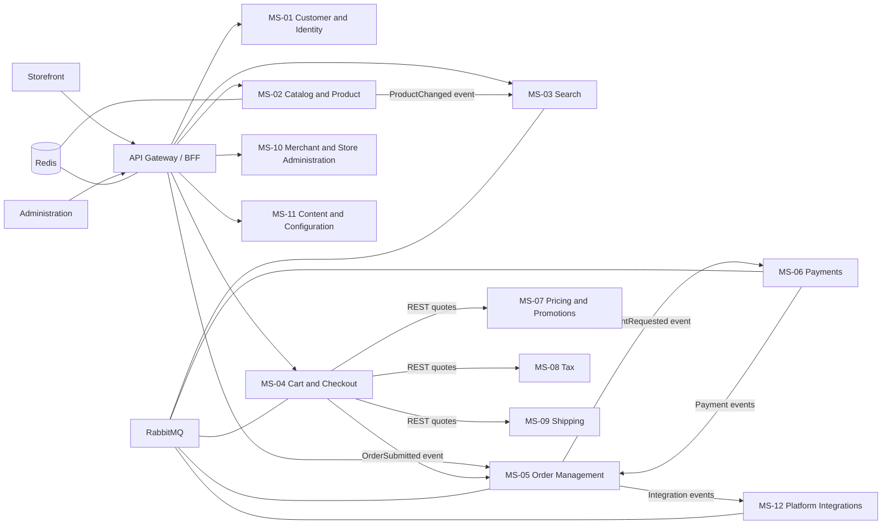

# Shopizer 3.2.7 Modernized Target Architecture

## Architecture intent

The target system is a tenant-aware headless commerce platform. The architecture separates
catalog truth, customer identity, checkout coordination, order lifecycle, payment state,
commercial calculation, fulfillment quotes, merchant administration, content, search, and
platform adapters. Each service owns its data and publishes stable domain events through
RabbitMQ.

## Confirmed technology stack

| Layer | Decision | Status |
|---|---|---|
| Language | C# (.NET 10+) | Human confirmed; preliminary until Phase 4b |
| Framework | ASP.NET Core | Human confirmed; preliminary until Phase 4b |
| Database | PostgreSQL | Human confirmed; one logical schema/database ownership per service |
| Messaging | RabbitMQ | Human confirmed; asynchronous integration backbone |
| Cache | Redis | Human confirmed; cache and short-lived coordination data only |
| Container/runtime | Docker + Azure Container Apps | Human confirmed |
| CI/CD | GitHub Actions | Human confirmed |
| Authentication | Central OIDC provider with OAuth2 access tokens | Architecture decision; provider remains deployable/configurable |
| Observability | OpenTelemetry, structured logs, metrics, distributed traces | Architecture decision |

Phase 4b may reconcile technology choices against migration evidence, operational constraints,
and cost. It must not silently replace the human-confirmed stack.

## Communication and integration

1. Storefront and administration clients use an API gateway/BFF over HTTPS. The gateway
   validates tokens, resolves the merchant/store context, applies rate limits, and routes
   requests to service APIs.
2. Synchronous REST is used for short-lived queries and commands where the caller needs an
   immediate result: catalog reads, cart mutations, quote requests, and administrative CRUD.
3. RabbitMQ carries domain events and long-running integration work. Events use versioned
   envelopes containing `eventId`, `eventType`, `eventVersion`, `occurredAt`, `tenantId`,
   `correlationId`, and a typed payload.
4. Services use the transactional outbox pattern when a database change and event publication
   must be coordinated. Consumers use an inbox/idempotency store and acknowledge messages only
   after successful processing.
5. Retries use bounded exponential backoff. Poison messages move to a dead-letter exchange
   with an operator-visible reason and correlation ID.

## Data ownership and consistency

- Each service owns its PostgreSQL schema and migrations. A service may expose read APIs but
  never shares tables or writes another service's schema.
- Cross-service references are opaque IDs or immutable snapshots; they are not foreign keys.
- Redis is non-authoritative. Losing Redis must not lose orders, payments, or customer data.
- Catalog, price, tax, shipping, and customer data are copied into projections where low-latency
  reads require it. Projections are refreshed by events and expose freshness metadata.
- Checkout stores the price, tax, shipping, and product snapshots used for order submission.
  The order service owns the resulting order snapshot and lifecycle after acceptance.
- Payment authorization and order state are coordinated by a saga. No distributed transaction
  spans checkout, order, and payment services.

## Security and tenancy

- A centralized OIDC provider issues OAuth2 access tokens. APIs validate issuer, audience,
  expiry, scopes, and tenant claims locally.
- `tenantId` and `storeId` are required in authenticated commands and are propagated into
  events. Services verify that resource ownership matches the authenticated context.
- Secrets, provider keys, and signing material are stored in Azure-managed secret storage and
  injected at runtime; they are never committed to the repository.
- Payment services keep provider references and tokenized identifiers only. Raw card data is
  outside the platform boundary.
- Administrative operations require explicit scopes and are audited with actor, tenant, action,
  target, correlation ID, and outcome.

## Observability

- All services emit structured JSON logs with correlation, causation, tenant, service, and
  operation identifiers. Sensitive fields are redacted at the logging boundary.
- OpenTelemetry traces cover gateway requests, REST calls, RabbitMQ publish/consume spans,
  database operations, and external provider calls.
- Metrics include request rate/latency/errors, queue depth, dead-letter count, outbox age,
  projection lag, checkout conversion, payment failure rate, and quote latency.
- Alerts are based on customer impact and recovery signals: elevated checkout failures,
  payment callback lag, stale search projections, growing dead letters, and database saturation.

## Deployment and operations

- Each service is packaged as a Docker image and deployed independently to Azure Container Apps.
- GitHub Actions runs build, unit/contract/integration tests, image scanning, migration checks,
  and signed image publication. Deployment uses environment promotion with approval for
  production.
- PostgreSQL migrations are forward-only and run as a controlled release step. Backups,
  point-in-time recovery, and restore drills are mandatory for transactional services.
- Azure Container Apps revisions support canary rollout and fast rollback. RabbitMQ and
  PostgreSQL are managed as highly available platform services or approved equivalent managed
  offerings.

## Architecture decisions

| ADR | Decision | Rationale |
|---|---|---|
| ADR-001 | Database ownership per service | Prevent shared-table coupling and make service boundaries enforceable. |
| ADR-002 | REST for request/response, RabbitMQ for events | Keeps user-facing latency predictable while allowing independent consumers. |
| ADR-003 | Checkout/order/payment saga | Preserves service autonomy while making partial failure and compensation explicit. |
| ADR-004 | OIDC plus gateway and local token validation | Centralizes identity without requiring every request to traverse the gateway. |
| ADR-005 | Outbox/inbox and idempotent consumers | Prevents lost events and duplicate effects during retries. |
| ADR-006 | Tenant context in tokens and event envelopes | Makes tenant isolation explicit across synchronous and asynchronous paths. |
| ADR-007 | Docker on Azure Container Apps | Matches the confirmed deployment choice and supports independent revisions. |

## Logical topology

