# Shopizer 3.2.7 Target Entity Relationship Diagrams

Each diagram is scoped to one service-owned PostgreSQL schema. `tenant_id` and `store_id` are
included on tenant-scoped records. Cross-service identifiers such as `customer_id`,
`product_id`, and `order_id` are opaque values without foreign-key constraints.

## MS-01 Customer and Identity

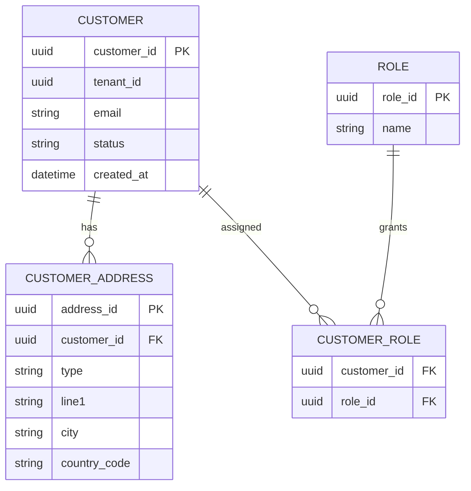

## MS-02 Catalog and Product

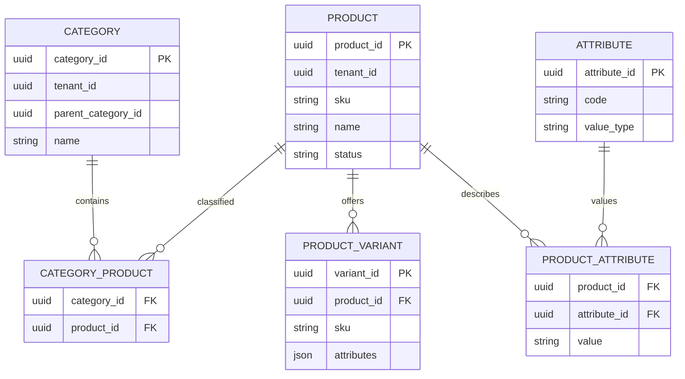

## MS-03 Search

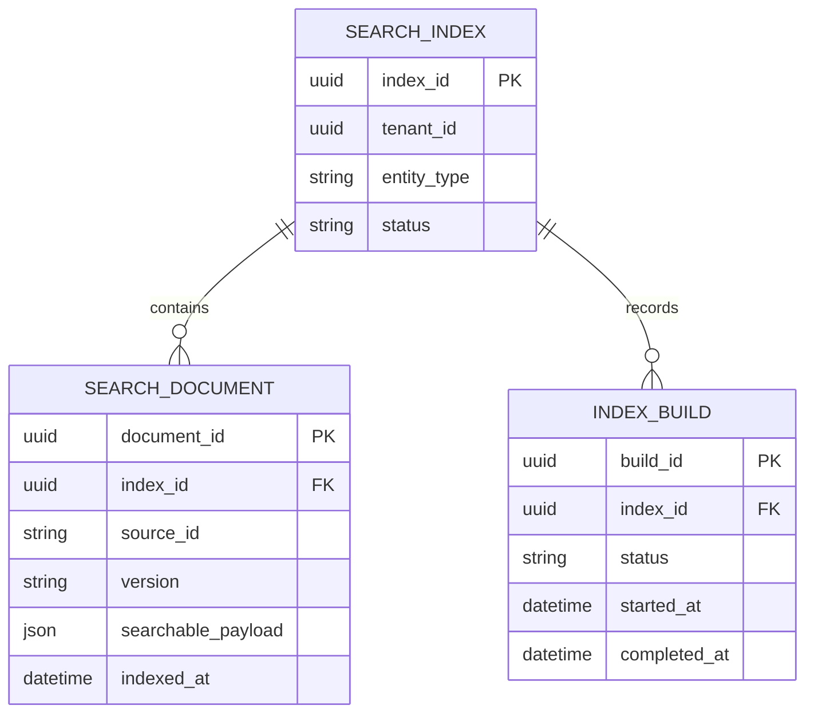

## MS-04 Cart and Checkout

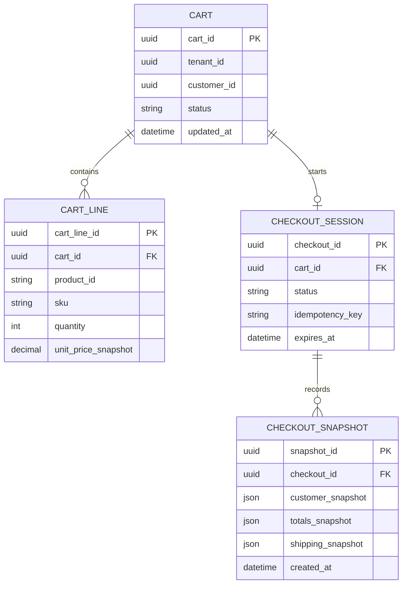

## MS-05 Order Management

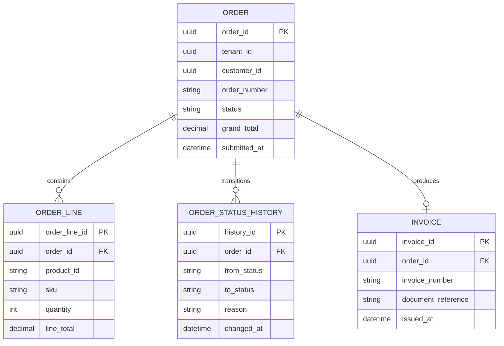

## MS-06 Payments

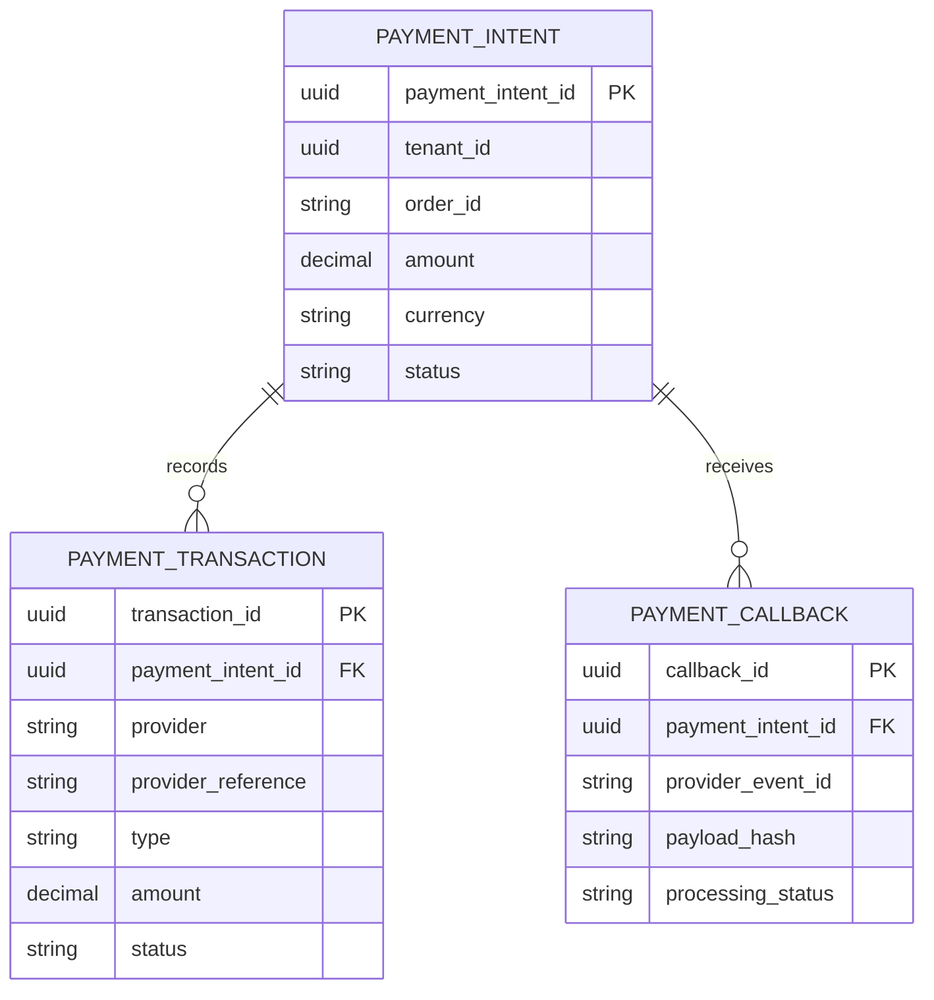

## MS-07 Pricing and Promotions

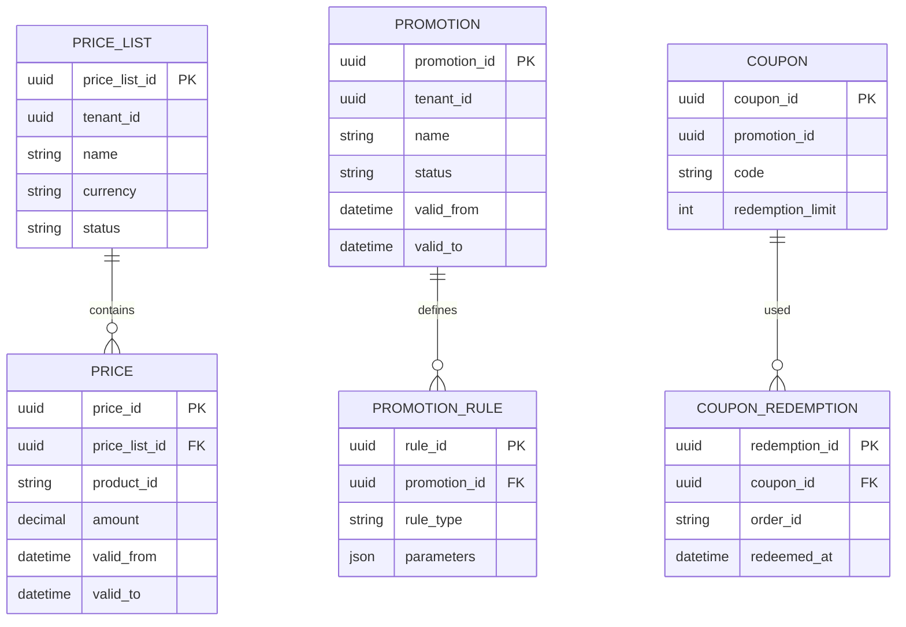

## MS-08 Tax

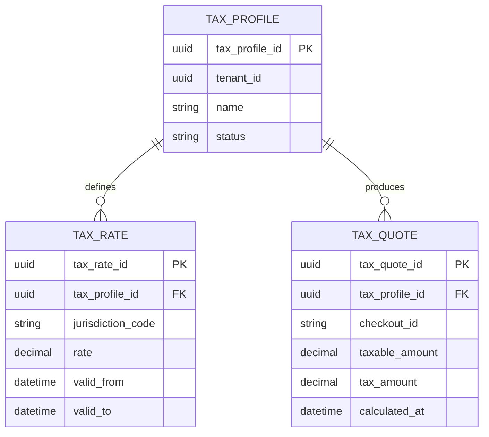

## MS-09 Shipping

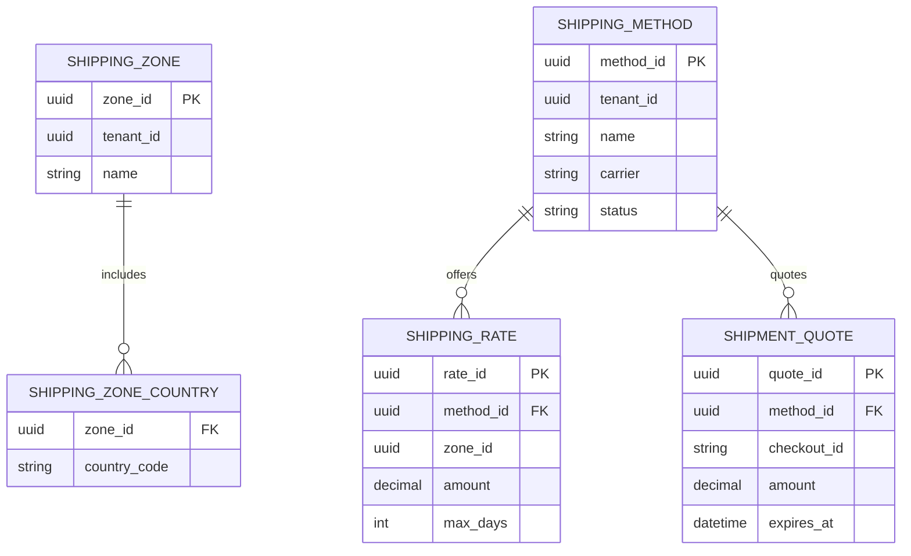

## MS-10 Merchant and Store Administration

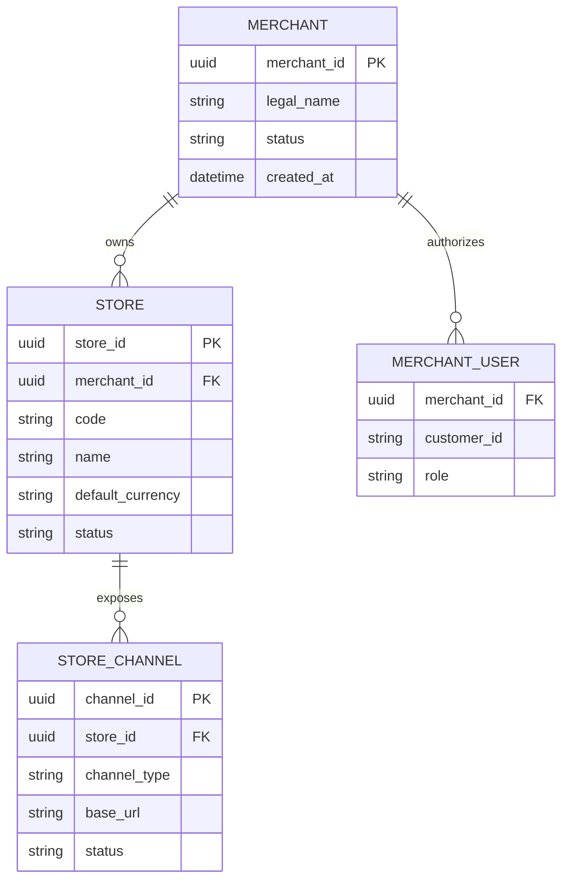

## MS-11 Content and Configuration

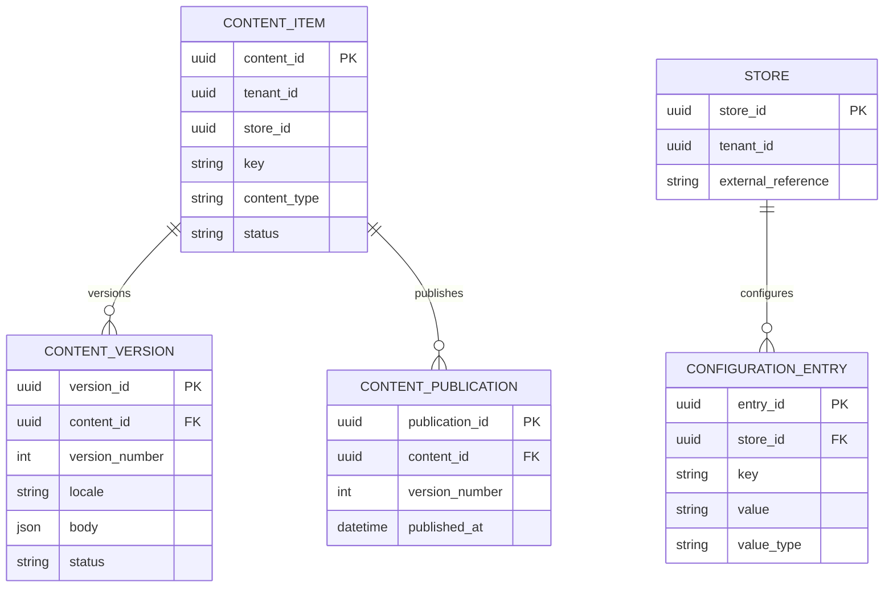

`STORE.external_reference` in this diagram is an opaque reference to MS-10. It is not a
cross-service foreign key; the simplified local entity is resolved through an API or event.

## MS-12 Platform Integrations

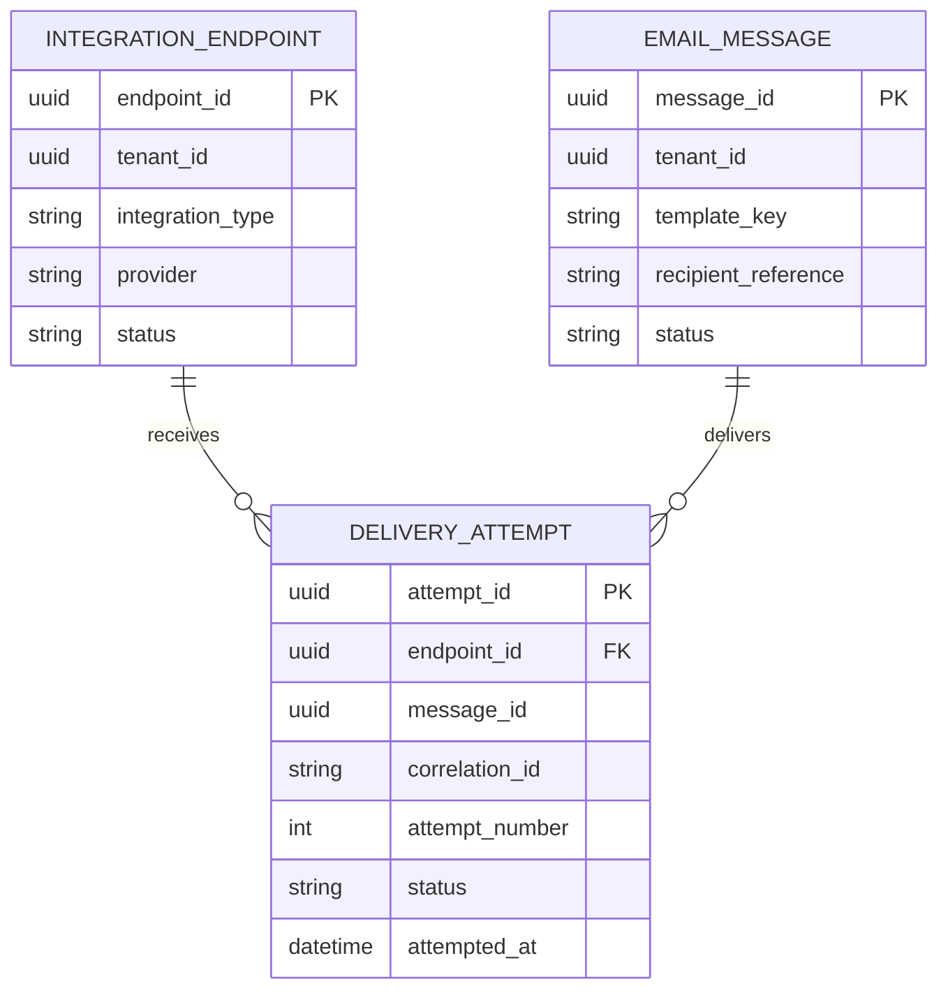

