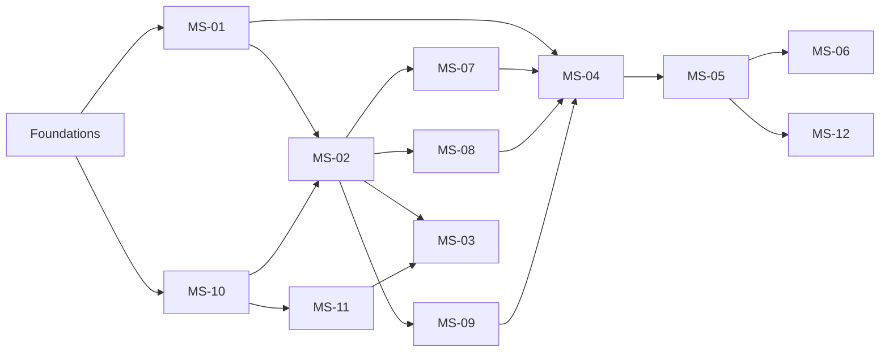

# Shopizer 3.2.7 Modernization Roadmap

## Delivery strategy

The migration proceeds from tenant and identity foundations to the revenue path, then to
derived/supporting capabilities. The legacy platform remains available through an anti-
corruption layer while each service earns traffic through contract tests, shadow reads, and
controlled tenant/store cohorts.

## Phases and timeline

| Phase | Timeline | Services | Primary outcomes | Exit criteria |
|---|---|---|---|---|
| 0. Foundations | Weeks 1-4 | Platform baseline; MS-01; MS-10 | Repository standards, CI/CD, OIDC integration, tenant/store model, shared event envelope, observability baseline | Build/deploy pipeline succeeds; tenant isolation tests pass; migration runbook approved |
| 1. Product foundation | Weeks 5-10 | MS-02 | Catalog/product APIs, product import, category and variant ownership, legacy read adapter | Catalog contract tests pass; reconciliation shows no missing active products for pilot tenants |
| 2. Revenue path | Weeks 11-20 | MS-07; MS-08; MS-09; MS-04; MS-05; MS-06 | Pricing, tax, shipping quotes, cart/checkout, order saga, payment provider adapters | End-to-end checkout succeeds for pilot payment methods; replay and compensation tests pass |
| 3. Experience and integrations | Weeks 21-26 | MS-03; MS-11; MS-12 | Search projections, content/configuration, email/files/maps/carrier adapters | Projection lag and integration retry SLOs met; admin/storefront smoke tests pass |
| 4. Migration and hardening | Weeks 27-32 | All services | Tenant-by-tenant cutover, decommissioning plan, backup/restore, load and failure testing | Production SLOs met for two release cycles; rollback rehearsal complete |

## Workstream sequencing

## Migration controls

- Use a tenant/store feature flag to select legacy or modern endpoints.
- Backfill service-owned databases with repeatable, checksummed jobs; never dual-write the
  same table from two owners.
- Compare legacy and modern catalog, quote, order, and payment outcomes in shadow mode before
  allowing a cohort to write through the modern path.
- Preserve external identifiers and publish translation mappings in the anti-corruption layer.
- Keep an immutable order/payment audit trail before migrating the next cohort.
- Retain replayable event history for at least the agreed operational retention period.

## Service implementation order

1. MS-01 and MS-10 establish tenant, store, actor, and authorization context.
2. MS-02 establishes product truth and the catalog import/reconciliation process.
3. MS-07, MS-08, and MS-09 provide deterministic quote contracts consumed by checkout.
4. MS-04 freezes the checkout snapshot and emits `OrderSubmitted`.
5. MS-05 creates the order aggregate and coordinates order state.
6. MS-06 integrates payment authorization, callbacks, capture, and refunds.
7. MS-03, MS-11, and MS-12 replace derived views and external delivery adapters.

## Roadmap assumptions to validate in Phase 4b

- Payment provider and tax/carrier contracts can support idempotency and signed callbacks.
- Existing data can be mapped to one clear owner without shared-table writes.
- Eventual consistency is acceptable for search, content indexing, email, and fulfillment updates.
- PostgreSQL and RabbitMQ operational ownership is available for production.
- The pilot cohort can run with a reversible gateway routing decision.

