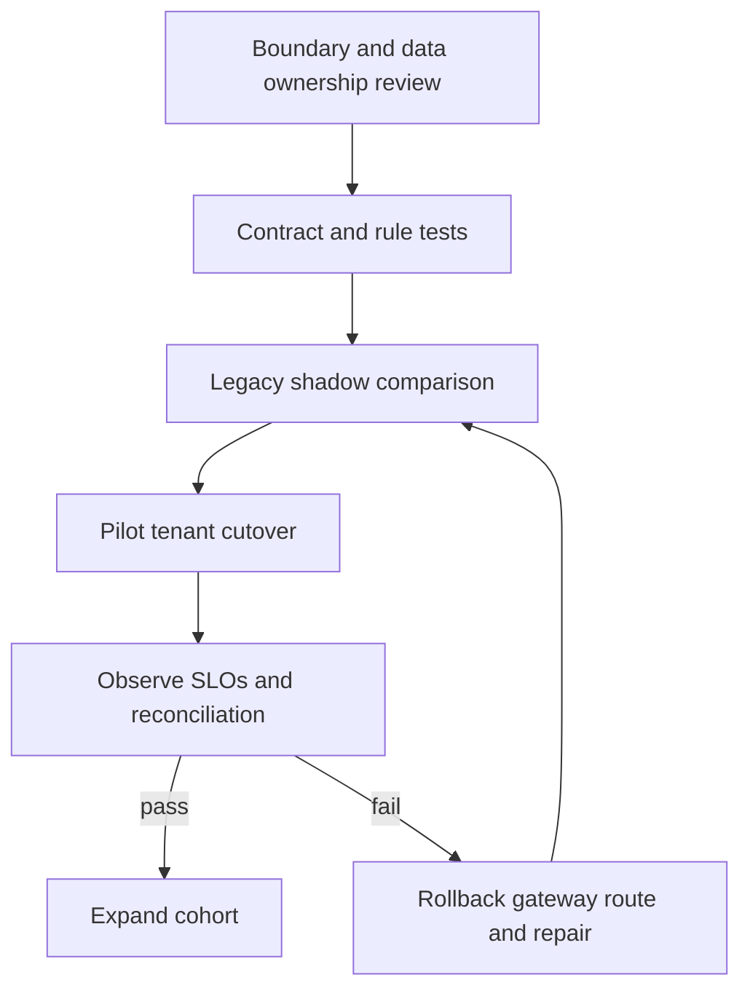

# Shopizer 3.2.7 Modernization Risk Analysis

## Risk register

| ID | Risk | Severity | Likelihood | Owner | Mitigation | Trigger and contingency |
|---|---|---|---|---|---|---|
| R-01 | Checkout, order, and payment saga leaves an order in an intermediate state | Critical | Medium | Order architect | Explicit state machine, outbox/inbox, idempotency keys, reconciliation job, operator-visible correlation IDs | Payment/order mismatch alert; replay event or invoke compensating cancellation/refund workflow |
| R-02 | Tenant data leaks through missing tenant filters or event context | Critical | Medium | Security lead | Token claim validation, repository-level tenant predicates, negative authorization tests, event envelope validation, audit logs | Isolation test failure; disable affected route and rotate credentials while investigating |
| R-03 | Legacy and modern pricing/tax/shipping totals differ | High | High | Commerce lead | Golden fixtures, shadow calculation, rounding/currency ADR, rule-by-rule comparison, pilot cohorts | Variance over threshold; route cohort back to legacy and block cutover |
| R-04 | Duplicate RabbitMQ delivery creates duplicate orders, payments, or emails | High | Medium | Platform lead | Inbox table, business idempotency keys, unique provider/event constraints, safe retry policies | Duplicate detection; quarantine message and reconcile affected aggregate |
| R-05 | Payment provider callbacks are delayed, spoofed, or replayed | Critical | Medium | Payments lead | Signature verification, provider event deduplication, timeout state, callback audit, no raw card data | Callback verification failure or SLA breach; hold settlement and reconcile provider reports |
| R-06 | Product/catalog backfill misses variants or store-specific visibility | High | Medium | Catalog lead | Checksummed import, source-to-target reconciliation, dual read comparison, resumable jobs | Count/hash mismatch; stop cohort and rerun from last checkpoint |
| R-07 | Search or content projections become stale and degrade storefront discovery | Medium | Medium | Experience lead | Versioned events, rebuild endpoint, freshness metric, replayable event history, fallback catalog query | Projection lag exceeds SLO; serve direct catalog search or rebuild index |
| R-08 | External email, file, map, carrier, or search adapters fail during checkout/admin work | High | Medium | Integration lead | Adapter isolation, bounded retries, dead-letter queues, circuit breakers, asynchronous delivery where possible | Error-rate threshold; use cached/manual fallback and expose degraded status |
| R-09 | Shared legacy schema assumptions prevent independent service deployment | High | High | Data migration lead | Ownership matrix, schema extraction, anti-corruption adapters, no cross-service writes, phased table retirement | Unowned table or write detected; pause migration and assign explicit owner |
| R-10 | Deferred production hosting target or managed dependencies cannot meet peak commerce load | High | Medium | Platform/SRE lead | Keep Docker/OCI images portable, validate Aspire local topology, load-test candidate platforms, maintain database capacity plan, rate limits, and restore drills | SLO breach or saturation; select an alternative hosting target before production rollout |

## Risk governance

- Critical risks require an exit criterion in the relevant implementation phase and an assigned
  human owner.
- High risks are reviewed at each tenant cohort cutover.
- Risk triggers are observable metrics or reconciliation results, not informal judgment.
- Any risk that changes a service boundary, data owner, or payment invariant becomes a recorded
  architecture decision and is reviewed before implementation continues.

## Key quality gates

