# Shopizer 3.2.7 Target Process Flows

The flows use REST for immediate queries/commands and RabbitMQ events for durable cross-service
coordination. Event handlers are idempotent and carry tenant and correlation context.

## 1. Browse catalog

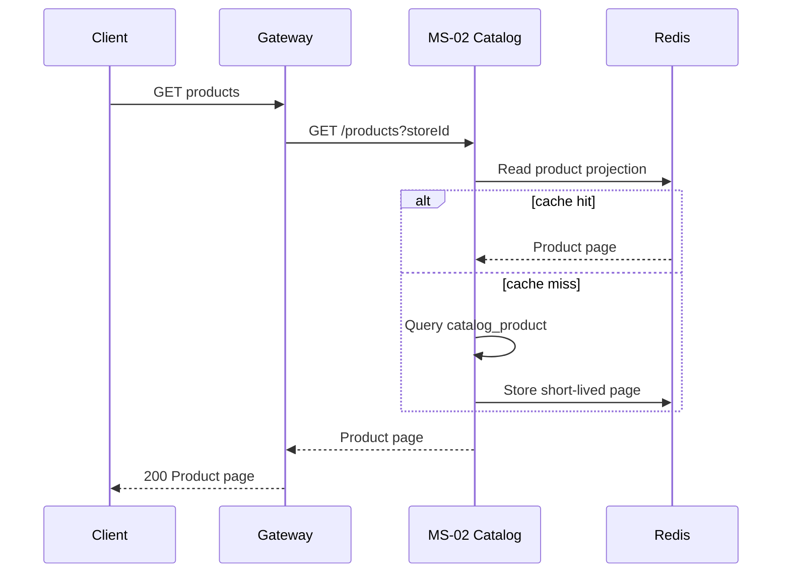

## 2. Search products

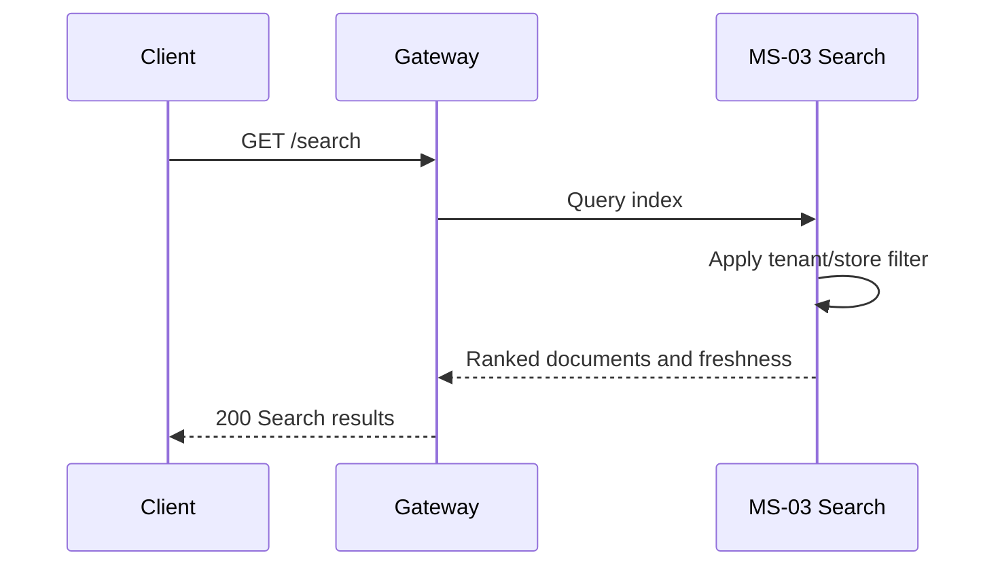

## 3. Customer registration and login

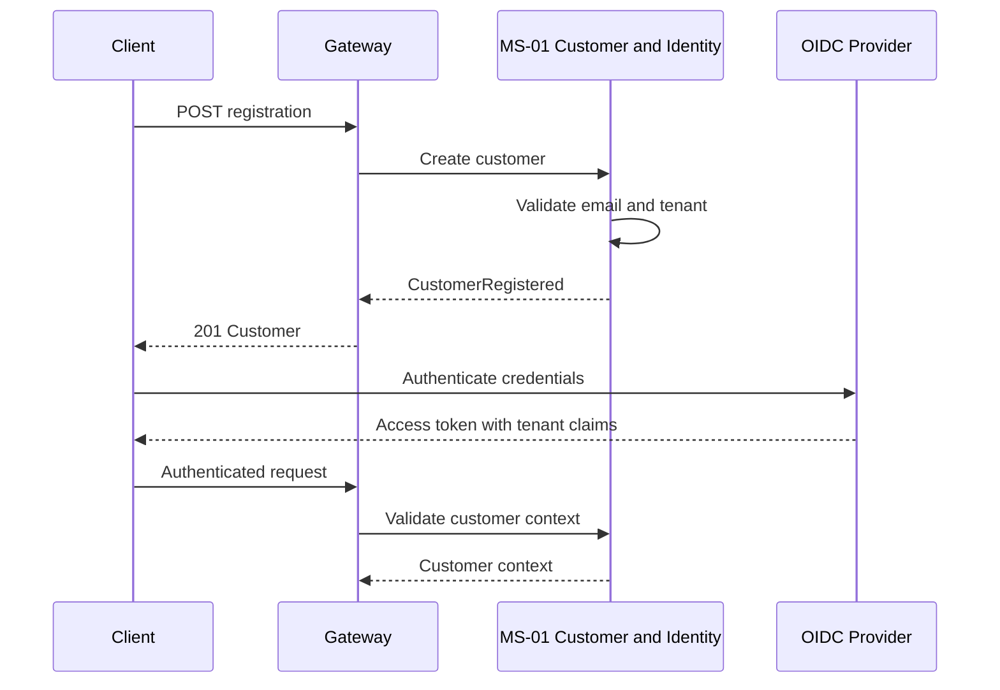

## 4. Update cart

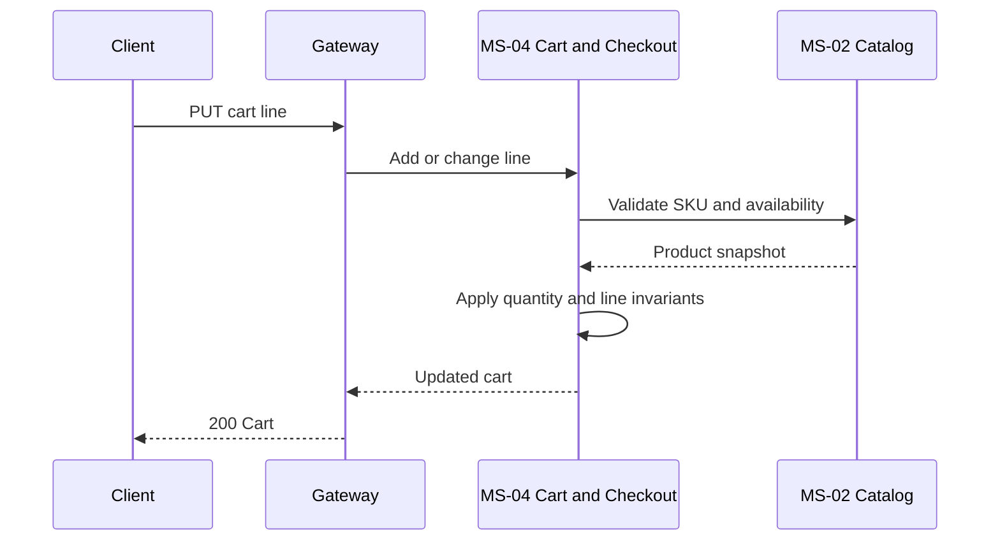

## 5. Checkout quote

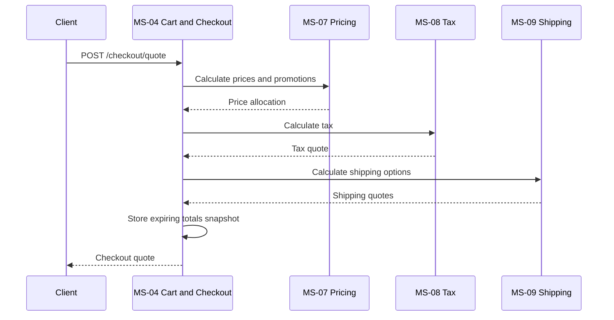

## 6. Submit order

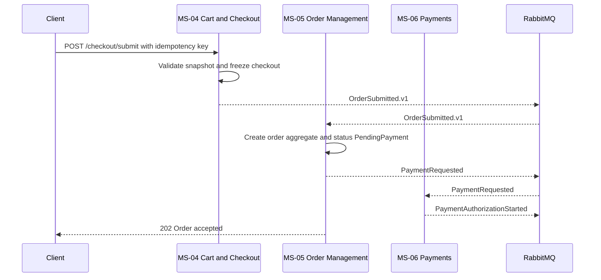

## 7. Payment authorization and callback

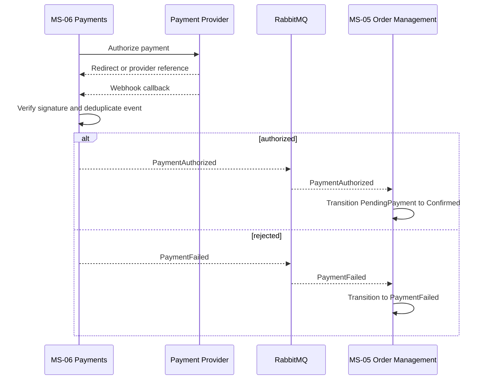

## 8. Apply promotion

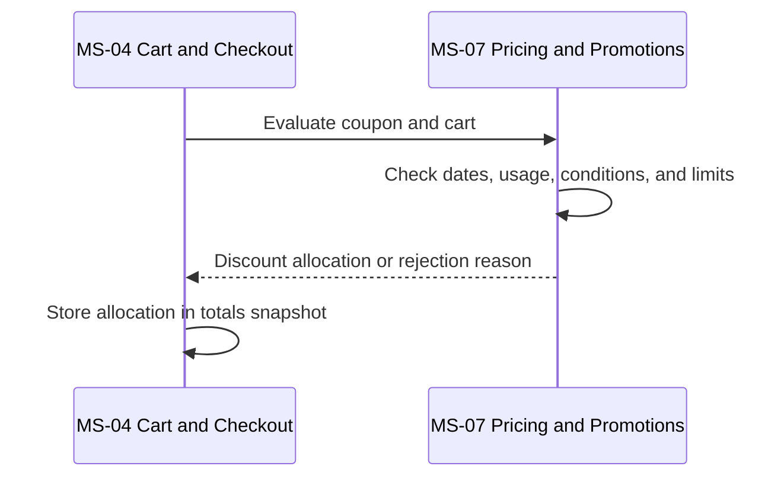

## 9. Tax and shipping quote

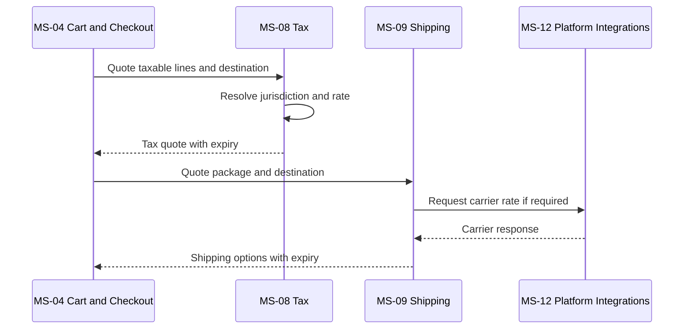

## 10. Merchant/store setup

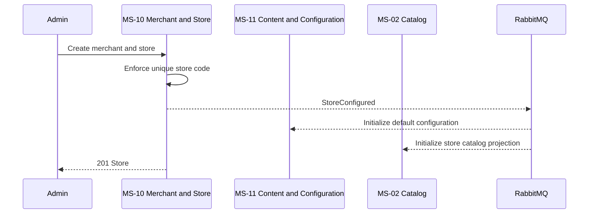

## 11. Publish content

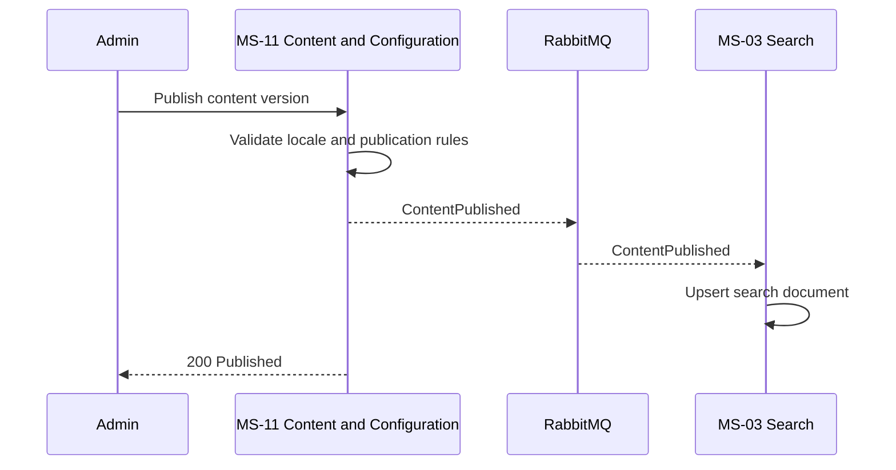

## 12. Catalog indexing

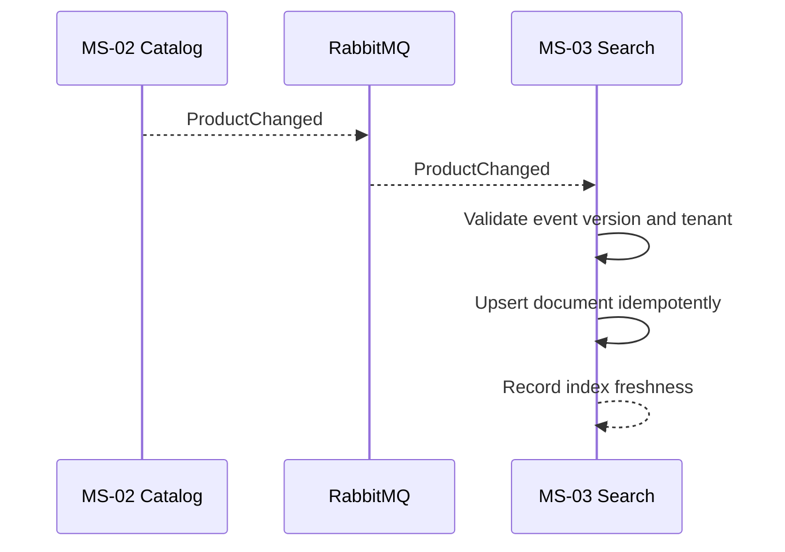
